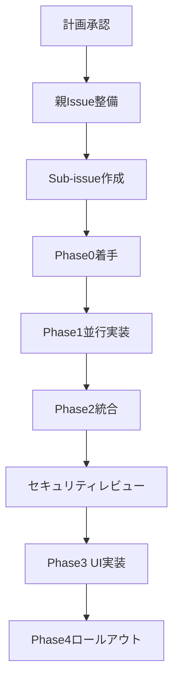

# CDP-Use 統合と Web UI 近代化計画

- **日付**: 2025-10-06
- **作成者**: GitHub Copilot Agent
- **関連 Issue**: [#53](https://github.com/Nobukins/2bykilt/issues/53), [#285](https://github.com/Nobukins/2bykilt/issues/285)
- **ロードマップ整合性**: Phase2-03 (Runner 拡張), Phase2-07 (Observability), Phase2-13/14 (Runner 構成標準化 & UI/UX Internationalization)

## 1. エグゼクティブサマリ

2bykilt は Browser-Use/Web-UI プロジェクト由来のレガシー UI 体験を整理しつつ、最新の CDP 機能を活用する必要があります。本計画では以下のように段階的なアプローチで実現します。

1. Issue #53 の調査結果をエンジンインターフェース仕様に落とし込み、再利用可能な契約として確立する。
2. 新しい `cdp-use` 実行パスをフィーチャーフラグ配下で統合し、既存の `browser-control` や `unlock-future` フローに後退を発生させずに段階的ロールアウトを可能にする。
3. Web UI をモジュール化し、トレース/実行履歴ビューを再導入し、フラグと連動した動的制御を強化することで Issue #285 を満たす。
4. ロールアウト期間中のリグレッションを防ぐため、可観測性と検証体制を拡充する。

## ✅ 進捗サマリ

- ✅ フェーズ0 – 仕様確定完了（`docs/engine/browser-engine-contract.md`、Issue #53 決定サマリ更新済み）
- ✅ フェーズ1 – Runner 抽象化基盤完了（`src/browser/engine/` 配下の実装と `src/config/feature_flags.py` 拡張）
- ✅ フェーズ2 – CDP エンジン統合完了（`src/browser/engine/cdp_engine.py`、アーティファクト/テレメトリー更新）
- ✅ フェーズ3 – UI 近代化完了（`src/ui/` モジュール化、Settings/Trace/RunHistory コンポーネント実装）
- ✅ フェーズ4 – ロールアウトと堅牢化完了（`docs/phase4-completion-report.md`、LLM サンドボックス/セキュリティ統制）

## 2. 目標と成功指標

| 目標 | 成功指標 | 測定方法 |
|------|----------|-----------|
| CDP エンジンの準備完了 | `Playwright` と `cdp-use` アダプターを備えた再利用可能なエンジン抽象化 | ユニット/統合テスト、仕様ドキュメント |
| Unlock-future の互換性と CDP 切替 | フィーチャーフラグで Playwright と新規 CDP バックエンドを切替可能 | 自動テストによるフラグ動作確認 |
| UI 近代化 | モジュール化された UI (`src/ui/...`)、トレース/履歴ウィジェット復活、設定画面の簡素化 | UI スモークテスト、UX レビューチェックリスト |
| 運用上の信頼性 | CDP 経路をカバーするテストとテレメトリーの拡充 | パイプライン安定、依存関係/マニフェスト検証スクリプト合格 |
| 安全な LLM 分離 | `ENABLE_LLM=true` 時に監査可能な境界を備えた隔離ランタイムで AI モジュールを実行し、無効時はフェイルセーフで停止 | セキュリティ机上演習、サンドボックス動作確認、シークレット管理統合 |

## 3. スコープ

### 対象範囲

- Issue #53 のスパイク結果をエンジン抽象化契約として文書化。
- `cdp-use` アダプターを導入し、最小限の操作（遷移/操作/スクリーンショット、トレース取得）をサポート。
- `unlock-future` オーケストレーションを抽象化経由で実行し、フィーチャーフラグで制御できるようリファクタリング。
- Web UI レイアウトを Browser-Use/Web-UI の設計を参照しつつ再構成。
- 実行トレース、履歴、フラグ対応メニューを UI に再導入。
- `ROADMAP.md`、`CONTRIBUTING.md`、`HOW_TO_PROMPT_TO_AGENT.md` などのドキュメントを新ワークフローに合わせて更新。
- セキュリティモデルと整合する形で `ENABLE_LLM` ワークフローを堅牢化し、サイドカーやサンドボックス経由で AI モジュールを遅延読み込み可能にする（インストール時は任意）。

### 対象外（初期フェーズ）

- Runner スケジューラー/キューの全面再設計。
- ブラウザ以外の自動化エンジン（ネイティブデスクトップ等）。
- Browser-Use/Web-UI と完全なビジュアル一致（まずは機能パリティを優先）。
- UX 承認が必要な大規模なビジュアル刷新（別途トラッキング）。
- 隔離とガードレール、トグル整合性を超える全く新しい生成 AI 機能の実装。

## 4. 現状評価

### 4.1 Runner とエンジンの状況

- 対応アクションタイプ（`config/llms_schema_validator.py`）: `script`、`browser-control`、`git-script`、`unlock-future`。
- `unlock-future` は `modules/execution_debug_engine.py` と `script/script_manager.py` を経由し、主に Playwright に依存。
- 専用の CDP 抽象化レイヤーは未整備。Issue #53 のスパイク完了が前提で比較資料の作成が必要。

### 4.2 UI レイヤー

- `src/ui/` 配下は `command_helper.py` と `stream_manager.py` のみで、UI ロジックは Runner 制御や Gradio 設定と密結合。
- Browser-Use/Web-UI に存在するインライントレースプレビュー、実行履歴タイムライン、統合設定パネルなどが欠落。
- フィーチャーフラグはバックエンドを制御するが、UI 上で可視化されていない。

### 4.3 可観測性とフラグ

- フィーチャーフラグ基盤（Phase1）は存在するが UI トグルが未整備。
- `scripts/validate_dependencies.py` は依存関係を監査するが、CDP パフォーマンスを観測する実行レベルのテレメトリーが不足。
- ログ拡充（Phase2-07）は進行中で、CDP 固有メトリクス取得の基盤となる。
- `ENABLE_LLM` 環境変数で AI 機能を切り替えられるが、現状はプロセス内読み込みでサンドボックスやシークレット範囲、ネットワーク制御が不足し、セキュリティモデルの要求を満たしていない。

## 5. 提案アーキテクチャ

### 5.1 エンジン抽象化レイヤー

- `src/browser/engine/` に軽量な `BrowserEngine` インターフェースを追加し、以下を提供:
  - `launch(context)`
  - `navigate(url)`
  - `dispatch(action)`（CDP/Playwright 共通コマンド）
  - `capture_artifacts()`（スクリーンショット、トレース、コンソールログ）
  - `shutdown()`
- アダプターを用意:
  - `PlaywrightEngine`（既存の unlock-future ロジックを抽出）。
  - `CDPEngine`（`cdp-use>=0.6.0` をラップ）。
- `execution_debug_engine.py` で依存性注入を行い、フィーチャーフラグ `runner.engine = "playwright"|"cdp"` によって切替。

### 5.2 Unlock-future 連携

- JSON ベースの `unlock-future` 契約を維持し、エンジン非依存のコマンドに変換。
- フラグ無効時にレガシーフローへフォールバックする互換レイヤーを追加。
- UI コンポーネントへ供給する任意のトレース取得をサポート。

### 5.3 UI モジュール化

- `src/ui/` を再構成:
  - `components/`（RecordingsList、TraceViewer、RunHistory、SettingsPanel など）。
  - `layouts/`（MainLayout、フラグ切替用 MinimalLayout）。
  - `services/`（FeatureFlagService、アーティファクト API へ接続する TraceService など）。
- Gradio エントリーポイントは薄くし、Browser-Use/Web-UI の `interface.py` に近い構成へ。
- アーティファクトパイプラインを利用してアニメーション GIF プレビュー（Issue #38/#237）を再導入。

### 5.4 フィーチャーフラグ戦略

- `feature_flags/FLAGS.md` にフラグを追加:
  - `runner.cdp_engine`（enum: `playwright`, `cdp`）。
  - `ui.modern_layout`（bool）で新 UI 構造を制御。
  - `ui.trace_viewer`（bool）でトレースウィジェットを制御。
- 既定値はレガシー挙動とし、ステージング環境から段階的に有効化。

### 5.5 可観測性とテレメトリー

- メトリクスパイプライン（`metrics/`）を拡張し、CDP 固有のレイテンシや失敗回数を収集。
- `scripts/validate_dependencies.py` を更新し、新エンジン依存関係を検証。
- 実行履歴ビュー向けに、エンジン種別やフラグ状態を含むメタデータを保存。

### 5.6 安全な LLM 分離とセキュリティ統制

- `ENABLE_LLM=true` のときのみ起動する `LLMServiceGateway` を設け、`docs/security/SECURITY_MODEL.md` の `SandboxManager` と `FileSystemSecurityManager` の原則を踏まえてサンドボックス化されたサイドカー（Docker/Firecracker/containerd 等）に委譲。
- LLM 依存パッケージはオプション（`requirements-llm.txt` や poetry extras）として提供し、分離を有効化しない環境ではインストール不要にする。
- ディフェンス・イン・デプスを徹底: サイドカーに読み取り専用マウントを設定し、`no_new_privileges`、seccomp/apparmor プロファイル、デフォルト `network_mode=none` を適用。API 利用が必要な場合は許可済み宛先のみホワイトリスト化。
- シークレット（API キーや埋め込みの資格情報）はボルト連携で供給し、環境変数→シークレットマネージャ→メモリ内ロードのフローとし、ログには自動マスキングした状態で残す。監査ログはセキュリティイベントパイプラインに記録。
- ゼロトラストと最小権限を維持するため、監査ログフックやレート制限付き API クライアントを提供。
- セキュリティチーム向けに有効化手順、ロールバック、モニタリングダッシュボードを含む運用ランブックを更新。

## 6. 実装フェーズとマイルストーン

### ✅ フェーズ0 – 仕様確定 (0.5 スプリント)

- ✅ Issue #53 のスパイク成果（比較表、ベンチマーク、採用メモ）を完了。
- ✅ `BrowserEngine` インターフェース案をまとめ、レビューに回付。
- ✅ 成果物: `docs/engine/browser-engine-contract.md`（新規）、Issue #53 の決定サマリ更新。

### ✅ フェーズ1 – Runner 抽象化基盤 (1 スプリント)

- ✅ Playwright ロジックを `PlaywrightEngine` アダプターに抽出。
- ✅ フィーチャーフラグの定義（設定スキーマ、デフォルト、CLI/環境変数オーバーライド）を整備。
- ✅ `execution_debug_engine.py` と `script_manager.py` に依存性注入を実装。
- ✅ `ENABLE_LLM=false` ではバイパスし、`ENABLE_LLM=true` でサンドボックス実行へルーティング可能な `LLMServiceGateway` スタブを追加。
- ✅ テスト: エンジンローダーのユニットテスト、Playwright 経路の統合テスト。

### ✅ フェーズ2 – CDP エンジン統合 (1〜1.5 スプリント)

- ✅ `cdp-use` を用いた `CDPEngine` アダプターを実装。
- ✅ 遷移・操作・スクリーンショット取得など最小アクションセット + トレース保存をサポート。
- ✅ アーティファクトパイプラインを更新し、CDP トレースを保存。
- ✅ エンジンを切り替えるフィーチャーフラグ付き E2E シナリオを追加。
- ✅ 新エンジンオプションを説明するドキュメント（CONTRIBUTING、HOW_TO_PROMPT_TO_AGENT）を更新。
- ✅ `ENABLE_LLM=true` 時に堅牢なデフォルトでサンドボックス/サイドカーを起動し、シークレット取得やアウトバウンドポリシー設定を行うよう `LLMServiceGateway` を配線。

### ✅ フェーズ3 – UI 近代化 (2 スプリント)

- ✅ `src/ui/` をレイアウト/コンポーネント/サービスにモジュール化。
- ✅ Run History、Trace Viewer、Settings（フラグ切替やエンジン状態）といった新ビューを導入。
- ✅ Browser-Use/Web-UI から不可欠な UX（アニメーションプレビュー等）を最小限のスタイリングで移植。
- ✅ FeatureFlagService をバックエンドと接続し、リアルタイムでフラグ状態を反映。
- ✅ テスト: Gradio セッションによる UI スモークテスト、レイアウト構成のスナップショットテスト。
- ✅ UI 設定パネルに `ENABLE_LLM` の状態を表示し、隔離準備状況、ボルト設定状況、セキュリティアラートを（非管理者は参照のみで）提供。

### ✅ フェーズ4 – ロールアウトと堅牢化 (完了)

- ✅ CDP のアクションカバレッジを拡大（ファイルアップロード、ネットワークインターセプト等）。
- ✅ テレメトリーを収集し、しきい値を調整。
- ✅ ステージング環境で段階的にフラグを有効化し、フィードバック収集後に GA を計画。
- ✅ 追加 UI 調整やドキュメントローカライズなどのフォローアップ Issue を追跡。
- ✅ セキュリティチームと合同でレビューを実施し、LLM 分離体制の脅威モデル更新やインシデント対応訓練、ボルト/シークレットローテーション手順を検証。

## 7. テストと検証戦略

- **ユニットテスト**: エンジンアダプター、フィーチャーフラグローダー、UI サービス。
- **統合テスト**: 両エンジンでの unlock-future 実行、アーティファクト取得の検証。
- **E2E テスト**: Gradio UI フロー（録画再生、フラグ切替）をヘッドレスブラウザで実施。
- **性能ベンチマーク**: Issue #53 の手法で CDP と Playwright のレイテンシを比較。
- **リグレッション対策**: `python scripts/validate_dependencies.py` やマニフェスト検証を継続し、新アーティファクトをカバー。
- **セキュリティ検証**: `ENABLE_LLM=true` サンドボックスの動作確認、依存脆弱性スキャン、監査ログ確認、シークレットマスキングのチェック。

## 8. 依存関係とツール

- `cdp-use>=0.6.0` を含む Python 仮想環境（venv312）。
- スキーマやドキュメント更新を含む既存フィーチャーフラグ基盤（Phase1）。
- 既存 Playwright を活用したブラウザ自動化ツール群（新 CDP ライブラリとの互換性確認が必要）。
- 任意: CDP 経路をナイトリー/ステージングで実行する GitHub Actions ワークフローの更新。
- 任意: LLM 用追加依存（`requirements-llm.txt` など）と、AI スタックを除外したコンテナビルドターゲット。
- シークレット管理連携（AWS Secrets Manager、HashiCorp Vault、SOPS など）により、設定ファイルへ資格情報を埋め込まずに配布。

## 9. リスク評価

| リスク | 発生確率 | 影響度 | 緩和策 |
|--------|----------|--------|--------|
| macOS/Windows での CDP アダプター不安定性 | 中 | 高 | アクションセットを限定して開始し、両 OS で統合テストを実施。本番は安定するまでフラグを無効維持。 |
| Playwright 比での性能低下 | 中 | 中 | 継続的にベンチマークし、フォールバックトグルを提供。テレメトリーを収集して既定有効化前に評価。 |
| UI レイアウト変更による回帰/混乱 | 中 | 高 | `ui.modern_layout` フラグで段階的に展開し、切替を提供。ドキュメント整備とフィードバック収集を実施。 |
| バックエンドと UI のフラグ定義ズレ | 低 | 中 | フラグ定義を一元管理し、UI がバックエンド値と同期する検証スクリプトを追加。 |
| 2 種エンジン運用による保守負荷増 | 中 | 中 | 共通ロジックを抽象化し、エンジン契約を明示化。定期的な同期作業の責任者を設定。 |
| 新 CDP 機能のセキュリティ懸念 | 低 | 高 | 既存サンドボックス制約を活用し、CDP 権限を精査。bandit/pip-audit 等のセキュリティスキャンを実行。 |
| LLM 分離の劣化やシークレット漏えい | 低 | 重大 | サンドボックスポリシーテストを自動化し、ボルト経由のシークレット供給を強制。CI でインラインシークレット利用を防ぐガードレールを追加。 |

## 10. 未解決事項とフォローアップ

- Playwright/CDP 以外のマルチエンジン（例: Chrome DevTools vs Firefox 特化）が必要か。
- 既存 unlock-future スクリプトを CDP 向けに変換する移行支援ツールが必要か。
- Browser-Use/Web-UI とのビジュアル整合性をどこまで追求するか。
- Issue #53 完了後に Issue #54（デュアルエンジン抽象化）とどのように連携するか。

## 11. Issue トラッキング戦略と承認フロー

### 11.1 GitHub Sub-issue による階層管理

本計画では GitHub の Sub-issue 機能を活用し、親子関係で全タスクを体系的に管理します。

**親 Issue の構成**:

- **Issue #53** (CDP エンジン調査と統合) — フェーズ0/1/2 の技術的親 Issue
- **Issue #285** (Web UI 近代化) — フェーズ3 の UI 関連親 Issue
- **新規 Issue: LLM 分離セキュリティ強化** — フェーズ1/2/3 のセキュリティ統制親 Issue

**Sub-issue の作成ルール**:

1. 各フェーズのマイルストーンごとに子 Issue を作成し、親 Issue の本文に `- [ ] #XXX` 形式でチェックリストとして追加。
2. 子 Issue には `parent: #親番号` ラベルを付与し、双方向トレーサビリティを確保。
3. フェーズ完了時に親 Issue の該当チェックボックスを更新し、進捗を可視化。

**Issue テンプレート**:

```markdown
## 親 Issue
Closes #53 (または #285, 新規セキュリティ Issue)

## 目的
[このフェーズの目標を簡潔に記述]

## 受け入れ基準
- [ ] [具体的な成果物や検証項目]
- [ ] テスト合格（ユニット/統合/E2E）
- [ ] ドキュメント更新
- [ ] レビュー承認

## 関連 PR
- #XXX (ブランチ: `feature/issue-XXX-description`)

## ブロッカー
なし / [依存する他 Issue があれば記載]
```

**Project ボードとの連携**:

- GitHub Projects の "2bykilt Phase2 Implementation" ボードを作成し、各 Sub-issue をカラム（Todo/In Progress/Review/Done）で管理。
- 自動化ルール: PR がマージされると関連 Issue を "Done" へ移動。
- マイルストーン `Phase2-CDP-UI` を設定し、全 Sub-issue を紐付け。

### 11.2 承認フローと実装開始

1. ✅ **計画承認**: 本ドキュメントがステークホルダーに承認済み（2025-10-06）。
2. **親 Issue の整備**:
   - Issue #53 へフェーズ0/1/2 のチェックリストを追記。
   - Issue #285 へフェーズ3 のチェックリストを追記。
   - 新規セキュリティ Issue を起票し、LLM 分離関連タスクを集約。
3. **Sub-issue 一斉作成**:
   - フェーズ0: `docs/engine/browser-engine-contract.md` 作成タスク（Issue #53 の子）。
   - フェーズ1: PlaywrightEngine 抽出、フラグ基盤、LLMServiceGateway（3つの子 Issue）。
   - フェーズ2: CDPEngine 実装、アーティファクト拡張、サンドボックス配線（3つの子 Issue）。
   - フェーズ3: UI モジュール化、新ビュー、ENABLE_LLM 表示（3つの子 Issue）。
4. **ブランチ戦略**:
   - 各 Sub-issue に対応する feature ブランチを切り、PR へ親 Issue への `Closes #XXX` を記載。
   - PR レビュー合格後にマージ、親 Issue のチェックリストを更新。
5. **クロスチェックポイント**:
   - 各フェーズ完了時に親 Issue へステータスコメントを投稿し、次フェーズ着手を宣言。
6. **セキュリティゲート**:
   - フェーズ2 完了時にセキュリティチームへサンドボックス設計レビューを依頼。
   - フェーズ3 完了時に机上演習を実施し、ENABLE_LLM 有効化判断。

### 11.3 実装開始シーケンス



**即座の行動**:

- フェーズ0 の子 Issue を起票し、`docs/engine/browser-engine-contract.md` の骨子を作成。
- Issue #53 へフェーズ別チェックリストを追記するコメントを投稿。
- ブランチ `feature/phase0-engine-contract` を作成し、仕様ドキュメントを commit。

---

本計画は 2025-10-06 に承認され、即座にフェーズ0 から実装を開始します。全タスクは Sub-issue で追跡され、統制された開発体制を維持します。
