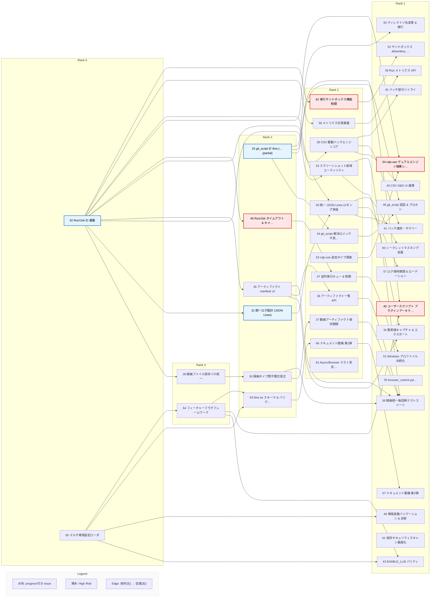

```mermaid
%% Auto-generated dependency graph
%% Generated at: 2025-08-30T23:34:38.774253Z
%% Edge方向: dependency --> dependent
graph LR

subgraph R5[Rank 5]
  32["32 Run/Job ID 基盤"]
  65["65 マルチ環境設定ローダ"]
end
subgraph R4[Rank 4]
  28["28 録画ファイル保存パス統一"]
  64["64 フィーチャーフラグフレームワーク"]
end
subgraph R3[Rank 3]
  25["25 git_script が llms.t… (partial)"]
  30["30 録画タイプ間不整合是正"]
  31["31 統一ログ設計 (JSON Lines)"]
  35["35 アーティファクト manifest v2"]
  46["46 Run/Job タイムアウト & キャ…"]
  63["63 llms.txt スキーマ & バリデ…"]
end
subgraph R2[Rank 2]
  33["33 スクリーンショット取得ユーティリティ"]
  36["36 アーティファクト一覧 API"]
  37["37 動画アーティファクト保持期間"]
  39["39 CSV 駆動バッチエンジンコア"]
  44["44 git_script 解決ロジック不具…"]
  47["47 並列実行キュー & 制限"]
  53["53 cdp-use 追加タイプ調査"]
  56["56 統一 JSON Lines ロギング実装"]
  58["58 メトリクス計測基盤"]
  62["62 実行サンドボックス機能制限"]
  66["66 ドキュメント整備 第1弾"]
  81["81 Async/Browser テスト安定…"]
end
subgraph R1[Rank 1]
  34["34 要素値キャプチャ & エクスポート"]
  38["38 録画統一後回帰テストスイート"]
  40["40 CSV D&D UI 連携"]
  41["41 バッチ進捗・サマリー"]
  42["42 バッチ部分リトライ"]
  43["43 ENABLE_LLM パリティ"]
  45["45 git_script 認証 & プロキシ"]
  48["48 環境変数バリデーション & 診断"]
  49["49 ユーザースクリプト プラグインアーキテ…"]
  50["50 ディレクトリ名変更 & 移行"]
  51["51 Windows プロファイル永続化"]
  52["52 サンドボックス allow/deny …"]
  54["54 cdp-use デュアルエンジン抽象レ…"]
  55["55 browser_control pyt…"]
  57["57 ログ保持期間 & ローテーション"]
  59["59 Run メトリクス API"]
  60["60 シークレットマスキング拡張"]
  61["61 依存セキュリティスキャン最適化"]
  67["67 ドキュメント整備 第2弾"]
end

%% Edges (depends --> dependent)
32 --> 28
28 --> 30
32 --> 31
32 --> 33
33 --> 34
35 --> 34
32 --> 35
35 --> 36
30 --> 37
30 --> 38
33 --> 38
35 --> 38
36 --> 38
37 --> 38
32 --> 39
39 --> 40
39 --> 41
56 --> 41
39 --> 42
64 --> 43
65 --> 43
25 --> 44
25 --> 45
44 --> 45
32 --> 46
46 --> 47
65 --> 48
64 --> 49
25 --> 49
25 --> 50
47 --> 51
62 --> 52
32 --> 54
53 --> 54
31 --> 56
32 --> 56
56 --> 57
32 --> 58
58 --> 59
56 --> 60
32 --> 62
64 --> 63
65 --> 63
65 --> 64
63 --> 66
66 --> 67

%% Styling definitions (Mermaid syntax uses colon)
classDef highrisk fill:#ffe6e6,stroke:#d40000,stroke-width:2px,color:#000;
classDef progress fill:#e6f4ff,stroke:#0366d6,stroke-width:2px,color:#000;

%% Class assignments
class 31,46,49,54,62 highrisk;
class 25,31,32 progress;

%% Legend (pseudo nodes)
subgraph Legend[Legend]
  L1[水色: progress付き Issue]
  L2[薄赤: High Risk]
  L3["Edge: 依存(左) → 従属(右)"]
end
style Legend fill:#fafafa,stroke:#ccc,stroke-dasharray:3 3;
```
