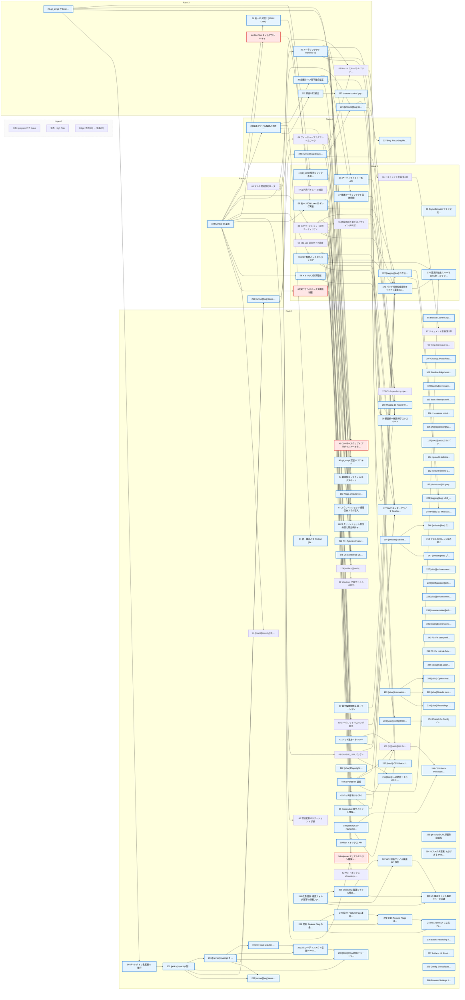

```mermaid
%% Auto-generated dependency graph
%% Generated at: 2025-10-06T03:20:32.274287+00:00
%% Edge方向: dependency --> dependent
graph LR

subgraph R5[Rank 5]
  32["32 Run/Job ID 基盤"]
  65["65 マルチ環境設定ローダ"]
  219["219 [runner][bug] searc…"]
end
subgraph R4[Rank 4]
  28["28 録画ファイル保存パス統一"]
  64["64 フィーチャーフラグフレームワーク"]
  220["220 [runner][bug] brows…"]
  237["237 Bug: Recording file…"]
end
subgraph R3[Rank 3]
  25["25 git_script が llms.t…"]
  30["30 録画タイプ間不整合是正"]
  31["31 統一ログ設計 (JSON Lines)"]
  35["35 アーティファクト manifest v2"]
  46["46 Run/Job タイムアウト & キャ…"]
  63["63 llms.txt スキーマ & バリデ…"]
  110["110 browser-control gap…"]
  111["111 録画/パス統合"]
  221["221 [artifacts][bug] sc…"]
end
subgraph R2[Rank 2]
  33["33 スクリーンショット取得ユーティリティ"]
  36["36 アーティファクト一覧 API"]
  37["37 動画アーティファクト保持期間"]
  39["39 CSV 駆動バッチエンジンコア"]
  44["44 git_script 解決ロジック不具…"]
  47["47 並列実行キュー & 制限"]
  53["53 cdp-use 追加タイプ調査"]
  56["56 統一 JSON Lines ロギング実装"]
  58["58 メトリクス計測基盤"]
  62["62 実行サンドボックス機能制限"]
  66["66 ドキュメント整備 第1弾"]
  76["76 依存更新自動化パイプライン (PR 起…"]
  81["81 Async/Browser テスト安定…"]
  175["175 バッチ行単位成果物キャプチャ基盤 (ス…"]
  176["176 宣言的抽出スキーマ (CSV列→コマン…"]
  222["222 [logging][feat] ログ出…"]
end
subgraph R1[Rank 1]
  34["34 要素値キャプチャ & エクスポート"]
  38["38 録画統一後回帰テストスイート"]
  40["40 CSV D&D UI 連携"]
  41["41 バッチ進捗・サマリー"]
  42["42 バッチ部分リトライ"]
  43["43 ENABLE_LLM パリティ"]
  45["45 git_script 認証 & プロキシ"]
  48["48 環境変数バリデーション & 診断"]
  49["49 ユーザースクリプト プラグインアーキテ…"]
  50["50 ディレクトリ名変更 & 移行"]
  51["51 Windows プロファイル永続化"]
  52["52 サンドボックス allow/deny …"]
  54["54 cdp-use デュアルエンジン抽象レ…"]
  55["55 browser_control pyt…"]
  57["57 ログ保持期間 & ローテーション"]
  59["59 Run メトリクス API"]
  60["60 シークレットマスキング拡張"]
  61["61 [maint][security] 既…"]
  67["67 ドキュメント整備 第2弾"]
  87["87 スクリーンショット重複保存フラグ導入"]
  88["88 スクリーンショット例外分類と特定例外キ…"]
  89["89 Screenshot ログイベント整備…"]
  90["90 Temp test issue for…"]
  91["91 統一録画パス Rollout (fla…"]
  102["102 Flags artifacts hel…"]
  107["107 Cleanup: PytestRetu…"]
  108["108 Stabilize Edge head…"]
  109["109 [quality][coverage]…"]
  113["113 docs: cleanup archi…"]
  114["114 ci: evaluate relaxi…"]
  115["115 [A3][regression][ha…"]
  127["127 [docs][batch] CSVバッ…"]
  154["154 pip-audit stabiliza…"]
  173["173 [UI][batch][#40 fol…"]
  174["174 [artifacts][batch] …"]
  177["177 MVP エンタープライズ Readin…"]
  178["178 CI: dependency-pipe…"]
  192["192 [security][follow-u…"]
  194["194 [artifacts] Tab ind…"]
  196["196 CI: local selector …"]
  197["197 [dashboard] UI grap…"]
  198["198 [batch] CSV NamedSt…"]
  199["199 [ui/ux] Internation…"]
  200["200 [policy] myscript 配…"]
  201["201 [runner] myscript ス…"]
  202["202 [ci] アーティファクト収集/キャッ…"]
  203["203 [docs] README/チュートリ…"]
  208["208 [ui/ux] Option Avai…"]
  209["209 [ui/ux] Results men…"]
  210["210 [ui/ux] Recordings …"]
  211["211 [docs] LLM 統合ドキュメント…"]
  212["212 [ui/ux] Playwright …"]
  218["218 テストカバレッジ率の向上"]
  223["223 [logging][bug] LOG_…"]
  224["224 [ui/ux][config] REC…"]
  226["226 [runner][bug] searc…"]
  227["227 [ui/ux][enhancement…"]
  228["228 [configuration][enh…"]
  229["229 [ui/ux][enhancement…"]
  230["230 [documentation][enh…"]
  231["231 [testing][enhanceme…"]
  240["240 P0: Fix user profil…"]
  241["241 P0: Fix Unlock-Futu…"]
  242["242 P1: Optimize Featur…"]
  244["244 [docs][feat] action…"]
  246["246 [artifacts][feat] ス…"]
  247["247 [artifacts][feat] ブ…"]
  248["248 CSV Batch Processin…"]
  249["249 Phase2-07 Metrics A…"]
  250["250 Phase2-13 Runner Fi…"]
  251["251 Phase2-14 Config Co…"]
  255["255 git-scriptのURL評価制限緩和"]
  257["257 [batch] CSV Batch J…"]
  264["264 リファクタ提案: 大きすぎる Pyth…"]
  265["265 改善提案: 複数フォルダ配下の録画ファ…"]
  266["266 Discovery: 録画ファイル検出…"]
  267["267 API: 録画ファイル検索 API 設計"]
  268["268 UI: 録画ファイル集約ビューと実装"]
  269["269 提案: Feature Flag の全…"]
  270["270 設計: Feature Flag 運用…"]
  271["271 実装: Feature Flags コ…"]
  272["272 UI: Admin UI による Fe…"]
  276["276 Batch: Recording fi…"]
  277["277 Artifacts UI: Provi…"]
  278["278 UI: Control tab vis…"]
  279["279 Config: Consolidate…"]
  280["280 Browser Settings: I…"]
end

%% Edges (depends --> dependent)
32 --> 28
28 --> 30
32 --> 31
32 --> 33
33 --> 34
35 --> 34
32 --> 35
35 --> 36
30 --> 37
30 --> 38
33 --> 38
35 --> 38
36 --> 38
37 --> 38
32 --> 39
39 --> 40
39 --> 41
56 --> 41
39 --> 42
64 --> 43
65 --> 43
25 --> 44
25 --> 45
44 --> 45
32 --> 46
46 --> 47
65 --> 48
64 --> 49
25 --> 49
25 --> 50
47 --> 51
62 --> 52
32 --> 54
53 --> 54
31 --> 56
32 --> 56
56 --> 57
32 --> 58
58 --> 59
64 --> 102
56 --> 60
32 --> 61
32 --> 62
64 --> 63
65 --> 63
65 --> 64
63 --> 66
66 --> 67
33 --> 76
33 --> 87
35 --> 87
33 --> 88
35 --> 88
33 --> 89
58 --> 89
28 --> 91
39 --> 173
40 --> 173
41 --> 173
42 --> 173
265 --> 266
265 --> 267
266 --> 267
265 --> 268
266 --> 268
267 --> 268
269 --> 270
269 --> 271
270 --> 271
269 --> 272
271 --> 272
28 --> 174
30 --> 174
33 --> 174
35 --> 174
39 --> 174
39 --> 175
40 --> 175
41 --> 175
42 --> 175
33 --> 175
35 --> 175
175 --> 176
39 --> 176
40 --> 176
60 --> 177
58 --> 177
35 --> 177
39 --> 177
43 --> 177
76 --> 178
28 --> 111
111 --> 110
201 --> 196
39 --> 198
50 --> 200
200 --> 201
201 --> 202
196 --> 202
200 --> 203
201 --> 203
202 --> 203
199 --> 208
199 --> 209
199 --> 210
43 --> 211
53 --> 212
200 --> 219
201 --> 219
200 --> 226
201 --> 226
219 --> 220
219 --> 221
220 --> 221
56 --> 222
57 --> 222
222 --> 223
221 --> 224
221 --> 237
64 --> 242
194 --> 246
194 --> 247
224 --> 251
220 --> 250
221 --> 250
222 --> 249
198 --> 248
173 --> 248
39 --> 257
198 --> 257
64 --> 278

%% Styling definitions (Mermaid syntax uses colon)
classDef highrisk fill:#ffe6e6,stroke:#d40000,stroke-width:2px,color:#000;
classDef progress fill:#e6f4ff,stroke:#0366d6,stroke-width:2px,color:#000;

%% Class assignments
class 31,46,49,54,62,176,237 highrisk;
class 25,28,30,31,32,34,35,36,37,38,39,40,41,42,44,45,50,55,56,57,58,59,81,87,88,89,91,102,107,108,109,110,111,113,114,115,127,154,175,176,177,192,194,196,197,198,199,200,201,202,203,208,209,210,211,212,218,219,220,221,222,223,224,226,227,228,229,230,231,237,240,241,242,244,246,247,248,249,250,251,255,257,264,265,266,267,268,269,270,271,272,276,277,278,279,280 progress;

%% Legend (pseudo nodes)
subgraph Legend[Legend]
  L1[水色: progress付き Issue]
  L2[薄赤: High Risk]
  L3["Edge: 依存(左) → 従属(右)"]
end
style Legend fill:#fafafa,stroke:#ccc,stroke-dasharray:3 3;
```
