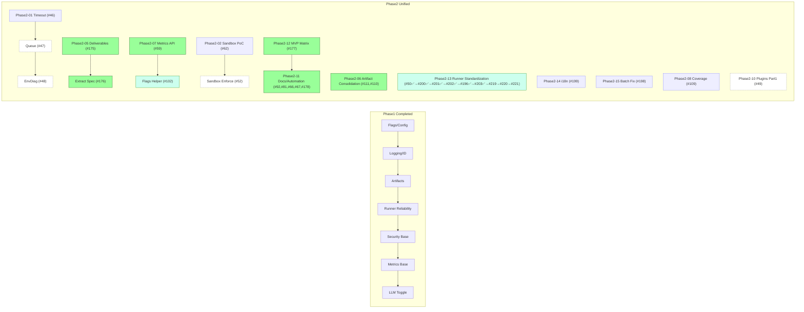
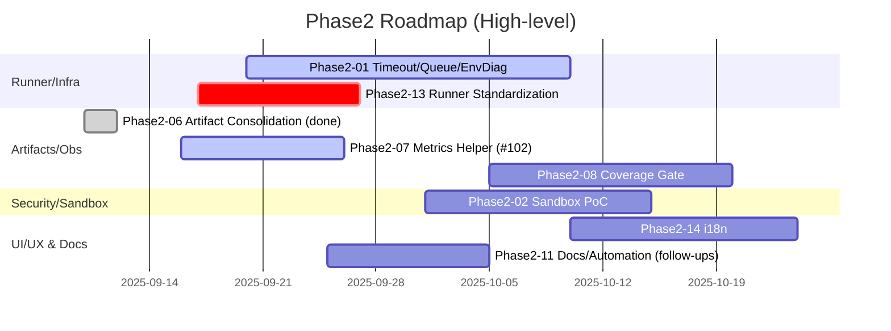
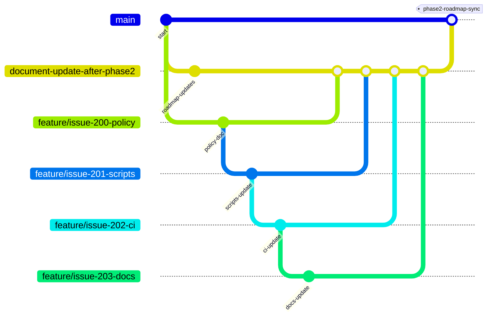

# 2bykilt 開発ロードマップ (Baseline v1)

最終更新: 2025-09-17
対象リポジトリ: <https://github.com/Nobukins/2bykilt>


- 基盤 (設定/Flag/ID/Logging/Artifacts/Security/Observability/Docs) を Phase 1 (Group A) で確立
- Phase 2 (Group B) で拡張 (Runner 高度化 / Batch / Plugins / Sandbox 強化 / Hardening)
- 各 Issue は Priority (P0–P3), Size (S/M/L), Dependencies を常に最新化
- Copilot Coding Agent を使った小刻みな自動実装を前提とした「一度に一タスク」運用

> 更新ルール: 各 Issue / PR 完了直後に:
 
> 1. ISSUE_DEPENDENCIES.yml を更新
> 2. ROADMAP の該当 Wave 進捗率を更新
> 3. 関連ガイド (LOGGING / METRICS / FLAGS / CONFIG_SCHEMA / ARTIFACTS_MANIFEST / SECURITY_MODEL / AGENT_PROMPT_GUIDE) を必要に応じ更新
> 4. PR に「Docs Updated: yes/no(理由)」行を必須記載
> 5. 未反映差分があればラベル `docs/desync` を付与し次の最優先 (P0) タスク化


---

## A. カテゴリ定義 (Domain Buckets)

| Category | Issue Examples (初期) | 概要 |
|----------|-----------------------|------|
| Config | #64, #65, #63 | Feature Flags / Multi-env / Schema Versioning |
| Logging / Observability | #31, #56, #57, #58, #59 | 統一ログ + Metrics Export |
| Artifacts | #28, #30, #33, #34, #35, #36, #37, #38 | 動画・スクショ・要素値・Manifest |
| Runner Core / Reliability | #25, #44, #45, #50, #32 | git_script / Run/Job ID |
| Security (Base) | #60, #61 | Secret Mask / Scan Ops |
| Security (Hardening) | #52, #62 | Sandbox / Path Control |
| Batch Processing | #39, #41, #42, #40 | CSV 駆動実行 |
| Plugins / Extensibility | #49, #53 | User Script Plugin Architecture |
| LLM Control | #43 | Flag による有効/無効 |
| Docs | #66, #67 | 契約 / 最終仕様文書化 |

---

## B. フェーズ (Group A / Phase2 統合)

### Group A (Phase 1 – 基盤 & 早期価値)

| Wave | Issues | Status | 備考 |
|------|--------|--------|------|
| A1 | #64 ✅ #65 ✅ #63 ✅ | ✅ Done | Feature Flags / Multi-env Loader / llms.txt Validator 実装完了 (PR #20 由来) |
| A2 | #32 ✅ #31 ✅ #56 ✅ #57 ✅ | ✅ Done | #56 / #57 実装完了 (PR #83) |
| A3 | #28 ✅ #30 ✅ #33 ✅ #35 ✅ #36 ✅ #34 ✅ #37 ✅ #38 ✅ #87 ✅ #88 ✅ #89 ✅ #91 ✅ | ✅ Done | 全 A3 アーティファクト系 Issue 完了 (#38 PR #103 反映) / Hardening follow-up (非機能) は別 Issue 検討 |
| A4 | #25 ✅ #44 ✅ #45 ✅ #50 ✅ (#55) | ✅ Done | Runner Reliability / git_script 系統 完了 (PR #118, #120) |
| A5 | #60 ✅ #61 ✅ | ✅ Done | Security Base (Mask / Scan) (PR #123 マージ完了) |
| A6 | #58 #59 ✅ | ✅ Done | Metrics 基盤 & Run API (Issue #155 ✅ として実装完了) |
| A7 | #43 | ✅ Done | LLM Toggle パリティ (PR #157 マージ完了) |
| Docs | #66 → #67 | In Progress | Doc Sync >90% 維持方針 |
| A8 | 後続の新規作成issue | Planned | 追加Issueの評価とスケジュール反映 |

Progress Summary (Phase 1): Wave A1 100% / Wave A2 100% / Wave A3 100% / Wave A4 100% / Wave A5 100% / Wave A6 100% / Wave A7 100% ( #60 Security Base 完了) 残: Group B Phase 2 へ移行。Draft/試行 PR は進捗計測に含めず。
Progress Summary (Phase2): Phase2-04 Done / Phase2-05 Done / Phase2-06 Done / Phase2-07 In Progress (4/5 issues completed) / Phase2-11 Done / Phase2-12 Done / Phase2-13 In Progress (7/9 issues completed) / Early focus shifts to Phase2-01 (Runner) & Phase2-07 (Metrics surfacing) / Upcoming gating: coverage (#109) & sandbox (#62)。

### Phase2 (拡張 / 高度化 / 継続改善 統合)

従来の Group B / C を統合し、優先度と依存関係に基づき再編した Wave (Phase2-XX) を定義。

| Wave (Phase2-XX) | Focus | Issues (順序) | 状態 | 備考 |
|------------------|-------|---------------|------|------|
| Phase2-01 | Runner 安定化基盤 | #46 ✅ → #47 ✅ → #48 | Planned | タイムアウト→並列→環境変数診断 |
| Phase2-02 | Sandbox 強化 & Exec 安全性 | #62 (PoC→Enforce) → #52 | Planned | システムコール/パス制限 → allow/deny 実装 |
| Phase2-03 | Runner 拡張 (CDP/Windows) | #53 → #54 → #51 | Planned | 調査→抽象レイヤ→Win プロファイル |
| Phase2-04 | Batch 価値強化 (完了) | #39 ✅ → #41 ✅ → #42 ✅ → #40 ✅ | Done | CSV コア→進捗→部分リトライ→UI |
| Phase2-05 | Batch 成果物/エクスポート | #175 ✅ → #176 ✅ | Done | ポリシー成果物 & 宣言的抽出 PoC |
| Phase2-06 | Artifacts 安定化 / 統合 | #111 ✅ → #110 ✅ → #106 → #104 | Done | 録画/パス統合 完了。flag enforcement/最終整備は反映済み (#193) |
| Phase2-07 | Observability 完全化 | #58 ✅ → #59 ✅ → #102 → #222 → #223 ✅ | In Progress | Metrics API / Flag artifacts helper / ログ標準化 / LOG_LEVEL 修正 |
| Phase2-08 | Quality / Coverage Gate | #109 → #107 → #108 | OPEN | カバレッジ→警告除去→Edge安定化 |
| Phase2-09 | Security / Compliance | #154 ✅ (follow-ups TBD) | Partial | 追加セキュリティギャップ分析 (#177 ✅ 連携) |
| Phase2-10 | Plugin 基盤 | #49 (part1 / part2) | Planned | 増分2段階 (Loader → Lifecycle) |
| Phase2-11 | Docs & Automation | #66 → #67 → #92 → #81 → #178 ✅ | Done | 整備 / enrichment / workflow 追加 (dependency-pipeline workflow実装完了) |
| Phase2-12 | MVP 定義 & ギャップ | #177 | ✅ Done | Enterprise readiness matrix 実装完了 (docs/mvp/README.md) |
| Phase2-13 | Runner 構成標準化 & CI/Docs 追随 | #50 ✅ → #200 ✅ → #201 ✅ → #202 ✅ → #196 ✅ → #203 ✅ → #219 ✅ → #220 → #221 | In Progress | 配置規約→代表スクリプト→CI→Docs完了 / search-linkedin失敗 / browser-control失敗 / 録画未生成 |
| Phase2-14 | UI/UX Internationalization | #199 → #224 | Planned | JA ベース → EN 追加。辞書/ヘルパ/トグル/フォールバック / RECORDING_PATH 競合解消 |
| Phase2-15 | Batch 安定化フォロー | #198 | Planned | CSV 入力正規化（NamedString 対応）+ 最小テスト |

**Phase2-12 MVP Matrix 詳細:**

- **機能性軸**: Batch Processing, Artifacts, Logging & Metrics, Configuration, Runner Core
- **透明性軸**: Execution Visibility, Error Reporting, Performance Metrics, Debug Information, Status Tracking
- **監査性軸**: Action Logging, Data Provenance, Change Tracking, Access Control, Retention Policy
- **セキュリティ軸**: Secret Management, Input Validation, Sandbox Execution, Network Security, Vulnerability Management
- **成熟度レベル**: L0（Prototype）→ L1（Usable）→ L2（Hardened）→ L3（Ready）
- **Measurable Signals**: 各軸・レベルで定量的な達成基準を定義
- **ギャップ分析**: High Priority Gapsとして#175, #62, #109を特定

Gate 条件:

- Group A
  - P0/P1 ≥95%
  - #58 稼働
  - #38 緑
- Docs
  - 同期率>90%

---

## C. 優先度 / サイズ / 基準

- Priority:
  - P0=基盤/重大バグ
  - P1=早期価値
  - P2=重要(後回し可)
  - P3=拡張/実験

- Size:
  - S≤1d
  - M=2-3d
  - L=4-6d(要分割)

---

## D. 依存関係

機械可読: ISSUE_DEPENDENCIES.yml を参照。


Issue 本文に "Depends on: #x, #y" を単一行で明記。

---

## E. シーケンス (Group A)

A1 Config → A2 Logging/ID → A3 Artifacts → A4 Runner Reliability → A5 Security Base → A6 Metrics → A7 LLM Toggle → Docs 並行。

---

## F. Copilot Coding Agent 運用 (要約)

1 Prompt = 1 Issue

依存未解決なら STOP & ASK。

テンプレは AGENT_PROMPT_GUIDE.md。

---


## G. KPI

P0 Burn-down / Wave Completion / Blocked >2d / Cycle Time / Regression Green / Doc Sync Lag / Flag Stale Count

---

## H. ロールバック

Flags / 後方互換 Schema / 追加専用ログ→削除遅延 / Sandbox enforcement 段階化。

---

## I. 次アクション

Phase2 再編後の短期優先セットを以下に再定義。A フェーズは完了済みのため記述簡略化。

### 優先順位付け方針

- **基盤機能完了**: Group A (A1-A4) の全Waveが完了したため、新機能開発を優先
- **ユーザーインパクト重視**: #39 ✅ (CSV駆動バッチエンジン) はユーザー体験向上効果が高いため優先
- **セキュリティ重視**: #60 ✅ (シークレットマスキング拡張) はセキュリティ強化のため優先

### 短期 (Phase2 Kick Re-aligned)

1. **P0 優先着手**: #219 (search-linkedin失敗) → #223 (LOG_LEVEL未反映) | 高速クローズ目標
2. Phase2-07 前倒し: #59 ✅ Run Metrics API → #102 ✅ Flags artifacts helper → #222 (ログ標準化) → #223 (LOG_LEVEL修正)
3. Phase2-13 並行: #219 (search-linkedin失敗) → #220 (browser-control失敗) → #221 (録画未生成) | 基盤部分完了、残り3件のバグ修正着手
4. Phase2-14 設定競合: #224 (RECORDING_PATH UI/環境変数競合) | #221 安定化後着手
5. Docs ギャップ定義: #177 ✅ MVP Matrix Draft → ギャップ派生 Issue 起票
6. Workflow 整合性: #178 ✅ dependency-pipeline workflow 実装完了 (自動生成・コミット機能統合)

### 中期 (Phase2 Expansion)

1. Runner 構成標準化 & CI 整備: #200 → #201 → #196 → #202（並行: #203 Docs 追随）
2. Sandbox Enforcement Path: #62 PoC → enforce gate → #52 allow/deny materialization
3. Runner Concurrency & Diagnostics: #47 ✅ queue infra → #48 env validation diagnostics
4. Plugin Increment (part1): #49 loader + registration minimal
5. Artifact/Manifest フォロー: #106 flag enforcement warn → #104 仕上げ（必要に応じ）

### 長期 (Phase2 Later)

1. UI/UX i18n 展開: #199（EN 辞書整備、切替UI、フォールバック最適化）
2. Batch フォローアップ: #198（CSV 入力正規化 + 最小テスト）
3. Plugin Lifecycle & Hooks (#49 part2)
4. CDP 二重エンジン: #53 research → #54 abstraction
5. Windows Profile Persist: #51 after queue stability
6. Quality Gate Hardening: #109 coverage gate automation + fail-fast
7. Docs/Automation: #92 enrichment pipeline + #81 async test stabilization synergy

### 完了基準 (Group A → Group B 移行)

- ✅ Group A: 全Wave完了 (A1-A7 100%)
- ✅ Security Base: 最低限のセキュリティ対策完了
- ✅ 新機能: 少なくとも1つのユーザー価値提供機能稼働
- ⏳ Docs: 同期率維持 (90%+)

### リスク管理

- **新機能リスク**: #39 ✅ は experimental だが、Phase 2 先頭として慎重に実装
- **セキュリティ優先**: #60 ✅ を A5 と並行して早期完了
- **後方互換**: Flag ベースの段階的導入を徹底

### 開発フロー (Mermaid - Phase2 色付け試案)



### Gantt (Phase2 Timeline)



### Git Flow (Branching Strategy)



### Gitツリー表示 (開発ブランチ構造)

```bash
2bykilt (main)
├── feature/issue-155-metrics-foundation (Metrics基盤)
├── feature/issue-43-enable-llm-parity (LLM Toggle)
├── feature/roadmap-update-wave-a-completion (Document更新)
└── feature/batch-engine-core (Batch Processing)
    ├── feature/batch-progress-summary (#41)
    ├── feature/batch-partial-retry (#42)
    └── feature/csv-ui-integration (#40)
```

---

## J. 改訂履歴

| Version | Date | Changes | Author |
|---------|------|---------|--------|
| 1.0.0 | 2025-08-26 | 初期ドラフト | Copilot Agent |
| 1.0.1 | 2025-08-30 | Wave A1 完了反映 / 進捗テーブル追加 / 次アクション更新 | Copilot Agent |
| 1.0.2 | 2025-08-30 | Wave A2 #32 完了反映 / Progress Summary & 次アクション更新 | Copilot Agent |
| 1.0.3 | 2025-08-31 | Wave A2 #31 完了反映 (#31 done / PR #80) / 進捗率更新 / 次アクション再構成 | Copilot Agent |
| 1.0.4 | 2025-08-31 | Wave A2 #56/#57 完了反映 (PR #83) / Progress 更新 / 次アクション整理 | Copilot Agent |
| 1.0.5 | 2025-09-01 | A3 In Progress (#87 #88 #89 追加) / 短期アクション更新 / Flag 追加反映 | Copilot Agent |
| 1.0.6 | 2025-09-01 | #76 を A3 にスケジュール、短期 Next Actions に追加 | Copilot Agent |
| 1.0.7 | 2025-09-03 | #34 完了 (PR #93) / Wave A3 テーブル反映 / Progress Summary 更新 | Copilot Agent |
| 1.0.8 | 2025-09-03 | #35 最小 manifest v2 スキーマ + flag gating + tests 追加 | Copilot Agent |
| 1.0.9 | 2025-09-03 | #87 duplicate screenshot copy flag 完了 (PR #96) / A3 進捗更新 | Copilot Agent |
| 1.0.10 | 2025-09-03 | #88 screenshot exception classification 完了 (PR #97) / #89 着手反映 | Copilot Agent |
| 1.0.11 | 2025-09-03 | #89 screenshot logging events 完了 (PR #98) / #37 着手 | Copilot Agent |
| 1.0.12 | 2025-09-04 | #37 完了 (PR #99) / #38 regression suite 着手 | Copilot Agent |
| 1.0.13 | 2025-09-04 | #91 統一録画パス rollout 完了 (flag default 有効化, legacy path warn, async loop 安定化, flaky tests 正常化) | Copilot Agent |
| 1.0.14 | 2025-09-06 | #28 録画ファイル保存パス統一 完了 (PR #112) / ISSUE_DEPENDENCIES 進捗同期 / Progress Summary 更新 | Copilot Agent |
| 1.0.16 | 2025-09-08 | Wave A4 完了反映 / 次アクション Group B 移行準備 / 優先順位付け方針追加 / 新規Issue評価反映 / Group Bテーブル化 | Copilot Agent |
| 1.0.17 | 2025-09-10 | Wave A7 #43 完了反映 (PR #157 マージ) / Progress Summary 更新 / 次アクション A5 Security Base 移行準備 | Copilot Agent |
| 1.0.18 | 2025-09-10 | Wave A5 #60/#61 完了反映 (PR #123 マージ) / Issue #60 クローズ / Group B Phase 2 移行準備 | Copilot Agent |
| 1.0.19 | 2025-09-10 | Group B B4 #39 完了反映 / Phase 2 進捗更新 / Batch Processing 展開準備 | Copilot Agent |
| 1.0.20 | 2025-09-10 | Wave A8 抽象化 / 次アクションにMermaid/Gitツリー追加 / Wave A完了区切り | Copilot Agent |
| 1.0.21 | 2025-09-10 | Group C追加 / 未記載OPEN IssueをPhase 3として整理 | Copilot Agent |
| 1.0.24 | 2025-09-13 | Phase2-07 status updated to In Progress based on ISSUE_DEPENDENCIES.yml latest state | Copilot Agent |
| 1.0.25 | 2025-09-14 | Phase2-11 #178 dependency-pipeline workflow 実装完了 / CIジョブ構成更新 / ワークフロー統合反映 | Copilot Agent |
| 1.0.26 | 2025-09-14 | Phase2 status info update | Nobukins |
| 1.0.28 | 2025-09-17 | Phase2-13進捗更新：完了issue(#50/#200/#201/#202/#196/#203)✅反映、Progress Summary更新、Next Actions更新、Mermaid図更新、Ganttチャート更新 | Copilot Agent |
| 1.0.29 | 2025-09-17 | Phase2-07 #223 ✅反映 / Phase2-13 #219 ✅反映 / Progress Summary更新 / ISSUE_DEPENDENCIES.yml同期 | Copilot Agent |

---

## K. 依存グラフ更新 / Pre-PR ローカル検証 & CI 方針

本セクションは `ISSUE_DEPENDENCIES.yml` を触る (Issue 状態変更 / 追加 / 進捗付与 / risk 変更 など) すべての PR に適用する統一プロセス。

### 1. 更新原則

- 単一ソース: 依存/メタ情報の唯一の編集対象は `docs/roadmap/ISSUE_DEPENDENCIES.yml`。
- 派生物 (`DEPENDENCY_GRAPH.md`, `TASK_DASHBOARD.md`, `TASK_QUEUE.yml`) は常に再生成し差分をコミット。
- 生成物は「再生成直後に再度生成しても差分 0 (idempotent)」でなければならない。
- Issue 完了時: `progress.state: done` & `progress.primary_pr: <PR番号>` を必須。`risk` 変更や `high_risk` 追加があれば `summary.high_risk` を同期。
- 新規 root issue 追加時: strict orphan に該当する場合 curated orphan リストへ追加 (superset 運用)。

### 2. ローカル Pre-PR チェックリスト

| Step | 必須 | コマンド / 内容 | 成功条件 |
|------|------|----------------|----------|
| 1 | ✅ | Edit `ISSUE_DEPENDENCIES.yml` | YAML パース成功 (エディタ/validator) |
| 2 | ✅ | `python scripts/validate_dependencies.py docs/roadmap/ISSUE_DEPENDENCIES.yml` | ERROR 0 / WARN 期待内 (curated orphan 追加のみ) |
| 3 | ✅ | `python scripts/gen_mermaid.py docs/roadmap/ISSUE_DEPENDENCIES.yml > docs/roadmap/DEPENDENCY_GRAPH.md` | ファイル更新 / グラフ生成成功 |
| 4 | ✅ | `python scripts/generate_task_dashboard.py` | `[OK] Generated` 表示 |
| 5 | ✅ | `python scripts/generate_task_queue.py --repo <owner/repo> --input docs/roadmap/ISSUE_DEPENDENCIES.yml --output docs/roadmap/TASK_QUEUE.yml --no-api` | 成功ログ / ステータス分類表示 |
| 6 | ✅ | `python scripts/validate_task_queue.py --queue docs/roadmap/TASK_QUEUE.yml --dependencies docs/roadmap/ISSUE_DEPENDENCIES.yml` | PASSED 表示 |
| 7 | ✅ | `git add . && git diff --cached` (or 再生成後 `git diff`) | 生成コマンドを再実行して差分 0 (idempotent) |
| 8 | ✅ | ROADMAP Wave 進捗調整 | 完了 Issue の ✅ 反映 / Progress Summary 更新 |
| 9 | ⭕ | (任意) 厳格孤立検査: `python scripts/validate_dependencies.py --orphan-mode exact docs/roadmap/ISSUE_DEPENDENCIES.yml` | (開発者が curated 上書き影響を精査) |
| 10 | ✅ | PR Description 更新 | 下記テンプレ項目を含む |

PR Description 追記テンプレ:

```markdown
Docs Updated: yes/no(<理由>)
Dependency Graph: regenerated
Validation: dependencies=pass, queue=pass (warnings=<数>)
Orphan List: updated|unchanged (strict_missing=0)
Idempotent Check: pass
```

### 3. CI 推奨ジョブ (GitHub Actions 例)

`/.github/workflows/dependency-pipeline.yml`

```yaml
name: Dependency Pipeline (Issue #178)

# Validates and auto-generates derived artifacts when ISSUE_DEPENDENCIES.yml changes
# Handles PR validation, scheduled generation, and manual triggers

on:
  # PR validation for default branch
  pull_request:
    branches: [2bykilt]
    paths: ['docs/roadmap/ISSUE_DEPENDENCIES.yml']
  
  # Scheduled generation at 3 AM UTC
  schedule:
    - cron: '0 3 * * *'
  
  # Manual trigger
  workflow_dispatch:
  
  # Push trigger for immediate generation
  push:
    branches: [2bykilt]
    paths: ['docs/roadmap/ISSUE_DEPENDENCIES.yml']

jobs:
  validate-deps:
    name: Validate Dependencies
    runs-on: ubuntu-latest
    steps:
      - uses: actions/checkout@v4
      - uses: actions/setup-python@v5
        with: {python-version: '3.12'}
      - run: pip install pyyaml requests
      - name: Dependency Validation
        run: python scripts/validate_dependencies.py docs/roadmap/ISSUE_DEPENDENCIES.yml
  
  regenerate-and-commit:
    name: Regenerate and Commit
    needs: validate-deps
    runs-on: ubuntu-latest
    steps:
      - uses: actions/checkout@v4
        with:
          token: ${{ secrets.GITHUB_TOKEN }}
      - uses: actions/setup-python@v5
        with: {python-version: '3.12'}
      - run: pip install pyyaml requests
      
      # Get current commit hashes for traceability
      - name: Get current commit hashes
        id: commits
        run: |
          echo "roadmap_commit=$(git rev-parse HEAD)" >> $GITHUB_OUTPUT
          echo "dependencies_commit=$(git log -1 --format="%H" -- docs/roadmap/ISSUE_DEPENDENCIES.yml)" >> $GITHUB_OUTPUT
      
      # Regenerate all derived artifacts
      - name: Regenerate derived artifacts
        run: |
          python scripts/gen_mermaid.py docs/roadmap/ISSUE_DEPENDENCIES.yml > docs/roadmap/DEPENDENCY_GRAPH.md
          python scripts/generate_task_dashboard.py
          python scripts/generate_task_queue.py \
            --repo ${{ github.repository }} \
            --input docs/roadmap/ISSUE_DEPENDENCIES.yml \
            --output docs/roadmap/TASK_QUEUE.yml \
            --no-api \
            --verbose
      
      # Update commit hashes in generated files
      - name: Update commit hashes in generated file
        run: |
          sed -i 's/roadmap_commit: REPLACE_ME/roadmap_commit: ${{ steps.commits.outputs.roadmap_commit }}/' docs/roadmap/TASK_QUEUE.yml
          sed -i 's/dependencies_commit: REPLACE_ME/dependencies_commit: ${{ steps.commits.outputs.dependencies_commit }}/' docs/roadmap/TASK_QUEUE.yml
      
      # Validate generated artifacts
      - name: Validate generated task queue
        run: python scripts/validate_task_queue.py \
          --queue docs/roadmap/TASK_QUEUE.yml \
          --dependencies docs/roadmap/ISSUE_DEPENDENCIES.yml
      
      # Check for changes and commit if needed
      - name: Check for changes
        id: changes
        run: |
          if git diff --quiet docs/roadmap/TASK_QUEUE.yml docs/roadmap/DEPENDENCY_GRAPH.md docs/roadmap/TASK_DASHBOARD.md; then
            echo "changed=false" >> $GITHUB_OUTPUT
          else
            echo "changed=true" >> $GITHUB_OUTPUT
          fi
      
      # Auto-commit changes (skip on PR)
      - name: Commit and push changes
        if: steps.changes.outputs.changed == 'true' && github.event_name != 'pull_request'
        run: |
          git config --local user.email "action@github.com"
          git config --local user.name "GitHub Action (Dependency Pipeline Bot)"
          git add docs/roadmap/TASK_QUEUE.yml docs/roadmap/DEPENDENCY_GRAPH.md docs/roadmap/TASK_DASHBOARD.md
          git commit -m "docs: auto-update dependency artifacts" \
                     -m "[skip ci]"
          git push origin 2bykilt
      
      # Skip commit on PR context
      - name: Skip push (PR context)
        if: steps.changes.outputs.changed == 'true' && github.event_name == 'pull_request'
        run: echo "Skip committing updates on pull_request (detached HEAD)"
      
      # Output summary
      - name: Output summary
        run: |
          echo "## Dependency Pipeline Summary" >> $GITHUB_STEP_SUMMARY
          echo "- **Changes detected**: ${{ steps.changes.outputs.changed }}" >> $GITHUB_STEP_SUMMARY
          echo "- **Generated artifacts**: TASK_QUEUE.yml, DEPENDENCY_GRAPH.md, TASK_DASHBOARD.md" >> $GITHUB_STEP_SUMMARY
```

### 4. 失敗時の対応基準

- Validation ERROR: 即修正 (進捗・risk・依存齟齬)。
- Orphan strict missing: curated リスト更新 or 孤立要件再確認。
- Idempotent 差分: 生成スクリプトの非決定要素 (timestamp 等) を抑止 / オプション化。
- Queue Validate 失敗: `status` 判定ルール (done / blocked) のロジック再確認。

### 5. 改善予定 (追跡用)

1. ✅ done 判定に GitHub API 無効時 `progress.state` fallback 追加 (#TBD) → dependency-pipeline workflow で実装済み
2. Mermaid 生成時刻抑制フラグ (`--stable`) 追加 (#TBD)
3. curated orphan を strict / extra 二段表示 (#TBD)
4. ワークフロー統合完了: generate-task-queue.yml → dependency-pipeline.yml一本化 (2025-09-14)

---


(EOF)
