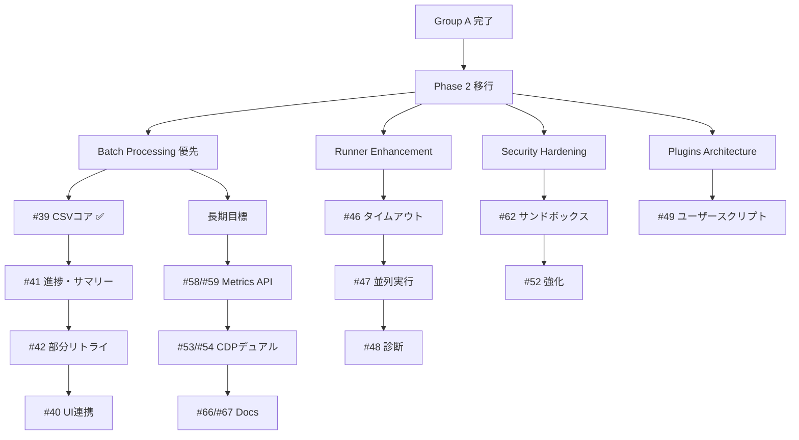

# 2bykilt 開発ロードマップ (Baseline v1)

最終更新: 2025-09-10
対象リポジトリ: <https://github.com/Nobukins/2bykilt>


- 基盤 (設定/Flag/ID/Logging/Artifacts/Security/Observability/Docs) を Phase 1 (Group A) で確立
- Phase 2 (Group B) で拡張 (Runner 高度化 / Batch / Plugins / Sandbox 強化 / Hardening)
- 各 Issue は Priority (P0–P3), Size (S/M/L), Dependencies を常に最新化
- Copilot Coding Agent を使った小刻みな自動実装を前提とした「一度に一タスク」運用

> 更新ルール: 各 Issue / PR 完了直後に:
 
> 1. ISSUE_DEPENDENCIES.yml を更新
> 2. ROADMAP の該当 Wave 進捗率を更新
> 3. 関連ガイド (LOGGING / METRICS / FLAGS / CONFIG_SCHEMA / ARTIFACTS_MANIFEST / SECURITY_MODEL / AGENT_PROMPT_GUIDE) を必要に応じ更新
> 4. PR に「Docs Updated: yes/no(理由)」行を必須記載
> 5. 未反映差分があればラベル `docs/desync` を付与し次の最優先 (P0) タスク化


---

## A. カテゴリ定義 (Domain Buckets)

| Category | Issue Examples (初期) | 概要 |
|----------|-----------------------|------|
| Config | #64, #65, #63 | Feature Flags / Multi-env / Schema Versioning |
| Logging / Observability | #31, #56, #57, #58, #59 | 統一ログ + Metrics Export |
| Artifacts | #28, #30, #33, #34, #35, #36, #37, #38 | 動画・スクショ・要素値・Manifest |
| Runner Core / Reliability | #25, #44, #45, #50, #32 | git_script / Run/Job ID |
| Security (Base) | #60, #61 | Secret Mask / Scan Ops |
| Security (Hardening) | #52, #62 | Sandbox / Path Control |
| Batch Processing | #39, #41, #42, #40 | CSV 駆動実行 |
| Plugins / Extensibility | #49, #53 | User Script Plugin Architecture |
| LLM Control | #43 | Flag による有効/無効 |
| Docs | #66, #67 | 契約 / 最終仕様文書化 |

---

## B. フェーズ (Group A / Group B)

### Group A (Phase 1 – 基盤 & 早期価値)

| Wave | Issues | Status | 備考 |
|------|--------|--------|------|
| A1 | #64 #65 #63 | ✅ Done | Feature Flags / Multi-env Loader / llms.txt Validator 実装完了 (PR #20 由来) |
| A2 | #32 ✅ #31 ✅ #56 ✅ #57 ✅ | ✅ Done | #56 / #57 実装完了 (PR #83) |
| A3 | #28 ✅ #30 ✅ #33 ✅ #35 ✅ #36 ✅ #34 ✅ #37 ✅ #38 ✅ #87 ✅ #88 ✅ #89 ✅ #91 ✅ | ✅ Done | 全 A3 アーティファクト系 Issue 完了 (#38 PR #103 反映) / Hardening follow-up (非機能) は別 Issue 検討 |
| A4 | #25 ✅ #44 ✅ #45 ✅ #50 ✅ (#55) | ✅ Done | Runner Reliability / git_script 系統 完了 (PR #118, #120) |
| A5 | #60 ✅ #61 ✅ | ✅ Done | Security Base (Mask / Scan) (PR #123 マージ完了) |
| A6 | #58 #59 | ✅ Done | Metrics 基盤 & Run API (Issue #155 として実装完了) |
| A7 | #43 | ✅ Done | LLM Toggle パリティ (PR #157 マージ完了) |
| Docs | #66 → #67 | In Progress | Doc Sync >90% 維持方針 |
| A8 | 後続の新規作成issue | Planned | 追加Issueの評価とスケジュール反映 |

Progress Summary (Phase 1): Wave A1 100% / Wave A2 100% / Wave A3 100% / Wave A4 100% / Wave A5 100% / Wave A6 100% / Wave A7 100% ( #60 Security Base 完了) 残: Group B Phase 2 へ移行。Draft/試行 PR は進捗計測に含めず。
Progress Summary (Phase 2): Wave B4 50% ( #39 CSV コア完了, #42 リトライ完了) 残: B1-B3, B5-B6 着手待ち。

### Group B (Phase 2 – 拡張 / 高度化)

| Wave | Issues | Status | 備考 |
|------|--------|--------|------|
| B1 | #46 → #47 → #48 | Planned | Run/Job タイムアウト & キャンセル → 並列実行キュー & 制限 → 環境変数バリデーション & 診断 |
| B2 | #52 → (#62 PoC) → (#62 Enforce) → #54 → #55 | Planned | サンドボックス allow/deny パス → 実行サンドボックス機能制限 → cdp-use デュアルエンジン抽象レイヤ → browser_control pytest パス修正 |
| B3 | #51 | Planned | Windows プロファイル永続化 |
| B4 | #39 ✅ → #41 ✅ → #42 ✅ → #40 ✅ | In Progress | CSV 駆動バッチエンジンコア (part1 完了) → バッチ進捗・サマリー → バッチ部分リトライ → CSV D&D UI 連携 |
| B5 | #53 → #49(part1/part2) | Planned | cdp-use 追加タイプ調査 → ユーザースクリプト プラグインアーキテクチャ |
| B6 | Hardening / Cleanup | Planned | 全体のHardeningとCleanup |

### Group C (Phase 3 – 継続改善 / 品質向上)

| Wave | Issues | Status | 備考 |
|------|--------|--------|------|
| C1 | #154 | OPEN | 🔴 CRITICAL: pip-audit dependency resolution failure in GitHub Actions |
| C2 | #127 | OPEN | `[docs][batch]` CSVバッチエンジン統合ドキュメントの包括的改善 |
| C3 | #115 | OPEN | `[A3][regression][hardening]` Post-#38 回帰スイート強化 |
| C4 | #114 #113 | OPEN | CI/ドキュメント改善 (pytest.ini guard scope / archived references cleanup) |
| C5 | #111 #110 | OPEN | アーティファクト統合・バグ修正 (recording_dir_resolver / browser-control録画未生成) |
| C6 | #109 | OPEN | `[quality][coverage]` Sonar 新規行カバレッジ向上とQuality Gate再挑戦 |
| C7 | #108 #107 | OPEN | テスト安定化 (Edge headless flake / PytestReturnNotNone warnings) |
| C8 | #106 #104 | OPEN | Phase 2 enforcement (unified recording path flag / rollout) |
| C9 | #102 #101 | OPEN | フラグ・テスト改善 (FeatureFlags アーティファクト / async browser起動安定化) |
| C10 | #92 #81 | OPEN | 高度化 (Enrichment Phase 3 / 非同期ブラウザ統合テスト安定化) |
| C11 | #67 #66 | OPEN | ドキュメント整備 (第2弾 / 第1弾) |

Gate 条件:

- Group A
  - P0/P1 ≥95%
  - #58 稼働
  - #38 緑
- Docs
  - 同期率>90%

---

## C. 優先度 / サイズ / 基準

- Priority:
  - P0=基盤/重大バグ
  - P1=早期価値
  - P2=重要(後回し可)
  - P3=拡張/実験

- Size:
  - S≤1d
  - M=2-3d
  - L=4-6d(要分割)

---

## D. 依存関係

機械可読: ISSUE_DEPENDENCIES.yml を参照。


Issue 本文に "Depends on: #x, #y" を単一行で明記。

---

## E. シーケンス (Group A)

A1 Config → A2 Logging/ID → A3 Artifacts → A4 Runner Reliability → A5 Security Base → A6 Metrics → A7 LLM Toggle → Docs 並行。

---

## F. Copilot Coding Agent 運用 (要約)

1 Prompt = 1 Issue

依存未解決なら STOP & ASK。

テンプレは AGENT_PROMPT_GUIDE.md。

---


## G. KPI

P0 Burn-down / Wave Completion / Blocked >2d / Cycle Time / Regression Green / Doc Sync Lag / Flag Stale Count

---

## H. ロールバック

Flags / 後方互換 Schema / 追加専用ログ→削除遅延 / Sandbox enforcement 段階化。

---

## I. 次アクション

Wave A4 は完了。Group A 基盤機能が完了したため、Phase 2 (Group B) の新機能開発へ移行。

### 優先順位付け方針

- **基盤機能完了**: Group A (A1-A4) の全Waveが完了したため、新機能開発を優先
- **ユーザーインパクト重視**: #39 (CSV駆動バッチエンジン) はユーザー体験向上効果が高いため優先
- **セキュリティ重視**: #60 (シークレットマスキング拡張) はセキュリティ強化のため優先

### 短期 (Group B Phase 2 移行 / 新機能開発開始)

1. **Group B 移行**: Phase 1 全Wave完了、Phase 2 へ移行開始
2. **新機能開発開始**: #39 CSV駆動バッチエンジンコア (Phase 2 先頭)
3. **Metrics 基盤準備**: #58 メトリクス計測基盤 (A6 完了済み)
4. **Security Base 完了**: #60/#61 シークレットマスキング & スキャン最適化 (A5 完了済み)
5. **追加Issue評価**: #81 (A2テスト安定化), #92 (Phase 3エンリッチメント), #102-#115 (A3/A8 各種改善) の優先順位付けとスケジュール反映

### 中期 (Phase 2 展開)

1. **Batch Processing 展開**: #39 ✅ (コア完了) → #41 バッチ進捗・サマリー → #42 バッチ部分リトライ → #40 CSV D&D UI 連携
2. **Runner Enhancement**: #46 → #47 → #48 (タイムアウト/並列/診断)
3. **Security Hardening**: #62 → #52 (サンドボックス強化)
4. **Plugins Architecture**: #49 (ユーザースクリプト拡張)

### 長期 (Phase 2 後半)

1. **Observability 完了**: #58 → #59 (メトリクスAPI)
2. **Advanced Features**: #53 → #54 (CDPデュアルエンジン)
3. **Documentation**: #66 → #67 (最終仕様文書化)

### 完了基準 (Group A → Group B 移行)

- ✅ Group A: 全Wave完了 (A1-A7 100%)
- ✅ Security Base: 最低限のセキュリティ対策完了
- ✅ 新機能: 少なくとも1つのユーザー価値提供機能稼働
- ⏳ Docs: 同期率維持 (90%+)

### リスク管理

- **新機能リスク**: #39 は experimental だが、Phase 2 先頭として慎重に実装
- **セキュリティ優先**: #60 を A5 と並行して早期完了
- **後方互換**: Flag ベースの段階的導入を徹底

### 開発フロー (Mermaid)



### Gitツリー表示 (開発ブランチ構造)

```
2bykilt (main)
├── feature/issue-155-metrics-foundation (Metrics基盤)
├── feature/issue-43-enable-llm-parity (LLM Toggle)
├── feature/roadmap-update-wave-a-completion (Document更新)
└── feature/batch-engine-core (Batch Processing)
    ├── feature/batch-progress-summary (#41)
    ├── feature/batch-partial-retry (#42)
    └── feature/csv-ui-integration (#40)
```

---

## J. 改訂履歴

| Version | Date | Changes | Author |
|---------|------|---------|--------|
| 1.0.0 | 2025-08-26 | 初期ドラフト | Copilot Agent |
| 1.0.1 | 2025-08-30 | Wave A1 完了反映 / 進捗テーブル追加 / 次アクション更新 | Copilot Agent |
| 1.0.2 | 2025-08-30 | Wave A2 #32 完了反映 / Progress Summary & 次アクション更新 | Copilot Agent |
| 1.0.3 | 2025-08-31 | Wave A2 #31 完了反映 (#31 done / PR #80) / 進捗率更新 / 次アクション再構成 | Copilot Agent |
| 1.0.4 | 2025-08-31 | Wave A2 #56/#57 完了反映 (PR #83) / Progress 更新 / 次アクション整理 | Copilot Agent |
| 1.0.5 | 2025-09-01 | A3 In Progress (#87 #88 #89 追加) / 短期アクション更新 / Flag 追加反映 | Copilot Agent |
| 1.0.6 | 2025-09-01 | #76 を A3 にスケジュール、短期 Next Actions に追加 | Copilot Agent |
| 1.0.7 | 2025-09-03 | #34 完了 (PR #93) / Wave A3 テーブル反映 / Progress Summary 更新 | Copilot Agent |
| 1.0.8 | 2025-09-03 | #35 最小 manifest v2 スキーマ + flag gating + tests 追加 | Copilot Agent |
| 1.0.9 | 2025-09-03 | #87 duplicate screenshot copy flag 完了 (PR #96) / A3 進捗更新 | Copilot Agent |
| 1.0.10 | 2025-09-03 | #88 screenshot exception classification 完了 (PR #97) / #89 着手反映 | Copilot Agent |
| 1.0.11 | 2025-09-03 | #89 screenshot logging events 完了 (PR #98) / #37 着手 | Copilot Agent |
| 1.0.12 | 2025-09-04 | #37 完了 (PR #99) / #38 regression suite 着手 | Copilot Agent |
| 1.0.13 | 2025-09-04 | #91 統一録画パス rollout 完了 (flag default 有効化, legacy path warn, async loop 安定化, flaky tests 正常化) | Copilot Agent |
| 1.0.14 | 2025-09-06 | #28 録画ファイル保存パス統一 完了 (PR #112) / ISSUE_DEPENDENCIES 進捗同期 / Progress Summary 更新 | Copilot Agent |
| 1.0.16 | 2025-09-08 | Wave A4 完了反映 / 次アクション Group B 移行準備 / 優先順位付け方針追加 / 新規Issue評価反映 / Group Bテーブル化 | Copilot Agent |
| 1.0.17 | 2025-09-10 | Wave A7 #43 完了反映 (PR #157 マージ) / Progress Summary 更新 / 次アクション A5 Security Base 移行準備 | Copilot Agent |
| 1.0.18 | 2025-09-10 | Wave A5 #60/#61 完了反映 (PR #123 マージ) / Issue #60 クローズ / Group B Phase 2 移行準備 | Copilot Agent |
| 1.0.19 | 2025-09-10 | Group B B4 #39 完了反映 / Phase 2 進捗更新 / Batch Processing 展開準備 | Copilot Agent |
| 1.0.20 | 2025-09-10 | Wave A8 抽象化 / 次アクションにMermaid/Gitツリー追加 / Wave A完了区切り | Copilot Agent |
| 1.0.21 | 2025-09-10 | Group C追加 / 未記載OPEN IssueをPhase 3として整理 | Copilot Agent |

---

## K. 依存グラフ更新 / Pre-PR ローカル検証 & CI 方針

本セクションは `ISSUE_DEPENDENCIES.yml` を触る (Issue 状態変更 / 追加 / 進捗付与 / risk 変更 など) すべての PR に適用する統一プロセス。

### 1. 更新原則

- 単一ソース: 依存/メタ情報の唯一の編集対象は `docs/roadmap/ISSUE_DEPENDENCIES.yml`。
- 派生物 (`DEPENDENCY_GRAPH.md`, `TASK_DASHBOARD.md`, `TASK_QUEUE.yml`) は常に再生成し差分をコミット。
- 生成物は「再生成直後に再度生成しても差分 0 (idempotent)」でなければならない。
- Issue 完了時: `progress.state: done` & `progress.primary_pr: <PR番号>` を必須。`risk` 変更や `high_risk` 追加があれば `summary.high_risk` を同期。
- 新規 root issue 追加時: strict orphan に該当する場合 curated orphan リストへ追加 (superset 運用)。

### 2. ローカル Pre-PR チェックリスト

| Step | 必須 | コマンド / 内容 | 成功条件 |
|------|------|----------------|----------|
| 1 | ✅ | Edit `ISSUE_DEPENDENCIES.yml` | YAML パース成功 (エディタ/validator) |
| 2 | ✅ | `python scripts/validate_dependencies.py docs/roadmap/ISSUE_DEPENDENCIES.yml` | ERROR 0 / WARN 期待内 (curated orphan 追加のみ) |
| 3 | ✅ | `python scripts/gen_mermaid.py docs/roadmap/ISSUE_DEPENDENCIES.yml > docs/roadmap/DEPENDENCY_GRAPH.md` | ファイル更新 / グラフ生成成功 |
| 4 | ✅ | `python scripts/generate_task_dashboard.py` | `[OK] Generated` 表示 |
| 5 | ✅ | `python scripts/generate_task_queue.py --repo <owner/repo> --input docs/roadmap/ISSUE_DEPENDENCIES.yml --output docs/roadmap/TASK_QUEUE.yml --no-api` | 成功ログ / ステータス分類表示 |
| 6 | ✅ | `python scripts/validate_task_queue.py --queue docs/roadmap/TASK_QUEUE.yml --dependencies docs/roadmap/ISSUE_DEPENDENCIES.yml` | PASSED 表示 |
| 7 | ✅ | `git add . && git diff --cached` (or 再生成後 `git diff`) | 生成コマンドを再実行して差分 0 (idempotent) |
| 8 | ✅ | ROADMAP Wave 進捗調整 | 完了 Issue の ✅ 反映 / Progress Summary 更新 |
| 9 | ⭕ | (任意) 厳格孤立検査: `python scripts/validate_dependencies.py --orphan-mode exact docs/roadmap/ISSUE_DEPENDENCIES.yml` | (開発者が curated 上書き影響を精査) |
| 10 | ✅ | PR Description 更新 | 下記テンプレ項目を含む |

PR Description 追記テンプレ:

```text
Docs Updated: yes/no(<理由>)
Dependency Graph: regenerated
Validation: dependencies=pass, queue=pass (warnings=<数>)
Orphan List: updated|unchanged (strict_missing=0)
Idempotent Check: pass
```

### 3. CI 推奨ジョブ (GitHub Actions 例)

`/.github/workflows/dependency-pipeline.yml`

```yaml
name: dependency-pipeline
on:
  pull_request:
    paths:
      - 'docs/roadmap/ISSUE_DEPENDENCIES.yml'
      - 'scripts/**.py'
jobs:
  validate-deps:
    runs-on: ubuntu-latest
    steps:
      - uses: actions/checkout@v4
      - uses: actions/setup-python@v5
        with: {python-version: '3.12'}
      - run: pip install pyyaml
      - name: Dependency Validation
        run: python scripts/validate_dependencies.py docs/roadmap/ISSUE_DEPENDENCIES.yml
  regenerate-and-check:
    needs: validate-deps
    runs-on: ubuntu-latest
    steps:
      - uses: actions/checkout@v4
      - uses: actions/setup-python@v5
        with: {python-version: '3.12'}
      - run: pip install pyyaml requests
      - name: Regenerate
        run: |
          python scripts/gen_mermaid.py docs/roadmap/ISSUE_DEPENDENCIES.yml > docs/roadmap/DEPENDENCY_GRAPH.md
          python scripts/generate_task_dashboard.py
          python scripts/generate_task_queue.py --repo ${{ github.repository }} --input docs/roadmap/ISSUE_DEPENDENCIES.yml --output docs/roadmap/TASK_QUEUE.yml --no-api
      - name: Queue Validate
        run: python scripts/validate_task_queue.py --queue docs/roadmap/TASK_QUEUE.yml --dependencies docs/roadmap/ISSUE_DEPENDENCIES.yml
      - name: Idempotency Check
        run: |
          cp docs/roadmap/TASK_QUEUE.yml /tmp/TASK_QUEUE.yml.bak
          python scripts/generate_task_queue.py --repo ${{ github.repository }} --input docs/roadmap/ISSUE_DEPENDENCIES.yml --output docs/roadmap/TASK_QUEUE.yml --no-api
          diff -u /tmp/TASK_QUEUE.yml.bak docs/roadmap/TASK_QUEUE.yml
  diff-guard:
    needs: regenerate-and-check
    runs-on: ubuntu-latest
    steps:
      - uses: actions/checkout@v4
      - name: Ensure committed artifacts up to date
        run: |
          python scripts/gen_mermaid.py docs/roadmap/ISSUE_DEPENDENCIES.yml > /tmp/graph.md
          diff -q /tmp/graph.md docs/roadmap/DEPENDENCY_GRAPH.md || (echo 'Graph out-of-sync' && exit 1)
```

### 4. 失敗時の対応基準

- Validation ERROR: 即修正 (進捗・risk・依存齟齬)。
- Orphan strict missing: curated リスト更新 or 孤立要件再確認。
- Idempotent 差分: 生成スクリプトの非決定要素 (timestamp 等) を抑止 / オプション化。
- Queue Validate 失敗: `status` 判定ルール (done / blocked) のロジック再確認。

### 5. 改善予定 (追跡用)

1. done 判定に GitHub API 無効時 `progress.state` fallback 追加 (#TBD)
2. Mermaid 生成時刻抑制フラグ (`--stable`) 追加 (#TBD)
3. curated orphan を strict / extra 二段表示 (#TBD)

---


(EOF)
