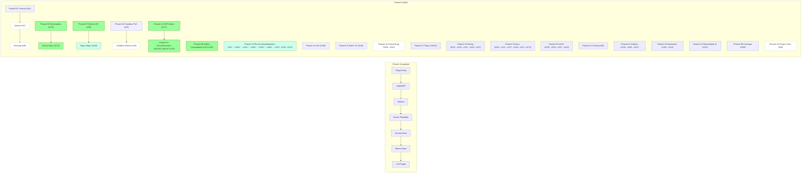
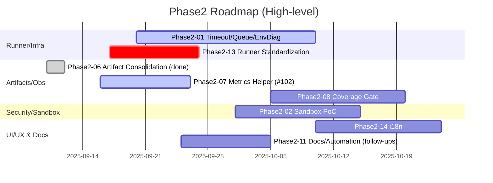
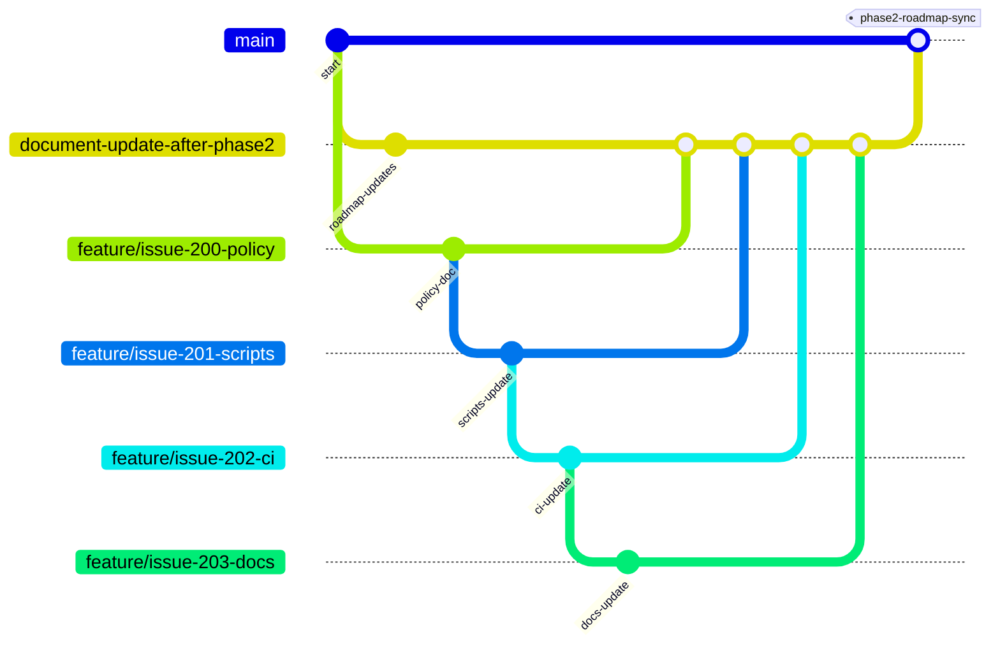

# 2bykilt 開発ロードマップ (Baseline v1)

 最終更新: 2025-10-05
対象リポジトリ: <https://github.com/Nobukins/2bykilt>


- 基盤 (設定/Flag/ID/Logging/Artifacts/Security/Observability/Docs) を Phase 1 (Group A) で確立
- Phase 2 (Group B) で拡張 (Runner 高度化 / Batch / Plugins / Sandbox 強化 / Hardening)
- 各 Issue は Priority (P0–P3), Size (S/M/L), Dependencies を常に最新化
- Copilot Coding Agent を使った小刻みな自動実装を前提とした「一度に一タスク」運用

> 更新ルール: 各 Issue / PR 完了直後に:
 
> 1. ISSUE_DEPENDENCIES.yml を更新
> 2. ROADMAP の該当 Wave 進捗率を更新
> 3. 関連ガイド (LOGGING / METRICS / FLAGS / CONFIG_SCHEMA / ARTIFACTS_MANIFEST / SECURITY_MODEL / AGENT_PROMPT_GUIDE) を必要に応じ更新
> 4. PR に「Docs Updated: yes/no(理由)」行を必須記載
> 5. 未反映差分があればラベル `docs/desync` を付与し次の最優先 (P0) タスク化


---

## A. カテゴリ定義 (Domain Buckets)

| Category | Issue Examples (初期 + Open) | 概要 |
|----------|-------------------------------|------|
| Config | #64, #65, #63, #240, #228, #224 | Feature Flags / Multi-env / Schema Versioning / User Profile / LLM Settings / RECORDING_PATH UI |
| Logging / Observability | #31, #56, #57, #58, #59, #197, #222, #223 | 統一ログ + Metrics Export / UI Graphs / Log Standardization |
| Artifacts | #28, #30, #33, #34, #35, #36, #37, #38, #194, #175, #174, #221, #237, #246, #247 | 動画・スクショ・要素値・Manifest / Tab Index Manifest / Batch Artifacts / Recording Issues / Screenshot Enhancement / Element Extraction Enhancement |
| Runner Core / Reliability | #25, #44, #45, #50, #32, #241, #219, #220, #226, #238, #212 | git_script / Run/Job ID / Browser Automation / Search-LinkedIn / Browser-Control / Codegen |
| Security (Base) | #60, #61, #192 | Secret Mask / Scan Ops / Pip-Audit Monitoring |
| Security (Hardening) | #52, #62 | Sandbox / Path Control |
| Batch Processing | #39, #41, #42, #40, #198, #173, #127 | CSV 駆動実行 / NamedString Fix / Preview & Mapping / Docs |
| Plugins / Extensibility | #49, #53 | User Script Plugin Architecture |
| LLM Control | #43, #242, #211, #210, #227 | Flag による有効/無効 / UI Menu Control / Docs / Error Messages |
| UI/UX | #199, #209, #229, #227, #224, #212 | Internationalization / Results Menu / Design System / Error Messages / RECORDING_PATH / Codegen Menu |
| Testing | #231, #218, #115, #108, #107, #109 | Test Suite Improvement / Coverage / Regression Suite / Flakes / Warnings / Sonar |
| Automation | #76, #178, #192, #114 | Dependency Pipeline / Pip-Audit Schedule / Pytest Guard |
| Quality | #109, #107 | Coverage / Warnings Cleanup |
| Docs | #66, #67, #244, #211, #127, #230, #113, #174 | Documentation Updates / Action Runner Template / LLM / Batch / Cleanup References / Artifact Flow |

---

## B. フェーズ (Group A / Phase2 統合)

### Group A (Phase 1 – 基盤 & 早期価値)

| Wave | Issues | Status | 備考 |
|------|--------|--------|------|
| A1 | #64 ✅ #65 ✅ #63 ✅ | ✅ Done | Feature Flags / Multi-env Loader / llms.txt Validator 実装完了 (PR #20 由来) |
| A2 | #32 ✅ #31 ✅ #56 ✅ #57 ✅ | ✅ Done | #56 / #57 実装完了 (PR #83) |
| A3 | #28 ✅ #30 ✅ #33 ✅ #35 ✅ #36 ✅ #34 ✅ #37 ✅ #38 ✅ #87 ✅ #88 ✅ #89 ✅ #91 ✅ | ✅ Done | 全 A3 アーティファクト系 Issue 完了 (#38 PR #103 反映) / Hardening follow-up (非機能) は別 Issue 検討 |
| A4 | #25 ✅ #44 ✅ #45 ✅ #50 ✅ (#55) | ✅ Done | Runner Reliability / git_script 系統 完了 (PR #118, #120) |
| A5 | #60 ✅ #61 ✅ | ✅ Done | Security Base (Mask / Scan) (PR #123 マージ完了) |
| A6 | #58 #59 ✅ | ✅ Done | Metrics 基盤 & Run API (Issue #155 ✅ として実装完了) |
| A7 | #43 | ✅ Done | LLM Toggle パリティ (PR #157 マージ完了) |
| Docs | #66 → #67 | In Progress | Doc Sync >90% 維持方針 |
| A8 | 後続の新規作成issue | Planned | 追加Issueの評価とスケジュール反映 |

### Phase2 (拡張 / 高度化 / 継続改善 統合)

従来の Group B / C を統合し、優先度と依存関係に基づき再編した Wave (Phase2-XX) を定義。

| Wave (Phase2-XX) | Focus | Issues (順序) | 状態 | 備考 |
|------------------|-------|---------------|------|------|
| Phase2-01 | Runner 安定化基盤 | #46 ✅ → #47 ✅ → #48 | Planned | タイムアウト→並列→環境変数診断 |
| Phase2-02 | Sandbox 強化 & Exec 安全性 | #62 (PoC→Enforce) → #52 | Planned | システムコール/パス制限 → allow/deny 実装 |
| Phase2-03 | Runner 拡張 (CDP/Windows) | #53 → #54 → #51 | Planned | 調査→抽象レイヤ→Win プロファイル |
| Phase2-04 | Batch 価値強化 (完了) | #39 ✅ → #41 ✅ → #42 ✅ → #40 ✅ | Done | CSV コア→進捗→部分リトライ→UI |
| Phase2-05 | Batch 成果物/エクスポート | #175 ✅ → #176 ✅ | Done | ポリシー成果物 & 宣言的抽出 PoC |
| Phase2-06 | Artifacts 安定化 / 統合 | #111 ✅ → #110 ✅ → #106 → #104 | Done | 録画/パス統合 完了。flag enforcement/最終整備は反映済み (#193) |
| Phase2-07 | Observability 完全化 | #58 ✅ → #59 ✅ → #102 → #222 → #223 ✅ | In Progress | Metrics API / Flag artifacts helper / ログ標準化 / LOG_LEVEL 修正 |
| Phase2-08 | Quality / Coverage Gate | #109 → #107 → #108 | OPEN | カバレッジ→警告除去→Edge安定化 |
| Phase2-09 | Security / Compliance | #154 ✅ (follow-ups TBD) | Partial | 追加セキュリティギャップ分析 (#177 ✅ 連携) |
| Phase2-10 | Plugin 基盤 | #49 (part1 / part2) | Planned | 増分2段階 (Loader → Lifecycle) |
| Phase2-11 | Docs & Automation | #66 → #67 → #92 → #81 → #178 ✅ | Done | 整備 / enrichment / workflow 追加 (dependency-pipeline workflow実装完了) |
| Phase2-12 | MVP 定義 & ギャップ | #177 | ✅ Done | Enterprise readiness matrix 実装完了 (docs/mvp/README.md) |
| Phase2-13 | Runner 構成標準化 & CI/Docs 追随 | #50 ✅ → #200 ✅ → #201 ✅ → #202 ✅ → #196 ✅ → #203 ✅ → #219 ✅ → #220 → #221 → #237 ✅ → #238 | In Progress | 配置規約→代表スクリプト→CI→Docs完了 / search-linkedin失敗 / browser-control失敗 / 録画未生成 / 録画ファイル生成バグ / LLM無効時browser-control失敗 / Note: PR #286 applied runtime fixes and test stabilizations affecting this group. |
| Phase2-14 | UI/UX Internationalization | #199 → #224 | Planned | JA ベース → EN 追加。辞書/ヘルパ/トグル/フォールバック / RECORDING_PATH 競合解消 (partial: PR #286 fixed script/artifact path handling; UI follow-up required) |
| Phase2-15 | Batch 安定化フォロー | #198 | Planned | CSV 入力正規化（NamedString 対応）+ 最小テスト |
| Phase2-16 | Critical Bug Fixes | #240 → #241 | Planned | User profile SSO/Cookie → Unlock-Future browser automation (エンタープライズ拡張、後回し) |
| Phase2-17 | Feature Flag UI Integration | #242 | OPEN | Hide LLM tabs when disabled |
| Phase2-18 | Testing & Quality Improvements | #231 → #218 → #115 → #108 → #107 | OPEN | Test suite / Coverage / Regression / Flakes / Warnings |
| Phase2-19 | Documentation Enhancements | #244 → #211 → #127 → #230 → #113 → #174 | OPEN | Action runner template / LLM docs / Batch docs / General docs / Cleanup / Artifact flow |
| Phase2-20 | UI/UX Polish | #209 → #229 → #227 → #212 | OPEN | Results menu / Design system / Error messages / Codegen menu |
| Phase2-21 | Configuration & LLM Settings | #228 | OPEN | LLM設定改善 |
| Phase2-22 | Artifacts & Multi-tab Support | #194 → #246 → #247 | OPEN | Tab index manifest / Screenshot enhancement / Element extraction enhancement |
| Phase2-23 | Automation & Security Monitoring | #192 → #114 | OPEN | Pip-audit schedule / Pytest guard |
| Phase2-24 | Observability UI | #197 | OPEN | UI graphs and presets |

**Phase2-12 MVP Matrix 詳細:**

- **機能性軸**: Batch Processing, Artifacts, Logging & Metrics, Configuration, Runner Core
- **透明性軸**: Execution Visibility, Error Reporting, Performance Metrics, Debug Information, Status Tracking
- **監査性軸**: Action Logging, Data Provenance, Change Tracking, Access Control, Retention Policy
- **セキュリティ軸**: Secret Management, Input Validation, Sandbox Execution, Network Security, Vulnerability Management
- **成熟度レベル**: L0（Prototype）→ L1（Usable）→ L2（Hardened）→ L3（Ready）
- **Measurable Signals**: 各軸・レベルで定量的な達成基準を定義
- **ギャップ分析**: High Priority Gapsとして#175, #62, #109を特定

Gate 条件:

- Group A
  - P0/P1 ≥95%
  - #58 稼働
  - #38 緑
- Docs
  - 同期率>90%

---

### Phase2 - 全Issueインデックス (ISSUE_DEPENDENCIES.yml と一致)

このサブセクションは、`ISSUE_DEPENDENCIES.yml` をソースにして Wave 単位でグルーピングした視認性の高い一覧を提供します。

使い方 (Agent / 自動生成向け):

- `ISSUE_DEPENDENCIES.yml` をパースして issue の `meta.phase` / `meta.priority` / `progress.state` を取得します。
- Agent はファイル内の `<!-- GENERATED:phase2-index -->` 範囲を上書きして Wave ベースの一覧を生成してください。
- Wave ヘッダは: `#### Wave: <name> — <短い説明> (完了数/全件数)` の形式で出力します。
- 各 Issue 行は短く: `- #NNN [P0|P1|P2|P3] (state) : Title` で表現してください。

<!-- GENERATED:phase2-index START -->
#### Wave: Phase1 (phase='1') (14/23)

- #25 [P0] (done) : git_script が llms.txt で指定したスクリプトを正しく解決するよう修正
- #28 [P0] (done) : 録画ファイル保存パス統一
- #30 [P0] (done) : 録画タイプ間不整合是正
- #31 [P0] (done) : 統一ログ設計 (JSON Lines)
- #32 [P0] (done) : Run/Job ID 基盤
- #33 [P0] (open) : スクリーンショット取得ユーティリティ
- #34 [P1] (done) : 要素値キャプチャ & エクスポート
- #35 [P0] (done) : アーティファクト manifest v2
- #36 [P1] (done) : アーティファクト一覧 API
- #37 [P1] (done) : 動画アーティファクト保持期間
- ... (+13 more)

#### Wave: Phase1-late (phase='1-late') (6/14)

- #38 [P2] (done) : 録画統一後回帰テストスイート
- #43 [P1] (open) : ENABLE_LLM パリティ
- #57 [P1] (done) : ログ保持期間 & ローテーション
- #60 [P1] (open) : シークレットマスキング拡張
- #63 [P0] (open) : llms.txt スキーマ & バリデータ
- #66 [P2] (open) : ドキュメント整備 第1弾
- ... (+7 more)

#### Wave: Phase2 (phase='2') (20/82)

- #39 [P1] (done) : CSV 駆動バッチエンジンコア
- #40 [P2] (done) : CSV D&D UI 連携
- #41 [P2] (done) : バッチ進捗・サマリー
- #42 [P2] (done) : バッチ部分リトライ
- #46 [P2] (open) : Run/Job タイムアウト & キャンセル
- #47 [P2] (open) : 並列実行キュー & 制限
- #48 [P2] (open) : 環境変数バリデーション & 診断
- #49 [P3] (open) : ユーザースクリプト プラグインアーキテクチャ
- #51 [P2] (open) : Windows プロファイル永続化
- #52 [P2] (open) : サンドボックス allow/deny パス
- ... (+72 more)

<!-- GENERATED:phase2-index END -->

（上の GENERATED 範囲は Agent による再生成を想定した見出し付きの Wave 表示例です。下に続く "コンパクト全件索引" は検証・参照用に維持します。）

- #25: git_script が llms.txt で指定したスクリプトを正しく解決するよう修正
- #28: 録画ファイル保存パス統一
- #30: 録画タイプ間不整合是正
- #31: 統一ログ設計 (JSON Lines)
- #32: Run/Job ID 基盤
- #33: スクリーンショット取得ユーティリティ
- #34: 要素値キャプチャ & エクスポート
- #35: アーティファクト manifest v2
- #36: アーティファクト一覧 API
- #37: 動画アーティファクト保持期間
- #38: 録画統一後回帰テストスイート
- #39: CSV 駆動バッチエンジンコア
- #40: CSV D&D UI 連携
- #41: バッチ進捗・サマリー
- #42: バッチ部分リトライ
- #43: ENABLE_LLM パリティ
- #44: git_script 解決ロジック不具合修正
- #45: git_script 認証 & プロキシ
- #46: Run/Job タイムアウト & キャンセル
- #47: 並列実行キュー & 制限
- #48: 環境変数バリデーション & 診断
- #49: ユーザースクリプト プラグインアーキテクチャ
- #50: ディレクトリ名変更 & 移行
- #51: Windows プロファイル永続化
- #52: サンドボックス allow/deny パス
- #53: cdp-use 追加タイプ調査
- #54: cdp-use デュアルエンジン抽象レイヤ
- #55: browser_control pytest パス修正
- #56: 統一 JSON Lines ロギング実装
- #57: ログ保持期間 & ローテーション
- #58: メトリクス計測基盤
- #59: Run メトリクス API
- #60: シークレットマスキング拡張
- #61: [maint][security] 既存依存セキュリティスキャン基盤の最適化 & 運用強化
- #62: 実行サンドボックス機能制限
- #63: llms.txt スキーマ & バリデータ
- #64: フィーチャーフラグフレームワーク
- #65: マルチ環境設定ローダ
- #66: ドキュメント整備 第1弾
- #67: ドキュメント整備 第2弾
- #76: 依存更新自動化パイプライン (PR 起票時の ISSUE_DEPENDENCIES.yml 自動更新)
- #81: Async/Browser テスト安定化計画
- #87: スクリーンショット重複保存フラグ導入
- #88: スクリーンショット例外分類と特定例外キャッチ
- #89: Screenshot ログイベント整備 (metrics 連携準備)
- #90: Temp test issue for enrichment
- #91: 統一録画パス Rollout (flag default 有効化 & legacy 廃止)
- #102: Flags artifacts helper
- #107: Cleanup: PytestReturnNotNone warnings across component tests
- #108: Stabilize Edge headless navigation flake (TargetClosedError)
- #109: [quality][coverage] Sonar 新規行カバレッジ向上とQuality Gate再挑戦 (#105 追随)
- #110: browser-control gap fix
- #111: 録画/パス統合
- #113: docs: cleanup archived references to tests/pytest.ini (post PR #112)
- #114: ci: evaluate relaxing pytest.ini guard scope for docs/archive references (follow-up to PR #112)
- #115: [A3][regression][hardening] Post-#38 回帰スイート強化
- #127: [docs][batch] CSVバッチエンジン統合ドキュメントの包括的改善
- #154: pip-audit stabilization in CI with normalizer + targeted suppressions
- #173: [UI][batch][#40 follow-up] CSV Preview & Command Argument Mapping
- #174: [artifacts][batch] Clarify Artifact Output & Access Flow
- #175: バッチ行単位成果物キャプチャ基盤 (スクリーンショット/要素値/ログ関連紐付け)
- #176: 宣言的抽出スキーマ (CSV列→コマンド引数/抽出ポリシーマッピング)
- #177: MVP エンタープライズ Readiness マトリクス定義
- #178: CI: dependency-pipeline workflow 追加 (生成物 idempotent 検証自動化)
- #192: [security][follow-up] Issue #154 pip-audit stabilization - monthly security monitoring schedule
- #194: [artifacts] Tab index manifest for multi-tab recordings
- #196: CI: local selector smoke を統合
- #197: [dashboard] UI graphs and preset expansion
- #198: [batch] CSV NamedString 入力の正規化
- #199: [ui/ux] Internationalization (i18n): JA base → EN 追加
- #200: [policy] myscript 配置規約の策定
- #201: [runner] myscript スクリプト修正（パス統一・生成物出力）
- #202: [ci] アーティファクト収集/キャッシュ更新（myscript 構成対応）
- #203: [docs] README/チュートリアル/ガイド更新（myscript 構成・出力ポリシー）
- #208: [ui/ux] Option Availability - 利用可能なオプションの可視化改善
- #209: [ui/ux] Results menu - 実行結果表示メニューの改善
- #210: [ui/ux] Recordings menu - 録画ファイル管理メニューの改善
- #211: [docs] LLM 統合ドキュメント整備
- #212: [ui/ux] Playwright Codegenメニューの保存ボタン統合改善
- #218: テストカバレッジ率の向上
- #219: [runner][bug] search-linkedin 初期コマンド失敗 (pytest経由引数未解釈)
- #220: [runner][bug] browser-control タイプ実行失敗の調査と修正
- #221: [artifacts][bug] script 以外で録画ファイル未生成 (browser-control/git-script)
- #222: [logging][feat] ログ出力ディレクトリ/カテゴリ標準化 & src/logs/ 廃止
- #223: [logging][bug] LOG_LEVEL 環境変数が反映されない (初期化順序バグ)
- #224: [ui/ux][config] RECORDING_PATH UI と環境変数の競合解消
- #226: [runner][bug] search-linkedin 実行時エラー修正
- #227: [ui/ux][enhancement] LLM有効時のエラーメッセージ改善とUI統一性確保
- #228: [configuration][enhancement] LLM設定の改善と設定ガイドの明確化
- #229: [ui/ux][enhancement] UI/UXの統一性確保とデザインシステムの確立
- #230: [documentation][enhancement] ドキュメントの改善とユーザガイドの充実
- #231: [testing][enhancement] テストスイートの改善とカバレッジ向上
- #237: Bug: Recording file generation not working for any run type
- #240: P0: Fix user profile utilization in browser launch - Critical SSO/Cookie functionality missing
- #241: P0: Fix Unlock-Future type browser automation - Operations hang without execution
- #242: P1: Optimize Feature Flag usage for UI menu control - Hide LLM tabs when disabled
- #244: [docs][feat] action_runner_template 利用方法ドドキュメント整備 & 実装サンプル追加
- #246: [artifacts][feat] スクリーンショットの取得・保存機能強化
- #247: [artifacts][feat] ブラウザ要素の取得・保存機能強化
- #248: CSV Batch Processing Enhancement Priority
- #249: Phase2-07 Metrics Advancement
- #250: Phase2-13 Runner Fixes Parallel
- #251: Phase2-14 Config Conflicts
- #255: git-scriptのURL評価制限緩和
- #257: [batch] CSV Batch Job Execution Not Triggered - Browser Automation Missing
- #264: リファクタ提案: 大きすぎる Python ファイルの分割とモジュール化
- #265: 改善提案: 複数フォルダ配下の録画ファイルを再帰的に発見・一覧表示
- #266: Discovery: 録画ファイル検出ユーティリティ（Discovery）
- #267: API: 録画ファイル検索 API 設計
- #268: UI: 録画ファイル集約ビューと実装
- #269: 提案: Feature Flag の全面活用とプロファイルベースの機能有効化
- #270: 設計: Feature Flag 運用設計とメタデータ仕様
- #271: 実装: Feature Flags コアライブラリと Profile ベースセットアップ
- #272: UI: Admin UI による Feature Flag 管理画面の実装
- #276: Batch: Recording file not copied to artifacts runs folder when using CSV batch
- #277: Artifacts UI: Provide UI listing for screenshots, text & element extracts
- #278: UI: Control tab visibility with Feature Flags (per-tab toggles & presets)
- #279: Config: Consolidate configuration menus, env files, and defaults
- #280: Browser Settings: Improve Browser Settings menu clarity & enforce behavior across run types

#### 3. 効率化プロトコル

**タスク分割原則:**

- 1 Issue = 1 論理的機能 (S/Mサイズに分割)
- 依存関係を事前解決 (Agentは未解決依存で停止)
- 自動検証を必須 (テスト/リンター/フォーマッター)

**コミュニケーション標準:**

- Agentへの指示: 明確/具体的/文脈豊富
- 人間への報告: 変更概要/テスト結果/リスク評価
- レビュー基準: 機能性/保守性/セキュリティ/パフォーマンス

**自動化活用:**

- ISSUE_DEPENDENCIES.yml 更新 → 自動生成 (TASK_QUEUE.yml, DEPENDENCY_GRAPH.md)
- コード変更 → 自動テスト実行
- PR作成 → 自動検証 & ドキュメント更新

#### 4. 品質保証フレームワーク

**自動検証層:**

- ユニットテスト (pytest) - 機能正確性
- 統合テスト (CI) - エンドツーエンド動作
- リンター (flake8/black) - コード品質
- セキュリティスキャン (bandit) - 脆弱性検出

**人間レビュー層:**

- コードロジック確認
- アーキテクチャ適合性
- ドキュメント完全性
- ユーザー影響評価

**継続的改善:**

- テストカバレッジ向上 (目標: 80%+)
- 自動化範囲拡大
- レビュー効率化 (テンプレート活用)

#### 5. KPI & メトリクス (生産性測定)

**Agent貢献度:**

- コード生成行数 / 時間
- 自動テスト通過率
- 初回レビュー合格率

**コラボレーション効率:**

- タスク完了サイクルタイム
- レビュー待ち時間
- ブロック解除時間

**品質メトリクス:**

- バグ検出率 (自動 vs 人間)
- リリース安定性
- ドキュメント同期率

#### 6. リスク管理 & フォールバック

**Agent限界の認識:**

- 創造的問題解決 (人間判断優先)
- 長期影響評価 (アーキテクチャレビュー必須)
- セキュリティ判断 (人間承認必須)

**フォールバック戦略:**

- Agent生成コードの人間オーバーライド
- ペアプログラミング (複雑タスク)
- 段階的導入 (実験的機能)

#### 7. トレーニング & 改善

**継続的学習:**

- Agentプロンプト改善 (AGENT_PROMPT_GUIDE.md 更新)
- 人間スキル向上 (コードレビュー研修)
- プロセス最適化 (定期レビュー)

**フィードバックループ:**

- 毎週振り返り (何がうまくいったか/改善点)
- メトリクス分析
- プロセス更新

このフレームワークにより、Agentの高速生成能力と人間の戦略的判断力を最大限に活用し、究極の開発効率を実現する。

---

## G. KPI

P0 Burn-down / Wave Completion / Blocked >2d / Cycle Time / Regression Green / Doc Sync Lag / Flag Stale Count

---

## H. ロールバック

Flags / 後方互換 Schema / 追加専用ログ→削除遅延 / Sandbox enforcement 段階化。

---

## I. 次アクション

### 優先順位付け方針 (更新済)

- ✅ 基盤機能完了: Group A (A1-A7) は完了済み。以後は Phase2 の Wave ごとに小さな PR 単位で進める。
- ✅ ユーザーインパクト重視: #39 は Done（ユーザー価値高）。
- ✅ セキュリティ留意: #60 は Done、フォローアップIssueは個別に扱う。
- 🔶 Open Issue はカテゴリ/優先度で P0/P1 を最優先にする。

### 短期 (Phase2 Kick — 状況付き)

1. CSVバッチ処理強化優先
    - #198 (CSV入力正規化) — ✅ Done
    - #173 (CSV Preview & Command Argument Mapping) — 🔶 In Progress
    - #175 (バッチ行単位成果物キャプチャ) — ✅ Done

2. Phase2-07 前倒し (Observability)
    - #59 (Run Metrics API) — ✅ Done
    - #102 (Flags artifacts helper) — 🏗️ In Progress
    - #222 (ログ標準化) — 🔜 Planned
    - #223 (LOG_LEVEL 修正) — ✅ Done

3. Phase2-13 並行 (Runner 標準化 / バグ修正)
    - #219 — ✅ Done
    - #220 — 🔶 Open / Triage
    - #221 — 🔶 Open / Investigation

4. Phase2-14 設定競合対応
    - #224 — 🏗️ In Progress (PR #286 により一部解決、UI フォローアップ残り)

5. Docs ギャップ定義
    - #177 — ✅ Done (MVP Matrix)
    - ギャップ派生 Issue を引き続き起票（docs owners 担当）

6. Workflow 整合性
    - #178 — ✅ Done (dependency-pipeline workflow 実装)

### 中期 (Phase2 Expansion — 状態付き)

1. Runner 構成標準化 & CI 整備
    - #200 — 🏗️ In Progress
    - #201 — ✅ Done
    - #196 — ✅ Done
    - #202 — ✅ Done
    - #203 — 🔶 Planned (Docs follow-up)

2. Sandbox Enforcement Path
    - #62 — 🔜 Planned (PoC -> Enforce)
    - #52 — 🔜 Planned (allow/deny 実装)

3. Runner Concurrency & Diagnostics
    - #47 — ✅ Done
    - #48 — 🔶 In Progress

4. Plugin Increment
    - #49 — 🔜 Planned (part1)

5. Artifact/Manifest フォロー
    - #106 → #104 — 🔶 Planned / follow-up

6. Artifacts 強化
    - #246 / #247 — 🔶 Open

7. SSO / プロファイル
    - #240 / #241 — 🔶 Planned / Low priority

### 長期 (Phase2 Later)

- UI/UX i18n (#199) — 🔜 Planned
- Batch follow-ups (#198) — ✅ Done (core)
- Plugin lifecycle (#49 part2) — Planned
- CDP dual-engine research (#53→#54) — Planned
- Windows profile persist (#51) — Planned
- Coverage gate hardening (#109) — 🔶 Open
- Docs/Automation (#92 / #81) — 🔶 Open / Enrichment

### 完了基準 (更新)

- ✅ Group A: 全Wave完了
- ✅ Security Base: 基本完了
- ✅ 新機能: 最低 1 機能稼働
- ⏳ Docs: 同期率 >= 90% を維持

### 新規 Issue（追加記述）

- #264: リファクタ提案 — 大きすぎる Python ファイルの分割とモジュール化。目的: 可読性・テスト分離。
- #265: 録画ファイル検出改善 — 複数フォルダ配下を再帰的に発見・一覧表示するユーティリティ。
- #266: Discovery: 録画ファイル検出ユーティリティ（#265 依存）。
- #267: API: 録画ファイル検索 API 設計（#265/#266 依存）。
- #268: UI: 録画ファイル集約ビューと実装（UX: 検索・フィルタ・プレビュー）。
- #269: Feature Flag 運用提案 — Profile ベースでのフラグ適用設計。
- #270: 設計: Feature Flag 運用設計とメタデータ仕様（#269 依存）。
- #271: 実装: Feature Flags コアライブラリと Profile ベースセットアップ（#269/#270 依存）。
- #272: UI: Admin UI による Feature Flag 管理画面の実装（運用向け）

### 最優先課題

- **今すぐ着手すべき**: #198 (CSV Batch Processing: 'NamedString' has no attribute 'read') - バッチ処理安定化でユーザー価値向上
- **次に着手すべき**: #173 (CSV Preview & Command Argument Mapping) - UI改善でバッチ利用性向上
- **並行着手可能**: #242 (P1: Optimize Feature Flag usage for UI menu control) - Hide LLM tabs when disabled

---

### 開発フロー (Mermaid - Phase2 色付け試案)



### Gantt (Phase2 Timeline)



### Git Flow (Branching Strategy)



### Gitツリー表示 (開発ブランチ構造)

```bash
2bykilt (main)
├── feature/issue-155-metrics-foundation (Metrics基盤)
├── feature/issue-43-enable-llm-parity (LLM Toggle)
├── feature/roadmap-update-wave-a-completion (Document更新)
└── feature/batch-engine-core (Batch Processing)
    ├── feature/batch-progress-summary (#41)
    ├── feature/batch-partial-retry (#42)
    └── feature/csv-ui-integration (#40)
```

---

## J. 改訂履歴

Progress Summary (Phase 1):
    Wave A1 100% / Wave A2 100% / Wave A3 100% / Wave A4 100% / Wave A5 100% / Wave A6 100% / Wave A7 100% ( #60 Security Base 完了) 残: Group B Phase 2 へ移行。Draft/試行 PR は進捗計測に含めず。
Progress Summary (Phase2): 
    Phase2-04 Done / Phase2-05 Done / Phase2-06 Done / Phase2-07 In Progress (4/5 issues completed) / Phase2-11 Done / Phase2-12 Done / Phase2-13 In Progress (8/11 issues completed) / Early focus shifts to Phase2-01 (Runner) & Phase2-07 (Metrics surfacing) / Upcoming gating: coverage (#109) & sandbox (#62)。

Note: PR #286 was merged to stabilize the pytest suite and improve runner/script artifact behavior. As a result, several issues were partially addressed and marked in-progress in `ISSUE_DEPENDENCIES.yml` (notably #81, #224, #231, #276). Further follow-up work and UI verification remains for those items.

| Version | Date | Changes | Author |
|---------|------|---------|--------|
| 1.0.0 | 2025-08-26 | 初期ドラフト | Copilot Agent |
| 1.0.1 | 2025-08-30 | Wave A1 完了反映 / 進捗テーブル追加 / 次アクション更新 | Copilot Agent |
| 1.0.2 | 2025-08-30 | Wave A2 #32 完了反映 / Progress Summary & 次アクション更新 | Copilot Agent |
| 1.0.3 | 2025-08-31 | Wave A2 #31 完了反映 (#31 done / PR #80) / 進捗率更新 / 次アクション再構成 | Copilot Agent |
| 1.0.4 | 2025-08-31 | Wave A2 #56/#57 完了反映 (PR #83) / Progress 更新 / 次アクション整理 | Copilot Agent |
| 1.0.5 | 2025-09-01 | A3 In Progress (#87 #88 #89 追加) / 短期アクション更新 / Flag 追加反映 | Copilot Agent |
| 1.0.6 | 2025-09-01 | #76 を A3 にスケジュール、短期 Next Actions に追加 | Copilot Agent |
| 1.0.7 | 2025-09-03 | #34 完了 (PR #93) / Wave A3 テーブル反映 / Progress Summary 更新 | Copilot Agent |
| 1.0.8 | 2025-09-03 | #35 最小 manifest v2 スキーマ + flag gating + tests 追加 | Copilot Agent |
| 1.0.9 | 2025-09-03 | #87 duplicate screenshot copy flag 完了 (PR #96) / A3 進捗更新 | Copilot Agent |
| 1.0.10 | 2025-09-03 | #88 screenshot exception classification 完了 (PR #97) / #89 着手反映 | Copilot Agent |
| 1.0.11 | 2025-09-03 | #89 screenshot logging events 完了 (PR #98) / #37 着手 | Copilot Agent |
| 1.0.12 | 2025-09-04 | #37 完了 (PR #99) / #38 regression suite 着手 | Copilot Agent |
| 1.0.13 | 2025-09-04 | #91 統一録画パス rollout 完了 (flag default 有効化, legacy path warn, async loop 安定化, flaky tests 正常化) | Copilot Agent |
| 1.0.14 | 2025-09-06 | #28 録画ファイル保存パス統一 完了 (PR #112) / ISSUE_DEPENDENCIES 進捗同期 / Progress Summary 更新 | Copilot Agent |
| 1.0.16 | 2025-09-08 | Wave A4 完了反映 / 次アクション Group B 移行準備 / 優先順位付け方針追加 / 新規Issue評価反映 / Group Bテーブル化 | Copilot Agent |
| 1.0.17 | 2025-09-10 | Wave A7 #43 完了反映 (PR #157 マージ) / Progress Summary 更新 / 次アクション A5 Security Base 移行準備 | Copilot Agent |
| 1.0.18 | 2025-09-10 | Wave A5 #60/#61 完了反映 (PR #123 マージ) / Issue #60 クローズ / Group B Phase 2 移行準備 | Copilot Agent |
| 1.0.19 | 2025-09-10 | Group B B4 #39 完了反映 / Phase 2 進捗更新 / Batch Processing 展開準備 | Copilot Agent |
| 1.0.20 | 2025-09-10 | Wave A8 抽象化 / 次アクションにMermaid/Gitツリー追加 / Wave A完了区切り | Copilot Agent |
| 1.0.21 | 2025-09-10 | Group C追加 / 未記載OPEN IssueをPhase 3として整理 | Copilot Agent |
| 1.0.24 | 2025-09-13 | Phase2-07 status updated to In Progress based on ISSUE_DEPENDENCIES.yml latest state | Copilot Agent |
| 1.0.25 | 2025-09-14 | Phase2-11 #178 dependency-pipeline workflow 実装完了 / CIジョブ構成更新 / ワークフロー統合反映 | Copilot Agent |
| 1.0.26 | 2025-09-14 | Phase2 status info update | Nobukins |
| 1.0.28 | 2025-09-17 | Phase2-13進捗更新：完了issue(#50/#200/#201/#202/#196/#203)✅反映、Progress Summary更新、Next Actions更新、Mermaid図更新、Ganttチャート更新 | Copilot Agent |
| 1.0.29 | 2025-09-17 | Phase2-07 #223 ✅反映 / Phase2-13 #219 ✅反映 / Progress Summary更新 / ISSUE_DEPENDENCIES.yml同期 | Copilot Agent |
| 1.0.30 | 2025-09-18 | Phase2-13に新critical bugs #237/#238追加 / ISSUE_DEPENDENCIES.yml更新 / Next Actions優先順位付け更新 / Progress Summary更新 | Copilot Agent |
| 1.0.31 | 2025-09-21 | Phase2-13 #237 ✅反映 (PR #239 マージ前提) / Progress Summary更新 (8/11 issues completed) / Next Actions更新 | Copilot Agent |
| 1.0.32 | 2025-09-23 | ROADMAP.md と ISSUE_DEPENDENCIES.yml の再策定: 全Open Issueのカテゴリ分類とPhase2統合 / PR #245 作成 | Copilot Agent |
| 1.0.34 | 2025-09-23 | 優先順位付け方針に初期リリース価値優先を追加 / 次アクションでCSVバッチ処理を優先 / Phase2-16を後回しに / 最優先課題をバッチ処理に変更 | Copilot Agent |
| 1.0.35 | 2025-09-23 | F. Copilot Coding Agent運用を大幅拡張: Agent-Human Collaboration Framework追加 / 役割分担/ワークフロー/効率化プロトコル/品質保証/KPI/リスク管理/トレーニングを詳細定義 | Copilot Agent |

---

## K. 依存グラフ更新 / Pre-PR ローカル検証 & CI 方針

本セクションは `ISSUE_DEPENDENCIES.yml` を触る (Issue 状態変更 / 追加 / 進捗付与 / risk 変更 など) すべての PR に適用する統一プロセス。

### 1. 更新原則

- 単一ソース: 依存/メタ情報の唯一の編集対象は `docs/roadmap/ISSUE_DEPENDENCIES.yml`。
- 派生物 (`DEPENDENCY_GRAPH.md`, `TASK_DASHBOARD.md`, `TASK_QUEUE.yml`) は常に再生成し差分をコミット。
- 生成物は「再生成直後に再度生成しても差分 0 (idempotent)」でなければならない。
- Issue 完了時: `progress.state: done` & `progress.primary_pr: <PR番号>` を必須。`risk` 変更や `high_risk` 追加があれば `summary.high_risk` を同期。
- 新規 root issue 追加時: strict orphan に該当する場合 curated orphan リストへ追加 (superset 運用)。


### 2. ローカル Pre-PR チェックリスト

| Step | 必須 | コマンド / 内容 | 成功条件 |
|------|------|----------------|----------|
| 1 | ✅ | Edit `ISSUE_DEPENDENCIES.yml` | YAML パース成功 (エディタ/validator) |
| 2 | ✅ | `python scripts/validate_dependencies.py docs/roadmap/ISSUE_DEPENDENCIES.yml` | ERROR 0 / WARN 期待内 (curated orphan 追加のみ) |
| 3 | ✅ | `python scripts/gen_mermaid.py docs/roadmap/ISSUE_DEPENDENCIES.yml > docs/roadmap/DEPENDENCY_GRAPH.md` | ファイル更新 / グラフ生成成功 |
| 4 | ✅ | `python scripts/generate_task_dashboard.py` | `[OK] Generated` 表示 |
| 5 | ✅ | `python scripts/generate_task_queue.py --repo <owner/repo> --input docs/roadmap/ISSUE_DEPENDENCIES.yml --output docs/roadmap/TASK_QUEUE.yml --no-api` | 成功ログ / ステータス分類表示 |
| 6 | ✅ | `python scripts/validate_task_queue.py --queue docs/roadmap/TASK_QUEUE.yml --dependencies docs/roadmap/ISSUE_DEPENDENCIES.yml` | PASSED 表示 |
| 7 | ✅ | `git add . && git diff --cached` (or 再生成後 `git diff`) | 生成コマンドを再実行して差分 0 (idempotent) |
| 8 | ✅ | ROADMAP Wave 進捗調整 | 完了 Issue の ✅ 反映 / Progress Summary 更新 |
| 9 | ⭕ | (任意) 厳格孤立検査: `python scripts/validate_dependencies.py --orphan-mode exact docs/roadmap/ISSUE_DEPENDENCIES.yml` | (開発者が curated 上書き影響を精査) |
| 10 | ✅ | PR Description 更新 | 下記テンプレ項目を含む |

PR Description 追記テンプレ:

```markdown
Docs Updated: yes/no(<理由>)
Dependency Graph: regenerated
Validation: dependencies=pass, queue=pass (warnings=<数>)
Orphan List: updated|unchanged (strict_missing=0)
Idempotent Check: pass
```

### 3. CI 推奨ジョブ (GitHub Actions 例)

`/.github/workflows/dependency-pipeline.yml`

```yaml
name: Dependency Pipeline (Issue #178)

# Validates and auto-generates derived artifacts when ISSUE_DEPENDENCIES.yml changes
# Handles PR validation, scheduled generation, and manual triggers

on:
  # PR validation for default branch
  pull_request:
    branches: [2bykilt]
    paths: ['docs/roadmap/ISSUE_DEPENDENCIES.yml']
  
  # Scheduled generation at 3 AM UTC
  schedule:
    - cron: '0 3 * * *'
  
  # Manual trigger
  workflow_dispatch:
  
  # Push trigger for immediate generation
  push:
    branches: [2bykilt]
    paths: ['docs/roadmap/ISSUE_DEPENDENCIES.yml']

jobs:
  validate-deps:
    name: Validate Dependencies
    runs-on: ubuntu-latest
    steps:
      - uses: actions/checkout@v4
      - uses: actions/setup-python@v5
        with: {python-version: '3.12'}
      - run: pip install pyyaml requests
      - name: Dependency Validation
        run: python scripts/validate_dependencies.py docs/roadmap/ISSUE_DEPENDENCIES.yml
  
  regenerate-and-commit:
    name: Regenerate and Commit
    needs: validate-deps
    runs-on: ubuntu-latest
    steps:
      - uses: actions/checkout@v4
        with:
          token: ${{ secrets.GITHUB_TOKEN }}
      - uses: actions/setup-python@v5
        with: {python-version: '3.12'}
      - run: pip install pyyaml requests
      
      # Get current commit hashes for traceability
      - name: Get current commit hashes
        id: commits
        run: |
          echo "roadmap_commit=$(git rev-parse HEAD)" >> $GITHUB_OUTPUT
          echo "dependencies_commit=$(git log -1 --format="%H" -- docs/roadmap/ISSUE_DEPENDENCIES.yml)" >> $GITHUB_OUTPUT
      
      # Regenerate all derived artifacts
      - name: Regenerate derived artifacts
        run: |
          python scripts/gen_mermaid.py docs/roadmap/ISSUE_DEPENDENCIES.yml > docs/roadmap/DEPENDENCY_GRAPH.md
          python scripts/generate_task_dashboard.py
          python scripts/generate_task_queue.py \
            --repo ${{ github.repository }} \
            --input docs/roadmap/ISSUE_DEPENDENCIES.yml \
            --output docs/roadmap/TASK_QUEUE.yml \
            --no-api \
            --verbose
      
      # Update commit hashes in generated files
      - name: Update commit hashes in generated file
        run: |
          sed -i 's/roadmap_commit: REPLACE_ME/roadmap_commit: ${{ steps.commits.outputs.roadmap_commit }}/' docs/roadmap/TASK_QUEUE.yml
          sed -i 's/dependencies_commit: REPLACE_ME/dependencies_commit: ${{ steps.commits.outputs.dependencies_commit }}/' docs/roadmap/TASK_QUEUE.yml
      
      # Validate generated artifacts
      - name: Validate generated task queue
        run: python scripts/validate_task_queue.py \
          --queue docs/roadmap/TASK_QUEUE.yml \
          --dependencies docs/roadmap/ISSUE_DEPENDENCIES.yml
      
      # Check for changes and commit if needed
      - name: Check for changes
        id: changes
        run: |
          if git diff --quiet docs/roadmap/TASK_QUEUE.yml docs/roadmap/DEPENDENCY_GRAPH.md docs/roadmap/TASK_DASHBOARD.md; then
            echo "changed=false" >> $GITHUB_OUTPUT
          else
            echo "changed=true" >> $GITHUB_OUTPUT
          fi
      
      # Auto-commit changes (skip on PR)
      - name: Commit and push changes
        if: steps.changes.outputs.changed == 'true' && github.event_name != 'pull_request'
        run: |
          git config --local user.email "action@github.com"
          git config --local user.name "GitHub Action (Dependency Pipeline Bot)"
          git add docs/roadmap/TASK_QUEUE.yml docs/roadmap/DEPENDENCY_GRAPH.md docs/roadmap/TASK_DASHBOARD.md
          git commit -m "docs: auto-update dependency artifacts" \
                     -m "[skip ci]"
          git push origin 2bykilt
      
      # Skip commit on PR context
      - name: Skip push (PR context)
        if: steps.changes.outputs.changed == 'true' && github.event_name == 'pull_request'
        run: echo "Skip committing updates on pull_request (detached HEAD)"
      
      # Output summary
      - name: Output summary
        run: |
          echo "## Dependency Pipeline Summary" >> $GITHUB_STEP_SUMMARY
          echo "- **Changes detected**: ${{ steps.changes.outputs.changed }}" >> $GITHUB_STEP_SUMMARY
          echo "- **Generated artifacts**: TASK_QUEUE.yml, DEPENDENCY_GRAPH.md, TASK_DASHBOARD.md" >> $GITHUB_STEP_SUMMARY
```

### 4. 失敗時の対応基準

- Validation ERROR: 即修正 (進捗・risk・依存齟齬)。
- Orphan strict missing: curated リスト更新 or 孤立要件再確認。
- Idempotent 差分: 生成スクリプトの非決定要素 (timestamp 等) を抑止 / オプション化。
- Queue Validate 失敗: `status` 判定ルール (done / blocked) のロジック再確認。

### 5. 改善予定 (追跡用)

1. ✅ done 判定に GitHub API 無効時 `progress.state` fallback 追加 (#TBD) → dependency-pipeline workflow で実装済み
2. Mermaid 生成時刻抑制フラグ (`--stable`) 追加 (#TBD)
3. curated orphan を strict / extra 二段表示 (#TBD)
4. ワークフロー統合完了: generate-task-queue.yml → dependency-pipeline.yml一本化 (2025-09-14)

---


(EOF)
