# 2bykilt 開発ロードマップ (Baseline v1)

 最終更新: 2025-10-05
対象リポジトリ: <https://github.com/Nobukins/2bykilt>


- 基盤 (設定/Flag/ID/Logging/Artifacts/Security/Observability/Docs) を Phase 1 (Group A) で確立
- Phase 2 (Group B) で拡張 (Runner 高度化 / Batch / Plugins / Sandbox 強化 / Hardening)
- 各 Issue は Priority (P0–P3), Size (S/M/L), Dependencies を常に最新化
- Copilot Coding Agent を使った小刻みな自動実装を前提とした「一度に一タスク」運用

> 更新ルール: 各 Issue / PR 完了直後に:
 
> 1. ISSUE_DEPENDENCIES.yml を更新
> 2. ROADMAP の該当 Wave 進捗率を更新
> 3. 関連ガイド (LOGGING / METRICS / FLAGS / CONFIG_SCHEMA / ARTIFACTS_MANIFEST / SECURITY_MODEL / AGENT_PROMPT_GUIDE) を必要に応じ更新
> 4. PR に「Docs Updated: yes/no(理由)」行を必須記載
> 5. 未反映差分があればラベル `docs/desync` を付与し次の最優先 (P0) タスク化


---

## A. カテゴリ定義 (Domain Buckets)

| Category | Issue Examples (初期 + Open) | 概要 |
|----------|-------------------------------|------|
| Config | #64, #65, #63, #240, #228, #224 | Feature Flags / Multi-env / Schema Versioning / User Profile / LLM Settings / RECORDING_PATH UI |
| Logging / Observability | #31, #56, #57, #58, #59, #197, #222, #223 | 統一ログ + Metrics Export / UI Graphs / Log Standardization |
| Artifacts | #28, #30, #33, #34, #35, #36, #37, #38, #194, #175, #174, #221, #237, #246, #247 | 動画・スクショ・要素値・Manifest / Tab Index Manifest / Batch Artifacts / Recording Issues / Screenshot Enhancement / Element Extraction Enhancement |
| Runner Core / Reliability | #25, #44, #45, #50, #32, #241, #219, #220, #226, #238, #212 | git_script / Run/Job ID / Browser Automation / Search-LinkedIn / Browser-Control / Codegen |
| Security (Base) | #60, #61, #192 | Secret Mask / Scan Ops / Pip-Audit Monitoring |
| Security (Hardening) | #52, #62 | Sandbox / Path Control |
| Batch Processing | #39, #41, #42, #40, #198, #173, #127 | CSV 駆動実行 / NamedString Fix / Preview & Mapping / Docs |
| Plugins / Extensibility | #49, #53 | User Script Plugin Architecture |
| LLM Control | #43, #242, #211, #210, #227 | Flag による有効/無効 / UI Menu Control / Docs / Error Messages |
| UI/UX | #199, #209, #229, #227, #224, #212 | Internationalization / Results Menu / Design System / Error Messages / RECORDING_PATH / Codegen Menu |
| Testing | #231, #218, #115, #108, #107, #109 | Test Suite Improvement / Coverage / Regression Suite / Flakes / Warnings / Sonar |
| Automation | #76, #178, #192, #114 | Dependency Pipeline / Pip-Audit Schedule / Pytest Guard |
| Quality | #109, #107 | Coverage / Warnings Cleanup |
| Docs | #66, #67, #244, #211, #127, #230, #113, #174 | Documentation Updates / Action Runner Template / LLM / Batch / Cleanup References / Artifact Flow |

---

## B. フェーズ (Group A / Phase2 統合)

### Group A (Phase 1 – 基盤 & 早期価値)

| Wave | Issues | Status | 備考 |
|------|--------|--------|------|
| A1 | #64 ✅ #65 ✅ #63 ✅ | ✅ Done | Feature Flags / Multi-env Loader / llms.txt Validator 実装完了 (PR #20 由来) |
| A2 | #32 ✅ #31 ✅ #56 ✅ #57 ✅ | ✅ Done | #56 / #57 実装完了 (PR #83) |
| A3 | #28 ✅ #30 ✅ #33 ✅ #35 ✅ #36 ✅ #34 ✅ #37 ✅ #38 ✅ #87 ✅ #88 ✅ #89 ✅ #91 ✅ | ✅ Done | 全 A3 アーティファクト系 Issue 完了 (#38 PR #103 反映) / Hardening follow-up (非機能) は別 Issue 検討 |
| A4 | #25 ✅ #44 ✅ #45 ✅ #50 ✅ (#55) | ✅ Done | Runner Reliability / git_script 系統 完了 (PR #118, #120) |
| A5 | #60 ✅ #61 ✅ | ✅ Done | Security Base (Mask / Scan) (PR #123 マージ完了) |
| A6 | #58 #59 ✅ | ✅ Done | Metrics 基盤 & Run API (Issue #155 ✅ として実装完了) |
| A7 | #43 | ✅ Done | LLM Toggle パリティ (PR #157 マージ完了) |
| Docs | #66 → #67 | In Progress | Doc Sync >90% 維持方針 |
| A8 | 後続の新規作成issue | Planned | 追加Issueの評価とスケジュール反映 |

Progress Summary (Phase 1): Wave A1 100% / Wave A2 100% / Wave A3 100% / Wave A4 100% / Wave A5 100% / Wave A6 100% / Wave A7 100% ( #60 Security Base 完了) 残: Group B Phase 2 へ移行。Draft/試行 PR は進捗計測に含めず。
Progress Summary (Phase2): Phase2-04 Done / Phase2-05 Done / Phase2-06 Done / Phase2-07 In Progress (4/5 issues completed) / Phase2-11 Done / Phase2-12 Done / Phase2-13 In Progress (8/11 issues completed) / Early focus shifts to Phase2-01 (Runner) & Phase2-07 (Metrics surfacing) / Upcoming gating: coverage (#109) & sandbox (#62)。

Note: PR #286 was merged to stabilize the pytest suite and improve runner/script artifact behavior. As a result, several issues were partially addressed and marked in-progress in `ISSUE_DEPENDENCIES.yml` (notably #81, #224, #231, #276). Further follow-up work and UI verification remains for those items.

### Phase2 (拡張 / 高度化 / 継続改善 統合)

従来の Group B / C を統合し、優先度と依存関係に基づき再編した Wave (Phase2-XX) を定義。

| Wave (Phase2-XX) | Focus | Issues (順序) | 状態 | 備考 |
|------------------|-------|---------------|------|------|
| Phase2-01 | Runner 安定化基盤 | #46 → #47 → #48 | Planned | タイムアウト→並列→環境変数診断 |
| Phase2-02 | Sandbox 強化 & Exec 安全性 | #62 (PoC→Enforce) → #52 | Planned | システムコール/パス制限 → allow/deny 実装 |
| Phase2-03 | Runner 拡張 (CDP/Windows) | #53 → #54 → #51 | Planned | 調査→抽象レイヤ→Win プロファイル |
| Phase2-04 | Batch 価値強化 (完了) | #39 ✅ → #41 ✅ → #42 ✅ → #40 ✅ | Done | CSV コア→進捗→部分リトライ→UI |
| Phase2-05 | Batch 成果物/エクスポート | #175 ✅ → #176 ✅ | Done | ポリシー成果物 & 宣言的抽出 PoC |
| Phase2-06 | Artifacts 安定化 / 統合 | #111 ✅ → #110 ✅ → #106 → #104 | Done | 録画/パス統合 完了。flag enforcement/最終整備は反映済み (#193) |
| Phase2-07 | Observability 完全化 | #58 ✅ → #59 ✅ → #102 🏗️ → #222 → #223 ✅ | In Progress | Metrics API / Flag artifacts helper / ログ標準化 / LOG_LEVEL 修正 |
| Phase2-08 | Quality / Coverage Gate | #109 → #107 → #108 | OPEN | カバレッジ→警告除去→Edge安定化 |
| Phase2-09 | Security / Compliance | #154 ✅ (follow-ups TBD) | Partial | 追加セキュリティギャップ分析 (#177 ✅ 連携) |
| Phase2-10 | Plugin 基盤 | #49 (part1 / part2) | Planned | 増分2段階 (Loader → Lifecycle) |
| Phase2-11 | Docs & Automation | #66 → #67 → #92 → #81 🏗️ → #178 | Done | 整備 / enrichment / workflow 追加 (dependency-pipeline workflow実装完了) |
| Phase2-12 | MVP 定義 & ギャップ | #177 ✅ | ✅ Done | Enterprise readiness matrix 実装完了 (docs/mvp/README.md) |
| Phase2-13 | Runner 構成標準化 & CI/Docs 追随 | #50 🏗️ → #200 🏗️ → #201 ✅ → #202 ✅ → #196 ✅ → #203 → #219 ✅ → #220 → #221 → #237 ✅ → #238 | In Progress | 配置規約→代表スクリプト→CI→Docs完了 / search-linkedin失敗 / browser-control失敗 / 録画未生成 / 録画ファイル生成バグ / LLM無効時browser-control失敗 / Note: PR #286 applied runtime fixes and test stabilizations affecting this group. |
| Phase2-14 | UI/UX Internationalization | #199 → #224 🏗️ | Planned | JA ベース → EN 追加。辞書/ヘルパ/トグル/フォールバック / RECORDING_PATH 競合解消 (partial: PR #286 fixed script/artifact path handling; UI follow-up required) |
| Phase2-15 | Batch 安定化フォロー | #198 ✅ | Planned | CSV 入力正規化（NamedString 対応）+ 最小テスト |
| Phase2-16 | Critical Bug Fixes | #240 → #241 | Planned | User profile SSO/Cookie → Unlock-Future browser automation (エンタープライズ拡張、後回し) |
| Phase2-17 | Feature Flag UI Integration | #242 | OPEN | Hide LLM tabs when disabled |
| Phase2-18 | Testing & Quality Improvements | #231 🏗️ → #218 → #115 → #108 → #107 | OPEN | Test suite / Coverage / Regression / Flakes / Warnings |
| Phase2-19 | Documentation Enhancements | #244 → #211 → #127 🏗️ → #230 → #113 → #174 | OPEN | Action runner template / LLM docs / Batch docs / General docs / Cleanup / Artifact flow |
| Phase2-20 | UI/UX Polish | #209 → #229 → #227 → #212 | OPEN | Results menu / Design system / Error messages / Codegen menu |
| Phase2-21 | Configuration & LLM Settings | #228 | OPEN | LLM設定改善 |
| Phase2-22 | Artifacts & Multi-tab Support | #194 → #246 → #247 | OPEN | Tab index manifest / Screenshot enhancement / Element extraction enhancement |
| Phase2-23 | Automation & Security Monitoring | #192 → #114 | OPEN | Pip-audit schedule / Pytest guard |
| Phase2-24 | Observability UI | #197 | OPEN | UI graphs and presets |

**Phase2-12 MVP Matrix 詳細:**

- **機能性軸**: Batch Processing, Artifacts, Logging & Metrics, Configuration, Runner Core
- **透明性軸**: Execution Visibility, Error Reporting, Performance Metrics, Debug Information, Status Tracking
- **監査性軸**: Action Logging, Data Provenance, Change Tracking, Access Control, Retention Policy
- **セキュリティ軸**: Secret Management, Input Validation, Sandbox Execution, Network Security, Vulnerability Management
- **成熟度レベル**: L0（Prototype）→ L1（Usable）→ L2（Hardened）→ L3（Ready）
- **Measurable Signals**: 各軸・レベルで定量的な達成基準を定義
- **ギャップ分析**: High Priority Gapsとして#175, #62, #109を特定

Gate 条件:

- Group A
  - P0/P1 ≥95%
  - #58 稼働
  - #38 緑
- Docs
  - 同期率>90%

---

## C. 優先度 / サイズ / 基準

- Priority:
  - P0=基盤/重大バグ
  - P1=早期価値
  - P2=重要(後回し可)
  - P3=拡張/実験

- Size:
  - S≤1d
  - M=2-3d
  - L=4-6d(要分割)

---

## D. 依存関係

機械可読: ISSUE_DEPENDENCIES.yml を参照。


Issue 本文に "Depends on: #x, #y" を単一行で明記。

---

## E. シーケンス (Group A)

A1 Config → A2 Logging/ID → A3 Artifacts → A4 Runner Reliability → A5 Security Base → A6 Metrics → A7 LLM Toggle → Docs 並行。

---

## F. Copilot Coding Agent 運用 (要約)

1 Prompt = 1 Issue

依存未解決なら STOP & ASK。

テンプレは AGENT_PROMPT_GUIDE.md。

### Agent-Human Collaboration Framework (究極の開発効率化)

#### 1. 役割分担 (最高効率の鍵)

**Agent (GitHub Copilot) の強み:**

- 高速コード生成 (S/Mサイズタスクを数分で実装)
- 自動化スクリプト作成 (検証/生成/テスト)
- ドキュメント生成 (README/ガイド/コメント)
- バグ検出と修正提案
- 依存関係分析とタスクキュー生成

**人間 (開発者) の強み:**

- 戦略的判断と優先順位付け
- ドメイン知識とビジネス要件理解
- 品質レビューとセキュリティ評価
- ユーザー体験設計
- チームコミュニケーション

#### 2. 連携ワークフロー (生産性の最大化)

```mermaid
flowchart TD
    A[人間: タスク分析 & 優先順位付け] --> B[人間: Issue作成 & 依存定義]
    B --> C[人間: Agentに実装依頼]
    C --> D[Agent: コード生成 & 自動テスト]
    D --> E[Agent: 自動検証実行]
    E --> F{検証PASS?}
    F -->|NO| G[Agent: 修正 & 再テスト]
    F -->|YES| H[人間: コードレビュー]
    H --> I{レビューPASS?}
    I -->|NO| J[人間: フィードバック & 修正依頼]
    I -->|YES| K[人間: 統合 & コミット]
    K --> L[自動: CI/CD実行]
    L --> M[人間: リリース判断]
```



#### 3. 効率化プロトコル

**タスク分割原則:**

- 1 Issue = 1 論理的機能 (S/Mサイズに分割)
- 依存関係を事前解決 (Agentは未解決依存で停止)
- 自動検証を必須 (テスト/リンター/フォーマッター)

**コミュニケーション標準:**

- Agentへの指示: 明確/具体的/文脈豊富
- 人間への報告: 変更概要/テスト結果/リスク評価
- レビュー基準: 機能性/保守性/セキュリティ/パフォーマンス

**自動化活用:**

- ISSUE_DEPENDENCIES.yml 更新 → 自動生成 (TASK_QUEUE.yml, DEPENDENCY_GRAPH.md)
- コード変更 → 自動テスト実行
- PR作成 → 自動検証 & ドキュメント更新

#### 4. 品質保証フレームワーク

**自動検証層:**

- ユニットテスト (pytest) - 機能正確性
- 統合テスト (CI) - エンドツーエンド動作
- リンター (flake8/black) - コード品質
- セキュリティスキャン (bandit) - 脆弱性検出

**人間レビュー層:**

- コードロジック確認
- アーキテクチャ適合性
- ドキュメント完全性
- ユーザー影響評価

**継続的改善:**

- テストカバレッジ向上 (目標: 80%+)
- 自動化範囲拡大
- レビュー効率化 (テンプレート活用)

#### 5. KPI & メトリクス (生産性測定)

**Agent貢献度:**

- コード生成行数 / 時間
- 自動テスト通過率
- 初回レビュー合格率

**コラボレーション効率:**

- タスク完了サイクルタイム
- レビュー待ち時間
- ブロック解除時間

**品質メトリクス:**

- バグ検出率 (自動 vs 人間)
- リリース安定性
- ドキュメント同期率

#### 6. リスク管理 & フォールバック

**Agent限界の認識:**

- 創造的問題解決 (人間判断優先)
- 長期影響評価 (アーキテクチャレビュー必須)
- セキュリティ判断 (人間承認必須)

**フォールバック戦略:**

- Agent生成コードの人間オーバーライド
- ペアプログラミング (複雑タスク)
- 段階的導入 (実験的機能)

#### 7. トレーニング & 改善

**継続的学習:**

- Agentプロンプト改善 (AGENT_PROMPT_GUIDE.md 更新)
- 人間スキル向上 (コードレビュー研修)
- プロセス最適化 (定期レビュー)

**フィードバックループ:**

- 毎週振り返り (何がうまくいったか/改善点)
- メトリクス分析
- プロセス更新

このフレームワークにより、Agentの高速生成能力と人間の戦略的判断力を最大限に活用し、究極の開発効率を実現する。

---


## G. KPI

P0 Burn-down / Wave Completion / Blocked >2d / Cycle Time / Regression Green / Doc Sync Lag / Flag Stale Count

---

## H. ロールバック

Flags / 後方互換 Schema / 追加専用ログ→削除遅延 / Sandbox enforcement 段階化。

---

## I. 次アクション

Phase2 再編後の短期優先セットを以下に再定義。A フェーズは完了済みのため記述簡略化。

### 優先順位付け方針

- **基盤機能完了**: Group A (A1-A4) の全Waveが完了したため、新機能開発を優先
- **ユーザーインパクト重視**: #39 ✅ (CSV駆動バッチエンジン) はユーザー体験向上効果が高いため優先
- **セキュリティ重視**: #60 ✅ (シークレットマスキング拡張) はセキュリティ強化のため優先
- **Open Issue 評価**: 全Open Issueをカテゴリ分類し、P0/P1を優先、依存関係を考慮した順序付け
- **初期リリース価値優先**: エンタープライズ企業ではSSOが一般的だが、最初に対応したいアプリにはSSO認証がないため、ブラウザ上でユーザー名・パスワード入力が必要。CSVファイル連携でのテンプレート複数バッチ処理連続実行の方がユーザー価値が高く、優先度を調整

### 短期 (Phase2 Kick Re-aligned)

1. **CSVバッチ処理強化優先**: #198 (CSV入力正規化) → #173 (CSV Preview & Command Argument Mapping) → #175 ✅ (バッチ行単位成果物キャプチャ) | ユーザー価値高いバッチ処理を優先
2. Phase2-07 前倒し: #59 ✅ Run Metrics API → #102 ✅ Flags artifacts helper → #222 (ログ標準化) → #223 ✅ (LOG_LEVEL修正)
3. Phase2-13 並行: #219 ✅ (search-linkedin失敗) → #220 (browser-control失敗) → #221 (録画未生成) | 基盤部分完了、残り3件のバグ修正着手
4. Phase2-14 設定競合: #224 (RECORDING_PATH UI/環境変数競合) | #221 安定化後着手
5. Docs ギャップ定義: #177 ✅ MVP Matrix Draft → ギャップ派生 Issue 起票
6. Workflow 整合性: #178 ✅ dependency-pipeline workflow 実装完了 (自動生成・コミット機能統合)

- **Roadmap sync**: Add new issues #264–#272 to ISSUE_DEPENDENCIES.yml and ROADMAP (branch: docs/update-roadmap-2025-09-26). Run validation scripts and open PR if green.

### 中期 (Phase2 Expansion)

1. Runner 構成標準化 & CI 整備: #200 ✅ → #201 ✅ → #196 ✅ → #202 ✅（並行: #203 Docs 追随）
2. Sandbox Enforcement Path: #62 PoC → enforce gate → #52 allow/deny materialization
3. Runner Concurrency & Diagnostics: #47 ✅ queue infra → #48 env validation diagnostics
4. Plugin Increment (part1): #49 loader + registration minimal
5. Artifact/Manifest フォロー: #106 flag enforcement warn → #104 仕上げ（必要に応じ）
6. Artifacts 強化: #246 (Screenshot enhancement) → #247 (Element extraction enhancement)
7. SSO/プロファイル機能: #240 (User profile SSO/Cookie) → #241 (Unlock-Future browser automation) | エンタープライズ向け拡張として後回し

### 長期 (Phase2 Later)

1. UI/UX i18n 展開: #199（EN 辞書整備、切替UI、フォールバック最適化）
2. Batch フォローアップ: #198（CSV 入力正規化 + 最小テスト）
3. Plugin Lifecycle & Hooks (#49 part2)
4. CDP 二重エンジン: #53 research → #54 abstraction
5. Windows Profile Persist: #51 after queue stability
6. Quality Gate Hardening: #109 coverage gate automation + fail-fast
7. Docs/Automation: #92 enrichment pipeline + #81 async test stabilization synergy

### 完了基準 (Group A → Group B 移行)

- ✅ Group A: 全Wave完了 (A1-A7 100%)
- ✅ Security Base: 最低限のセキュリティ対策完了
- ✅ 新機能: 少なくとも1つのユーザー価値提供機能稼働
- ⏳ Docs: 同期率維持 (90%+)

### リスク管理

- **新機能リスク**: #39 ✅ は experimental だが、Phase 2 先頭として慎重に実装
- **セキュリティ優先**: #60 ✅ を A5 と並行して早期完了
- **後方互換**: Flag ベースの段階的導入を徹底

### 最優先課題

- **今すぐ着手すべき**: #198 (CSV Batch Processing: 'NamedString' has no attribute 'read') - バッチ処理安定化でユーザー価値向上
- **次に着手すべき**: #173 (CSV Preview & Command Argument Mapping) - UI改善でバッチ利用性向上
- **並行着手可能**: #242 (P1: Optimize Feature Flag usage for UI menu control) - Hide LLM tabs when disabled

### 開発フロー (Mermaid - Phase2 色付け試案)

```mermaid
graph LR
    subgraph A[Phase1 Completed]
      A1[Flags/Config] --> A2[Logging/ID] --> A3[Artifacts] --> A4[Runner Reliability] --> A5[Security Base] --> A6[Metrics Base] --> A7[LLM Toggle]
    end
    subgraph P2[Phase2 Unified]
      P201["Phase2-01 Timeout (#46)"]:::planned --> P201b["Queue (#47)"]:::future --> P201c["EnvDiag (#48)"]:::future
      P205["Phase2-05 Deliverables (#175)"]:::done --> P205b["Extract Spec (#176)"]:::done
      P207["Phase2-07 Metrics API (#59)"]:::done --> P207b["Flags Helper (#102)"]:::inprogress
      P206["Phase2-06 Artifact Consolidation (#111,#110)"]:::done
      P213["Phase2-13 Runner Standardization (#50✅→#200✅→#201✅→#202✅→#196✅→#203✅→#219→#220→#221)"]:::inprogress
      P214["Phase2-14 i18n (#199)"]:::planned
      P215["Phase2-15 Batch Fix (#198)"]:::planned
      P216["Phase2-16 Critical Bugs (#240→#241)"]:::future
      P217["Phase2-17 Flag UI (#242)"]:::open
      P218["Phase2-18 Testing (#231→#218→#115→#108→#107)"]:::open
      P219["Phase2-19 Docs (#244→#211→#127→#230→#113→#174)"]:::open
      P220["Phase2-20 UI/UX (#209→#229→#227→#212)"]:::open
      P221["Phase2-21 Config (#228)"]:::open
      P222["Phase2-22 Artifacts (#194→#246→#247)"]:::open
      P223["Phase2-23 Automation (#192→#114)"]:::open
      P224["Phase2-24 Observability UI (#197)"]:::open
      P208["Phase2-08 Coverage (#109)"]:::planned
      P202["Phase2-02 Sandbox PoC (#62)"]:::planned --> P202b["Sandbox Enforce (#52)"]:::future
      P210["Phase2-10 Plugins Part1 (#49)"]:::future
      P212["Phase2-12 MVP Matrix (#177)"]:::done --> P211["Phase2-11 Docs/Automation (#92,#81,#66,#67,#178)"]:::done
    end
    classDef planned fill:#eef,stroke:#88f;
    classDef inprogress fill:#cfe,stroke:#393;
    classDef done fill:#9f9,stroke:#363;
    classDef future fill:#fff,stroke:#999,stroke-dasharray: 4 2;
```



### Gantt (Phase2 Timeline)


### Git Flow (Branching Strategy)


### Gitツリー表示 (開発ブランチ構造)

```bash
2bykilt (main)
├── feature/issue-155-metrics-foundation (Metrics基盤)
├── feature/issue-43-enable-llm-parity (LLM Toggle)
├── feature/roadmap-update-wave-a-completion (Document更新)
└── feature/batch-engine-core (Batch Processing)
    ├── feature/batch-progress-summary (#41)
    ├── feature/batch-partial-retry (#42)
    └── feature/csv-ui-integration (#40)
```

---

## J. 改訂履歴

| Version | Date | Changes | Author |
|---------|------|---------|--------|
| 1.0.0 | 2025-08-26 | 初期ドラフト | Copilot Agent |
| 1.0.1 | 2025-08-30 | Wave A1 完了反映 / 進捗テーブル追加 / 次アクション更新 | Copilot Agent |
| 1.0.2 | 2025-08-30 | Wave A2 #32 完了反映 / Progress Summary & 次アクション更新 | Copilot Agent |
| 1.0.3 | 2025-08-31 | Wave A2 #31 完了反映 (#31 done / PR #80) / 進捗率更新 / 次アクション再構成 | Copilot Agent |
| 1.0.4 | 2025-08-31 | Wave A2 #56/#57 完了反映 (PR #83) / Progress 更新 / 次アクション整理 | Copilot Agent |
| 1.0.5 | 2025-09-01 | A3 In Progress (#87 #88 #89 追加) / 短期アクション更新 / Flag 追加反映 | Copilot Agent |
| 1.0.6 | 2025-09-01 | #76 を A3 にスケジュール、短期 Next Actions に追加 | Copilot Agent |
| 1.0.7 | 2025-09-03 | #34 完了 (PR #93) / Wave A3 テーブル反映 / Progress Summary 更新 | Copilot Agent |
| 1.0.8 | 2025-09-03 | #35 最小 manifest v2 スキーマ + flag gating + tests 追加 | Copilot Agent |
| 1.0.9 | 2025-09-03 | #87 duplicate screenshot copy flag 完了 (PR #96) / A3 進捗更新 | Copilot Agent |
| 1.0.10 | 2025-09-03 | #88 screenshot exception classification 完了 (PR #97) / #89 着手反映 | Copilot Agent |
| 1.0.11 | 2025-09-03 | #89 screenshot logging events 完了 (PR #98) / #37 着手 | Copilot Agent |
| 1.0.12 | 2025-09-04 | #37 完了 (PR #99) / #38 regression suite 着手 | Copilot Agent |
| 1.0.13 | 2025-09-04 | #91 統一録画パス rollout 完了 (flag default 有効化, legacy path warn, async loop 安定化, flaky tests 正常化) | Copilot Agent |
| 1.0.14 | 2025-09-06 | #28 録画ファイル保存パス統一 完了 (PR #112) / ISSUE_DEPENDENCIES 進捗同期 / Progress Summary 更新 | Copilot Agent |
| 1.0.16 | 2025-09-08 | Wave A4 完了反映 / 次アクション Group B 移行準備 / 優先順位付け方針追加 / 新規Issue評価反映 / Group Bテーブル化 | Copilot Agent |
| 1.0.17 | 2025-09-10 | Wave A7 #43 完了反映 (PR #157 マージ) / Progress Summary 更新 / 次アクション A5 Security Base 移行準備 | Copilot Agent |
| 1.0.18 | 2025-09-10 | Wave A5 #60/#61 完了反映 (PR #123 マージ) / Issue #60 クローズ / Group B Phase 2 移行準備 | Copilot Agent |
| 1.0.19 | 2025-09-10 | Group B B4 #39 完了反映 / Phase 2 進捗更新 / Batch Processing 展開準備 | Copilot Agent |
| 1.0.20 | 2025-09-10 | Wave A8 抽象化 / 次アクションにMermaid/Gitツリー追加 / Wave A完了区切り | Copilot Agent |
| 1.0.21 | 2025-09-10 | Group C追加 / 未記載OPEN IssueをPhase 3として整理 | Copilot Agent |
| 1.0.24 | 2025-09-13 | Phase2-07 status updated to In Progress based on ISSUE_DEPENDENCIES.yml latest state | Copilot Agent |
| 1.0.25 | 2025-09-14 | Phase2-11 #178 dependency-pipeline workflow 実装完了 / CIジョブ構成更新 / ワークフロー統合反映 | Copilot Agent |
| 1.0.26 | 2025-09-14 | Phase2 status info update | Nobukins |
| 1.0.28 | 2025-09-17 | Phase2-13進捗更新：完了issue(#50/#200/#201/#202/#196/#203)✅反映、Progress Summary更新、Next Actions更新、Mermaid図更新、Ganttチャート更新 | Copilot Agent |
| 1.0.29 | 2025-09-17 | Phase2-07 #223 ✅反映 / Phase2-13 #219 ✅反映 / Progress Summary更新 / ISSUE_DEPENDENCIES.yml同期 | Copilot Agent |
| 1.0.30 | 2025-09-18 | Phase2-13に新critical bugs #237/#238追加 / ISSUE_DEPENDENCIES.yml更新 / Next Actions優先順位付け更新 / Progress Summary更新 | Copilot Agent |
| 1.0.31 | 2025-09-21 | Phase2-13 #237 ✅反映 (PR #239 マージ前提) / Progress Summary更新 (8/11 issues completed) / Next Actions更新 | Copilot Agent |
| 1.0.32 | 2025-09-23 | ROADMAP.md と ISSUE_DEPENDENCIES.yml の再策定: 全Open Issueのカテゴリ分類とPhase2統合 / PR #245 作成 | Copilot Agent |
| 1.0.34 | 2025-09-23 | 優先順位付け方針に初期リリース価値優先を追加 / 次アクションでCSVバッチ処理を優先 / Phase2-16を後回しに / 最優先課題をバッチ処理に変更 | Copilot Agent |
| 1.0.35 | 2025-09-23 | F. Copilot Coding Agent運用を大幅拡張: Agent-Human Collaboration Framework追加 / 役割分担/ワークフロー/効率化プロトコル/品質保証/KPI/リスク管理/トレーニングを詳細定義 | Copilot Agent |

---

## K. 依存グラフ更新 / Pre-PR ローカル検証 & CI 方針

本セクションは `ISSUE_DEPENDENCIES.yml` を触る (Issue 状態変更 / 追加 / 進捗付与 / risk 変更 など) すべての PR に適用する統一プロセス。

### 1. 更新原則

- 単一ソース: 依存/メタ情報の唯一の編集対象は `docs/roadmap/ISSUE_DEPENDENCIES.yml`。
- 派生物 (`DEPENDENCY_GRAPH.md`, `TASK_DASHBOARD.md`, `TASK_QUEUE.yml`) は常に再生成し差分をコミット。
- 生成物は「再生成直後に再度生成しても差分 0 (idempotent)」でなければならない。
- Issue 完了時: `progress.state: done` & `progress.primary_pr: <PR番号>` を必須。`risk` 変更や `high_risk` 追加があれば `summary.high_risk` を同期。
- 新規 root issue 追加時: strict orphan に該当する場合 curated orphan リストへ追加 (superset 運用)。

### 2. ローカル Pre-PR チェックリスト

| Step | 必須 | コマンド / 内容 | 成功条件 |
|------|------|----------------|----------|
| 1 | ✅ | Edit `ISSUE_DEPENDENCIES.yml` | YAML パース成功 (エディタ/validator) |
| 2 | ✅ | `python scripts/validate_dependencies.py docs/roadmap/ISSUE_DEPENDENCIES.yml` | ERROR 0 / WARN 期待内 (curated orphan 追加のみ) |
| 3 | ✅ | `python scripts/gen_mermaid.py docs/roadmap/ISSUE_DEPENDENCIES.yml > docs/roadmap/DEPENDENCY_GRAPH.md` | ファイル更新 / グラフ生成成功 |
| 4 | ✅ | `python scripts/generate_task_dashboard.py` | `[OK] Generated` 表示 |
| 5 | ✅ | `python scripts/generate_task_queue.py --repo <owner/repo> --input docs/roadmap/ISSUE_DEPENDENCIES.yml --output docs/roadmap/TASK_QUEUE.yml --no-api` | 成功ログ / ステータス分類表示 |
| 6 | ✅ | `python scripts/validate_task_queue.py --queue docs/roadmap/TASK_QUEUE.yml --dependencies docs/roadmap/ISSUE_DEPENDENCIES.yml` | PASSED 表示 |
| 7 | ✅ | `git add . && git diff --cached` (or 再生成後 `git diff`) | 生成コマンドを再実行して差分 0 (idempotent) |
| 8 | ✅ | ROADMAP Wave 進捗調整 | 完了 Issue の ✅ 反映 / Progress Summary 更新 |
| 9 | ⭕ | (任意) 厳格孤立検査: `python scripts/validate_dependencies.py --orphan-mode exact docs/roadmap/ISSUE_DEPENDENCIES.yml` | (開発者が curated 上書き影響を精査) |
| 10 | ✅ | PR Description 更新 | 下記テンプレ項目を含む |

PR Description 追記テンプレ:

```markdown
Docs Updated: yes/no(<理由>)
Dependency Graph: regenerated
Validation: dependencies=pass, queue=pass (warnings=<数>)
Orphan List: updated|unchanged (strict_missing=0)
Idempotent Check: pass
```

### 3. CI 推奨ジョブ (GitHub Actions 例)

`/.github/workflows/dependency-pipeline.yml`

```yaml
name: Dependency Pipeline (Issue #178)

# Validates and auto-generates derived artifacts when ISSUE_DEPENDENCIES.yml changes
# Handles PR validation, scheduled generation, and manual triggers

on:
  # PR validation for default branch
  pull_request:
    branches: [2bykilt]
    paths: ['docs/roadmap/ISSUE_DEPENDENCIES.yml']
  
  # Scheduled generation at 3 AM UTC
  schedule:
    - cron: '0 3 * * *'
  
  # Manual trigger
  workflow_dispatch:
  
  # Push trigger for immediate generation
  push:
    branches: [2bykilt]
    paths: ['docs/roadmap/ISSUE_DEPENDENCIES.yml']

jobs:
  validate-deps:
    name: Validate Dependencies
    runs-on: ubuntu-latest
    steps:
      - uses: actions/checkout@v4
      - uses: actions/setup-python@v5
        with: {python-version: '3.12'}
      - run: pip install pyyaml requests
      - name: Dependency Validation
        run: python scripts/validate_dependencies.py docs/roadmap/ISSUE_DEPENDENCIES.yml
  
  regenerate-and-commit:
    name: Regenerate and Commit
    needs: validate-deps
    runs-on: ubuntu-latest
    steps:
      - uses: actions/checkout@v4
        with:
          token: ${{ secrets.GITHUB_TOKEN }}
      - uses: actions/setup-python@v5
        with: {python-version: '3.12'}
      - run: pip install pyyaml requests
      
      # Get current commit hashes for traceability
      - name: Get current commit hashes
        id: commits
        run: |
          echo "roadmap_commit=$(git rev-parse HEAD)" >> $GITHUB_OUTPUT
          echo "dependencies_commit=$(git log -1 --format="%H" -- docs/roadmap/ISSUE_DEPENDENCIES.yml)" >> $GITHUB_OUTPUT
      
      # Regenerate all derived artifacts
      - name: Regenerate derived artifacts
        run: |
          python scripts/gen_mermaid.py docs/roadmap/ISSUE_DEPENDENCIES.yml > docs/roadmap/DEPENDENCY_GRAPH.md
          python scripts/generate_task_dashboard.py
          python scripts/generate_task_queue.py \
            --repo ${{ github.repository }} \
            --input docs/roadmap/ISSUE_DEPENDENCIES.yml \
            --output docs/roadmap/TASK_QUEUE.yml \
            --no-api \
            --verbose
      
      # Update commit hashes in generated files
      - name: Update commit hashes in generated file
        run: |
          sed -i 's/roadmap_commit: REPLACE_ME/roadmap_commit: ${{ steps.commits.outputs.roadmap_commit }}/' docs/roadmap/TASK_QUEUE.yml
          sed -i 's/dependencies_commit: REPLACE_ME/dependencies_commit: ${{ steps.commits.outputs.dependencies_commit }}/' docs/roadmap/TASK_QUEUE.yml
      
      # Validate generated artifacts
      - name: Validate generated task queue
        run: python scripts/validate_task_queue.py \
          --queue docs/roadmap/TASK_QUEUE.yml \
          --dependencies docs/roadmap/ISSUE_DEPENDENCIES.yml
      
      # Check for changes and commit if needed
      - name: Check for changes
        id: changes
        run: |
          if git diff --quiet docs/roadmap/TASK_QUEUE.yml docs/roadmap/DEPENDENCY_GRAPH.md docs/roadmap/TASK_DASHBOARD.md; then
            echo "changed=false" >> $GITHUB_OUTPUT
          else
            echo "changed=true" >> $GITHUB_OUTPUT
          fi
      
      # Auto-commit changes (skip on PR)
      - name: Commit and push changes
        if: steps.changes.outputs.changed == 'true' && github.event_name != 'pull_request'
        run: |
          git config --local user.email "action@github.com"
          git config --local user.name "GitHub Action (Dependency Pipeline Bot)"
          git add docs/roadmap/TASK_QUEUE.yml docs/roadmap/DEPENDENCY_GRAPH.md docs/roadmap/TASK_DASHBOARD.md
          git commit -m "docs: auto-update dependency artifacts" \
                     -m "[skip ci]"
          git push origin 2bykilt
      
      # Skip commit on PR context
      - name: Skip push (PR context)
        if: steps.changes.outputs.changed == 'true' && github.event_name == 'pull_request'
        run: echo "Skip committing updates on pull_request (detached HEAD)"
      
      # Output summary
      - name: Output summary
        run: |
          echo "## Dependency Pipeline Summary" >> $GITHUB_STEP_SUMMARY
          echo "- **Changes detected**: ${{ steps.changes.outputs.changed }}" >> $GITHUB_STEP_SUMMARY
          echo "- **Generated artifacts**: TASK_QUEUE.yml, DEPENDENCY_GRAPH.md, TASK_DASHBOARD.md" >> $GITHUB_STEP_SUMMARY
```

### 4. 失敗時の対応基準

- Validation ERROR: 即修正 (進捗・risk・依存齟齬)。
- Orphan strict missing: curated リスト更新 or 孤立要件再確認。
- Idempotent 差分: 生成スクリプトの非決定要素 (timestamp 等) を抑止 / オプション化。
- Queue Validate 失敗: `status` 判定ルール (done / blocked) のロジック再確認。

### 5. 改善予定 (追跡用)

1. ✅ done 判定に GitHub API 無効時 `progress.state` fallback 追加 (#TBD) → dependency-pipeline workflow で実装済み
2. Mermaid 生成時刻抑制フラグ (`--stable`) 追加 (#TBD)
3. curated orphan を strict / extra 二段表示 (#TBD)
4. ワークフロー統合完了: generate-task-queue.yml → dependency-pipeline.yml一本化 (2025-09-14)

---


(EOF)
