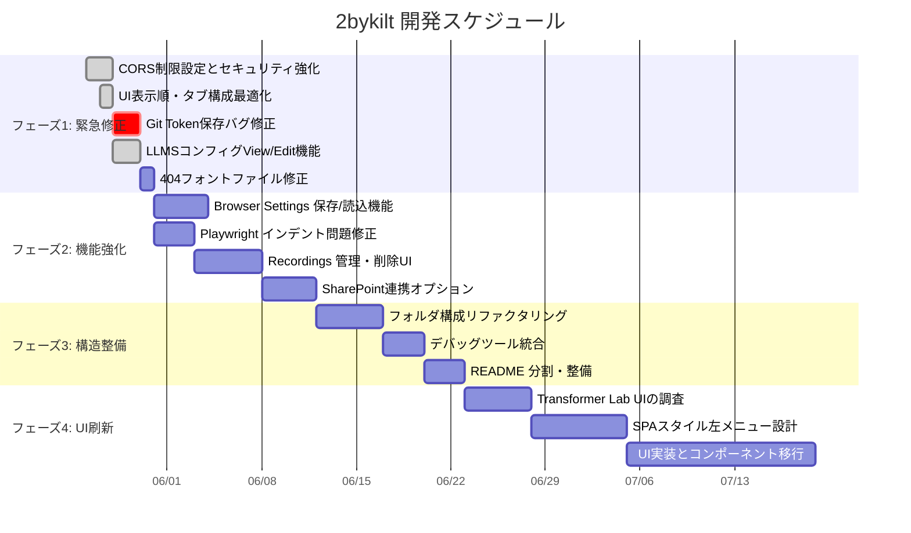
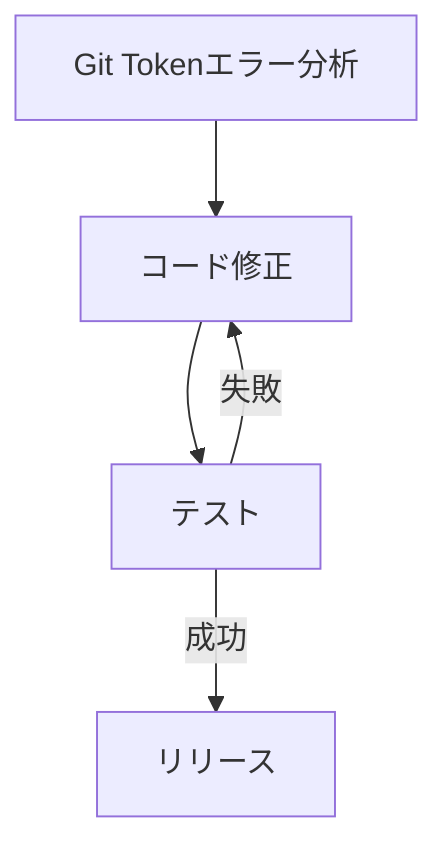
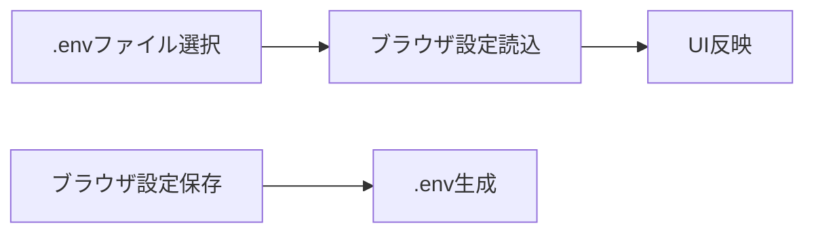
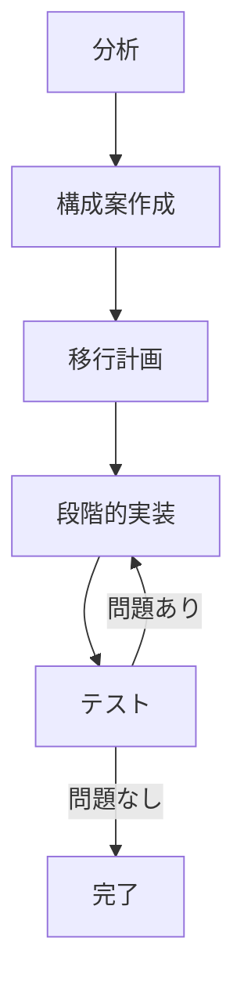
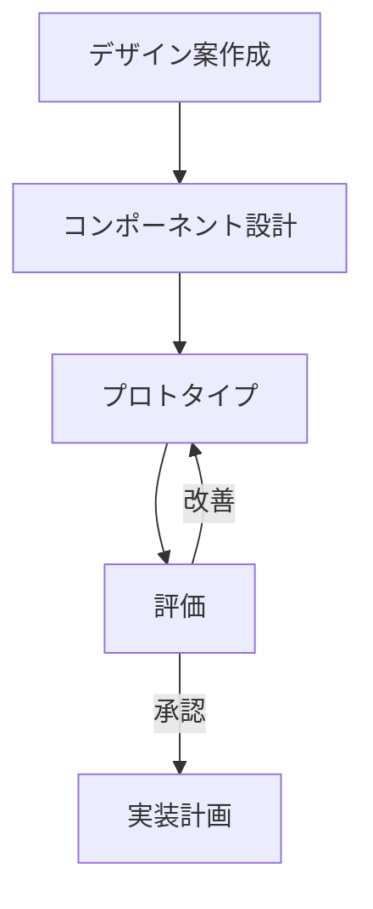

# 2bykilt 開発ロードマップ（2025年5月〜7月）

## 1. 現状分析と開発方針

現在の 2bykilt は基本機能が実装されており、ビジネスニーズに応える最小機能が整備されつつありますが、UI/UX の改善やバグ修正、機能拡張が必要な状況です。開発方針として、**まず既存の問題を解決し、段階的に機能を拡張、最終的に大規模な UI/UX 刷新を検討**する流れで進めます。

## 2. 開発フェーズとスケジュール

## 3. フェーズ別の詳細実装計画

### フェーズ1: 緊急修正（〜6/5、約1.5週間）

#### 3.1.1 Git Token バグ修正（優先度: 🔴高）

- エラー内容：`Error - tuple index out of range` 
- 原因：保存処理に渡される引数の数とタプルのインデックス不一致
- 修正：コールバック関数の引数チェックと処理の適切化

#### 3.1.2 LLMS Config View/Edit 機能（優先度: 🟡中）[完了済]

- View/Edit 二段構成の実装
- リアルタイム更新通知機能

#### 3.1.3 404フォントファイル修正（優先度: 🟢低）

- 不要なフォントリクエストを除去するために CSS クリーンアップ
- もしくは必要なフォントを適切に配置

### フェーズ2: 機能強化（6/6〜6/20、約2週間）

#### 3.2.1 Browser Settings の保存/読込機能（優先度: 🔴高）

- Profile 名を付けて保存
- .env ファイルからの設定読み込み

#### 3.2.2 Recordings 管理/削除機能（優先度: 🟡中）

- ファイル一覧表示と削除ボタン
- バックアップ確認機能（削除前チェック）
- SharePoint 連携オプション（MS Graph API 利用）

#### 3.2.3 Playwright インデント問題修正（優先度: 🟡中）

- スクリプト生成時の Python フォーマッティング適用
- 拡張子問題の修正（.py → なし or .yaml）

### フェーズ3: 構造整備（6/21〜7/5、約2週間）

#### 3.3.1 フォルダ構造リファクタリング（優先度: 🟡中）

- Root ディレクトリのクリーンアップ
- src 構造の整理
- コンポーネント分割の徹底

#### 3.3.2 デバッグツール統合（優先度: 🟢低）

- debug_bykilt.py/debug_bykilt2.py の統合
- CLI と GUI モードの両立
- ユースケース別ヘルプの提供

#### 3.3.3 README 整備（優先度: 🟡中）

- ビジネス向けインストール/使用説明（先頭に配置）
- 魔法/ドラクエテイストのセクションを別途保持
- スクリーンショットや図解の追加

### フェーズ4: UI刷新（7/6〜、約4週間+）

#### 3.4.1 Transformer Lab UI の調査（優先度: 🟢低）

- コード構造分析
- 採用技術の検証
- 移行可能性評価

#### 3.4.2 SPA スタイル UI 設計（優先度: 🟢低）

- 左メニューナビゲーション
- コンソールログ表示領域
- ダークモード対応

## 4. 工数見積もりと人員配置

| フェーズ | 工数（人日） | 必要スキル |
|---------|------------|-----------|
| フェーズ1 | 7人日 | Python, Gradio, FastAPI |
| フェーズ2 | 16人日 | Python, MS Graph API, Playwright |
| フェーズ3 | 11人日 | リファクタリング, ドキュメント |
| フェーズ4 | 26人日+ | React/Electron, UI/UX, Python |

**合計**: 約60人日（3ヶ月分、1人換算）

## 5. リスクと対策

1. **タイトなスケジュール**: フェーズごとに優先度を明確化し、必要に応じてスコープ調整
2. **技術スタック変更リスク**: フェーズ4は分離し、フェーズ1-3は既存技術でまず対応
3. **要件の変更**: 週次レビューと優先度再評価を実施

## 6. 次のステップ

- 本ロードマップの承認
- フェーズ1の詳細タスク分解と担当者アサイン
- 週次進捗レビューと調整の仕組み構築