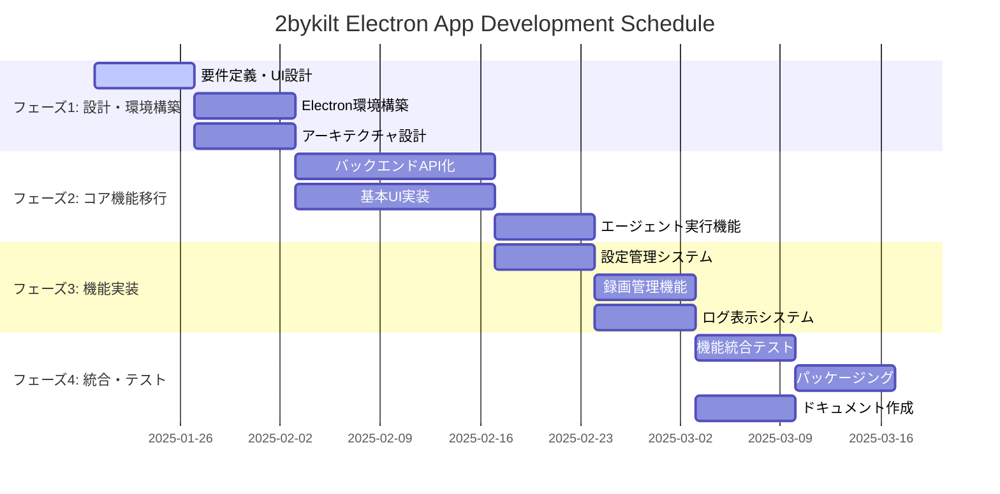
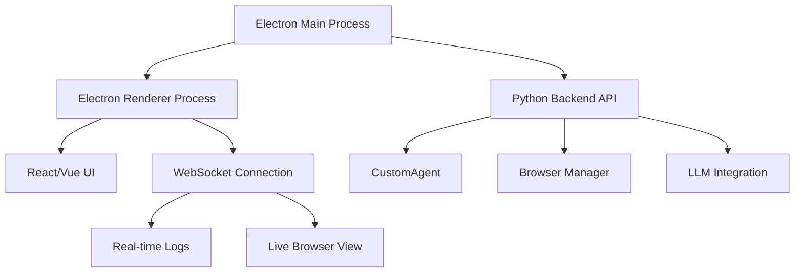

# 2bykilt UI/UX改善とElectronアプリ移行の開発スケジュール

## 概要

現在のGradio WebUIからElectronベースのデスクトップアプリケーションへの移行により、ユーザビリティとアクセシビリティを大幅に改善します。

## 現状分析

### 既存の問題点
- Gradio UIのビジネスユーザー向けUI/UXの限界
- Python/Git環境構築の複雑さによる利用障壁
- フォント404エラーなどの技術的問題
- タブベースUIの操作性の課題
- 設定保存機能の不具合

### 目指すべき方向性
- Transformer Lab / LM Studioライクなデスクトップアプリ
- ワンクリックインストール・起動
- SPA方式の直感的なUI
- リアルタイムログ表示
- 統合された設定管理

## 開発スケジュール（12週間）



## フェーズ別詳細計画

### フェーズ1: 設計・環境構築（3週間）

#### 週1: 要件定義・UI設計
- [ ] Transformer Labのソースコード分析
- [ ] 2bykiltの既存機能マッピング
- [ ] UI/UXワイヤーフレーム作成
- [ ] 技術スタック選定

**成果物:**
- UI/UX設計書
- 機能要件定義書
- 技術選定結果

#### 週2: Electron環境構築
- [ ] Electron + React/Vue.js セットアップ
- [ ] ビルドパイプライン構築
- [ ] 開発環境整備

#### 週3: アーキテクチャ設計
- [ ] フロントエンド・バックエンド分離設計
- [ ] API仕様設計
- [ ] データフロー設計



### フェーズ2: コア機能移行（4週間）

#### 週4-5: バックエンドAPI化
- [ ] bykilt.pyのAPI化
- [ ] FastAPI エンドポイント実装
- [ ] WebSocket通信実装
- [ ] エラーハンドリング強化

**主要API:**
```python
# 主要エンドポイント
POST /api/agent/run      # エージェント実行
GET  /api/config         # 設定取得
POST /api/config         # 設定保存
GET  /api/recordings     # 録画一覧
WS   /ws/logs           # リアルタイムログ
WS   /ws/browser        # ブラウザビュー
```

#### 週6-7: 基本UI実装
- [ ] メインレイアウト（サイドバー + メインエリア）
- [ ] エージェント実行画面
- [ ] 設定画面
- [ ] ナビゲーション実装

#### 週8: エージェント実行機能
- [ ] タスク実行UI
- [ ] リアルタイム結果表示
- [ ] 停止機能
- [ ] エラー表示

### フェーズ3: 機能実装（3週間）

#### 週9: 設定管理システム
- [ ] 統合設定管理
- [ ] LLM設定UI
- [ ] ブラウザ設定UI
- [ ] 設定保存・読込機能
- [ ] Git Token エラー修正

#### 週10: 録画管理機能
- [ ] 録画ファイル一覧表示
- [ ] 録画ファイル削除機能
- [ ] SharePoint連携オプション
- [ ] バックアップ確認機能

#### 週11: ログ表示システム
- [ ] リアルタイムログ表示
- [ ] ログレベル フィルタリング
- [ ] ログエクスポート機能
- [ ] 起動時ログ表示

### フェーズ4: 統合・テスト（2週間）

#### 週12: 機能統合テスト
- [ ] 全機能統合テスト
- [ ] パフォーマンステスト
- [ ] クロスプラットフォームテスト

#### 週13: パッケージング・リリース準備
- [ ] Electronアプリパッケージング
- [ ] インストーラー作成
- [ ] 自動更新機能実装

## 技術仕様

### フロントエンド
- **フレームワーク**: Electron + React/TypeScript
- **UI ライブラリ**: Ant Design / Material-UI
- **状態管理**: Redux Toolkit / Zustand
- **通信**: WebSocket + REST API

### バックエンド
- **既存**: Python FastAPI（bykilt.pyベース）
- **新機能**: WebSocket サーバー
- **API**: RESTful + リアルタイム通信

### パッケージング
- **ビルドツール**: electron-builder
- **配布**: GitHub Releases
- **自動更新**: electron-updater

## マイルストーン

| マイルストーン | 期日 | 主要成果物 |
|---|---|---|
| M1: 設計完了 | 3週目 | UI設計書、アーキテクチャ設計 |
| M2: MVP完成 | 8週目 | 基本機能動作するElectronアプリ |
| M3: 機能完成 | 11週目 | 全機能実装完了 |
| M4: リリース準備完了 | 13週目 | パッケージ化・ドキュメント完成 |

## リスク管理

### 高リスク項目
1. **Playwright統合の複雑さ**: Electronプロセス間でのPlaywright実行
2. **パフォーマンス**: リアルタイムログ・ブラウザビューの負荷
3. **クロスプラットフォーム対応**: Windows/Mac/Linux対応

### 対策
- 週次レビューでの進捗確認
- 技術検証の早期実施
- 段階的リリース（Alpha → Beta → Production）

## 予算・リソース

### 開発リソース
- フロントエンド開発者: 1名（13週間）
- バックエンド統合: 1名（8週間）
- UI/UXデザイナー: 1名（3週間）

### 開発ツール
- Figma（UI設計）
- GitHub Actions（CI/CD）
- Electron Forge（開発環境）

---

**次のステップ**: このスケジュールについてご確認いただき、開始タイミングと優先機能について合意形成を行います。