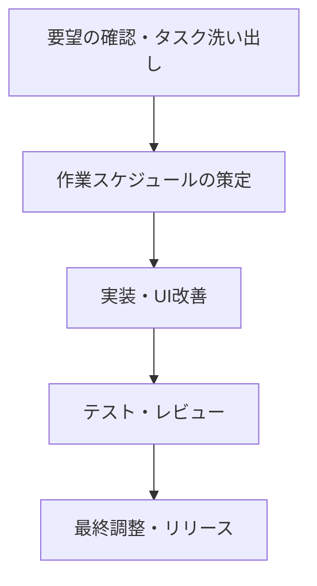

# UI/UX改善と機能追加の開発スケジュール

## 1. 全体概要
- **目標**: 記載された要望を効率的に実装し、既存問題の修正とUI/UXの大幅改善を行う  
- **言語**: Python  
- **想定工数**: 約3～4週間（初期見積もり）

## 2. フェーズ別概要

1. **要件整理 (約1日)**
   - 現在の実装範囲と課題を整理  
   - 使用するフレームワークやWorkspace参照箇所を特定  

2. **スケジュール策定 (約1日)**
   - `./roadmap/2bykilt-ui-ux-improvement-development-schedule.md` などで詳細な計画策定  
   - メニュー構成、SPA化、ログ表示仕様などを決定  

3. **UI/UX改善 (約1週間)**
   - SPA化対応（左側メニュー、不要なタブ削除等）  
   - 不要フォントの削除や404エラー修正  

4. **各機能修正・追加 (約1週間)**
   - `Configuration`の保存先明確化と`Git Token`エラー修正  
   - `Recordings`管理機能とSharePoint保存オプション  
   - `Playwright Codegen`段落のインデントや拡張子バグ修正  

5. **LLM統合の可否分岐 (約3日)**
   - LLM/SML連携機能のオン・オフ管理  
   - 不要機能(`Use LM Studio compatible endpoints`)の削除  

6. **フォルダ構成とドキュメント整理 (約3日)**
   - `debug_*.py`リネームと整理  
   - 主要ファイル数削減、README.mdをビジネス向けに再構成  

7. **テスト・レビュー (約1週間)**
   - 単体テスト・動作確認  
   - クライアントへの動作確認と許諾取得  

8. **最終調整・リリース (約2日)**
   - 運用開始用のデプロイ  
   - 利用ガイドやリリースノートの作成  

## 3. 今後の運用
- 作業進捗に伴って`./roadmap/2bykilt-ui-ux-improvement-development-schedule.md`を随時更新  
- ユーザーの許諾ポイントを合意しながら進行  
- 新たな要件や変更点も適宜反映し総合的にアップデート  

