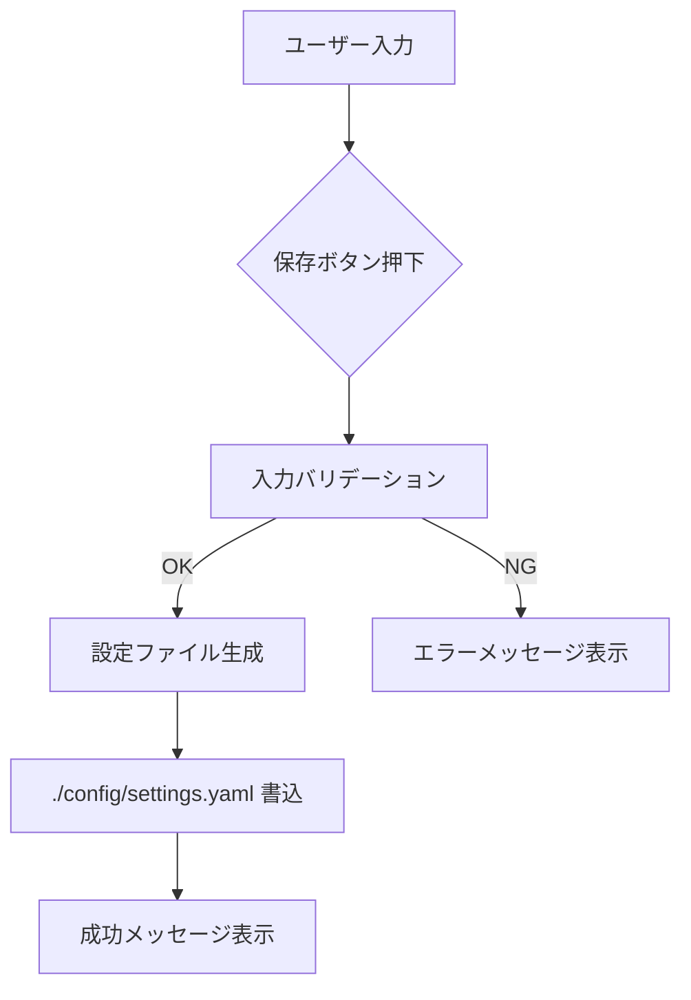

# 2bykilt UI/UX 大幅改善 開発スケジュール見積もり

以下は「UI/UX の大幅な改善・改良」要望を効率的かつ最適化された形で実装するためのロードマップです。  
各フェーズごとに期間とゴール、必要なアウトプットを示します。

---

## 全体スケジュール（約6週間）

| フェーズ                  | 期間       | 主なタスク・成果物                              |
|---------------------------|------------|-------------------------------------------------|
| 1. 調査・要件定義         | Week 1     | - 既存UIの課題整理、Transformer Lab 参照 - 機能優先度リストアップ  |
| 2. アーキテクチャ設計     | Week 2     | - SPA 基盤選定（React/Vue/Svelte 等） - 左側メニュー構成設計 - ログ表示 UI モックアップ |
| 3. 静的リソース修正       | Week 3 前半 | - フォントディレクトリ構成と404対応修正 - `static/fonts` のクリーンアップ |
| 4. 設定/記録管理機能実装  | Week 3 後半～4 | - Configuration 保存先明確化 & UI 完成 - Recordings 管理機能（一覧・削除・SharePoint連携オプション） |
| 5. LLM 統合オプション整備 | Week 5     | - “LLM 統合なし” モード追加 - LM Studio 互換エンドポイント削除 |
| 6. Playwright Codegen 修正| Week 5     | - インデントエラー解消 - llms.txt 自動登録時の拡張子除去 |
| 7. リポジトリ＆デバッグ整理| Week 6 前半 | - フォルダ構成見直し - `debug_bykilt.py` → `debug-tool.py` 等リネーム - 新デバッグツール導線整備 |
| 8. README＆ドキュメント整備| Week 6 後半 | - ビジネス向け手順まとめ - 魔法要素の分離・魅力維持 - 各機能フロー図（Mermaid）追加 |
| 9. テスト・レビュー・リリース| 追加予備週 | - E2E テスト - UI/UX レビュー - バージョンリリース準備 |

---

## フロー例：Configuration 保存処理

---

## 各フェーズ詳細

### 1. 調査・要件定義（1週間）
- 既存 [01_gradioウェブUI](tutorial/output/jp/2bykilt/01_gradioウェブui_.md) の課題抽出  
- Transformer Lab ソースレビュー  
- 最終版モックアップ成果物：要件定義書（Markdown）

### 2. アーキテクチャ設計（1週間）
- SPA フレームワーク選定＋プロジェクト構造  
- 左側メニュー/アイコン ナビゲーション設計  
- ログパネル UI モック  

### 3. 静的リソース修正（0.5週間）
- [`bykilt.py`](bykilt.py) のフォント生成ロジック整理  
- `assets/fonts` ディレクトリ再構築  
- 404 が出ない状態を確認  

### 4. 設定/記録管理機能実装（1.5週間）
- Configuration 保存先を明確化 & UI側実装  
- Git Token エラー (`tuple index out of range`) 対応  
- Recordings：一覧取得・削除・SharePoint オプション  

### 5. LLM 統合オプション整備（1週間）
- “LLM 統合なし” モード追加（設定画面切替）  
- OpenAI 初期値見直し  
- LM Studio 互換エンドポイント削除  

### 6. Playwright Codegen 修正（0.5週間）
- 自動生成スクリプトのインデント修正  
- llms.txt 登録時の拡張子 `.py` 除去  

### 7. リポジトリ＆デバッグ整理（0.5週間）
- ルートファイル整理（README.md 表示性向上）  
- `debug_bykilt.py` → `debug-tool.py` 等にリネーム  
- 新デバッグツールUX作成  

### 8. README＆ドキュメント整備（0.5週間）
- ビジネス向け手順を明示  
- ドラクエ魔法要素の維持と分離  
- Mermaid 図の追加による理解促進  

### 9. テスト・レビュー・リリース（予備1週間）
- UI/UX テストシナリオ作成・実施  
- コードレビューフィードバック反映  
- パッケージ・リリース作業  

---

> ※ 各フェーズの進捗に応じてスケジュールは随時更新します。  
> ※ ユーザー許諾が必要な箇所は都度コメントアウトで確認依頼を実施。  
> ※ 本スケジュールは「大筋合意」を得るための第一版です。
