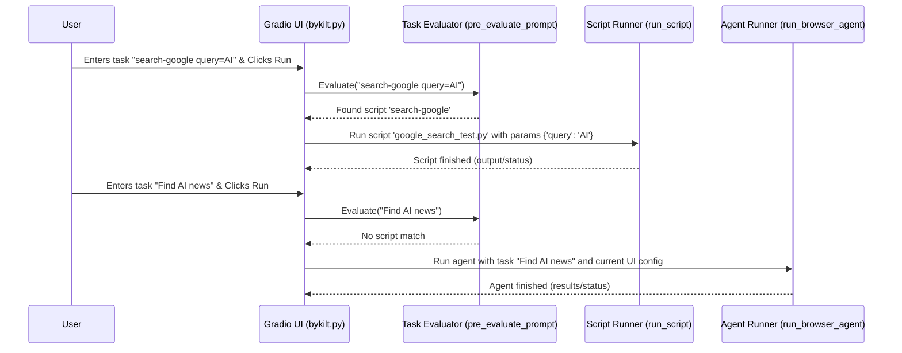

# Chapter 1: Task Definition & Configuration

Welcome to the `2bykilt` tutorial! Imagine you have a super helpful robot assistant that can use a web browser for you. Before it can do anything, you need to tell it two things:

1.  **What task** do you want it to do? (e.g., "Find the latest news about AI")
2.  **How** should it do it? (e.g., Use the Chrome browser? Should you see the browser window? Which AI brain should it use?)

This chapter explains how `2bykilt` handles these two crucial parts: defining the job (the **Task**) and setting up the tools and environment (the **Configuration**).

Let's use a simple goal as our example throughout this chapter: **"Search Google for the latest news about Artificial Intelligence."**

## What is a Task?

In `2bykilt`, a "Task" is simply the instruction you give the system. It tells the AI agent *what* you want to achieve. There are two main ways to define a task:

### 1. Natural Language Instructions (Via the UI)

This is the most straightforward way. You just type what you want the agent to do directly into the "Task Description" box in the user interface (UI).

For our example, you would type something like:

```
Search Google for the latest news about Artificial Intelligence.
```

The AI agent, powered by a Large Language Model (LLM), will read this instruction and try its best to understand and execute it using the web browser. This is flexible and great for unique or one-off tasks.

### 2. Predefined Scripts (`llms.txt`)

Sometimes, you might have a task you want to run repeatedly, perhaps with slight variations. `2bykilt` allows you to define these common tasks as "scripts". These scripts are defined in a special file called `llms.txt`.

Think of `llms.txt` as a menu of pre-packaged commands. Each command has a name, points to a specific script file (usually a `pytest` script for automated testing), and might accept parameters.

Here's a tiny peek at what an entry in `llms.txt` might look like (simplified):

```yaml
# Inside llms.txt
actions:
  - name: search-google # The name you use in the UI
    script: google_search_test.py # The actual script file to run
    params: query # Defines 'query' as a parameter
    slowmo: 500 # Optional: Slow down execution (milliseconds)
```

To run this predefined script, you would type its name and any parameters into the "Task Description" box in the UI, like this:

```
search-google query=latest_AI_news
```

When `2bykilt` sees a task description like this, it first checks if it matches any `name` defined in `llms.txt`. If it finds a match (like `search-google`), it won't send the instruction to the AI. Instead, it will run the specified script (`google_search_test.py` in this case) and pass the parameter (`query=latest_AI_news`) to it. This is useful for automating routine browser tasks reliably.

*How it checks:* The `pre_evaluate_prompt` function in `bykilt.py` looks at your input. If it finds a name from `llms.txt` and any required parameters, it triggers the script execution.

```python
# Simplified from bykilt.py
def pre_evaluate_prompt(prompt):
    try:
        # 1. Fetch content from llms.txt (local or URL)
        content = fetch_llms_txt(prompt)
        # 2. Parse the actions defined in the file
        actions = parse_llms_txt(content)
        # 3. Check if the prompt text contains an action name
        for action in actions:
            if action.get('name') in prompt:
                return action # Found a matching script!
        return None # No script match, treat as natural language task
    except Exception as e:
        print(f"Error checking for scripts: {e}")
        return None
```

This code tries to find `llms.txt`, reads the defined actions, and checks if your typed task contains the name of one of those actions.

## What is Configuration?

Configuration is like setting up your workspace and tools before starting a project. It involves all the settings that control *how* the agent and the browser operate. You need to configure things so the agent works the way you want it to.

Key configuration areas include:

*   **LLM Settings:** Which AI model should the agent use (e.g., `gpt-4o`, a local Ollama model)? What's its API key? How creative should it be (temperature)?
*   **Browser Settings:** Should the browser window be visible (`headless=False`) or hidden (`headless=True`)? What size should the window be? Should it use your existing Chrome profile (`use_own_browser`)? Should the browser stay open after the task (`keep_browser_open`)?
*   **Saving Settings:** Where should recordings of the browser session be saved? What about detailed logs (traces) or the agent's step-by-step history?

### How Configuration is Managed

`2bykilt` offers several ways to manage these settings, applied in a specific order of priority:

1.  **Defaults (Lowest Priority):** The system starts with a set of sensible default settings. These are defined in `src/utils/default_config_settings.py`.

    ```python
    # Simplified from src/utils/default_config_settings.py
    def default_config():
        """Prepare the default configuration"""
        return {
            "agent_type": "custom",
            "max_steps": 100,
            "llm_provider": "openai",
            "llm_model_name": "gpt-4o",
            "headless": False, # Browser window is visible by default
            "enable_recording": True, # Recording is on by default
            "save_recording_path": "./tmp/record_videos",
            # ... other default settings ...
        }
    ```
    This function just returns a dictionary with standard starting values.

2.  **Environment Variables:** You can override defaults using environment variables, often set in a `.env` file in the project directory. This is common for sensitive information like API keys. `2bykilt` uses `python-dotenv` to load these. Special variables starting with `$SENSITIVE_` in the task description are also replaced by their environment variable values (useful for passing secrets without typing them directly in the UI).

    ```python
    # Simplified from bykilt.py / webui.py
    from dotenv import load_dotenv
    load_dotenv() # Loads variables from .env file

    # ---

    # Example of resolving sensitive variables
    def resolve_sensitive_env_variables(text):
        import re, os
        # Finds patterns like $SENSITIVE_MY_API_KEY
        env_vars = re.findall(r'\$SENSITIVE_[A-Za-z0-9_]*', text)
        result = text
        for var in env_vars:
            env_name = var[1:] # Get 'SENSITIVE_MY_API_KEY'
            env_value = os.getenv(env_name) # Read from environment
            if env_value is not None:
                result = result.replace(var, env_value) # Replace placeholder
        return result

    # ---

    # Example Usage later when running the task
    # task_input = "Login using username $SENSITIVE_USERNAME and password $SENSITIVE_PASSWORD"
    # resolved_task = resolve_sensitive_env_variables(task_input)
    # # resolved_task might become: "Login using username myuser and password mysecret123"
    ```

3.  **UI Settings / Config Files (Highest Priority):** The settings you adjust directly in the `2bykilt` web interface tabs ("Agent Settings", "LLM Configuration", "Browser Settings") have the final say. You can also save your current UI settings into a `.pkl` file and load them back later using the "Configuration" tab. This makes it easy to switch between different setups.

    *   **Saving:** The `save_current_config` function gathers all settings from the UI elements and saves them to a `.pkl` file using `save_config_to_file`.
    *   **Loading:** The `load_config_from_file` function reads a `.pkl` file, and `update_ui_from_config` takes these loaded settings and updates all the corresponding UI elements.

    ```python
    # Simplified from src/utils/default_config_settings.py
    import pickle
    import os
    import uuid

    def save_config_to_file(settings, save_dir="./tmp/webui_settings"):
        """Save the current settings to a UUID.pkl file."""
        os.makedirs(save_dir, exist_ok=True)
        config_file = os.path.join(save_dir, f"{uuid.uuid4()}.pkl")
        with open(config_file, 'wb') as f:
            pickle.dump(settings, f) # Use pickle to save the dictionary
        return f"Configuration saved to {config_file}"

    def load_config_from_file(config_file_path):
        """Load settings from a .pkl file."""
        try:
            with open(config_file_path, 'rb') as f:
                settings = pickle.load(f) # Use pickle to load
            return settings
        except Exception as e:
            # Handle errors like file not found or invalid format
            return f"Error loading configuration: {str(e)}"
    ```

## Tying it Together: Our Example

Let's revisit our task: **"Search Google for the latest news about Artificial Intelligence."**

1.  **Define the Task:** You type the sentence above into the "Task Description" box in the "Run Agent" tab of the UI.
2.  **Configure:**
    *   In the "LLM Configuration" tab, you might choose `gpt-4o` as the model.
    *   In the "Browser Settings" tab, you ensure `Headless Mode` is unchecked (so you can see the browser) and `Enable Recording` is checked. You might also set the `Recording Path`.
    *   Maybe you save these settings to a file named `my_news_search_config.pkl` using the "Configuration" tab for next time.
3.  **Run:** You click the "▶️ Run Agent" button.

`2bykilt` now takes your task ("Search Google...") and all your chosen configurations (use `gpt-4o`, show the browser, record it, etc.). It passes this information to the core agent logic.

## Under the Hood: A Quick Look

What happens right after you click "Run"?

**1. Task Evaluation:**

*   The system first checks if your task matches a predefined script in `llms.txt` using `pre_evaluate_prompt`.
*   For our example "Search Google...", it likely won't match a script name.
*   If it *did* match a script (e.g., `search-google query=...`), the flow would divert to run that specific script.



**2. Configuration Gathering:**

*   The `run_with_stream` function (which handles running the agent and showing live updates) gathers all the settings from the UI components (LLM choice, headless state, save paths, etc.).
*   These settings, along with the task description, are passed as arguments to the appropriate agent execution function (`run_org_agent` or `run_custom_agent`).

```python
# Simplified from bykilt.py - showing how settings are passed

# User clicks Run, this function is called eventually
async def run_with_stream(
    # Parameters below are filled from UI widgets
    agent_type, llm_provider, llm_model_name, # ... many config values ...
    headless, save_recording_path, enable_recording, task, # ... etc.
    # ... other parameters ...
):
    # ... (logic for streaming view) ...

    # It calls the main agent runner function
    result = await run_browser_agent(
        agent_type=agent_type,
        llm_provider=llm_provider,
        llm_model_name=llm_model_name,
        # ... passing all the config values ...
        headless=headless,
        save_recording_path=save_recording_path if enable_recording else None,
        task=task,
        # ... etc ...
    )
    # ... (yield results) ...
```

This ensures the agent operates exactly according to the parameters you've set.

## Conclusion

You've learned the first crucial step in using `2bykilt`: telling it **what** to do (Task Definition) and **how** to do it (Configuration).

*   **Tasks** can be simple natural language instructions or predefined scripts from `llms.txt`.
*   **Configuration** involves setting up the LLM, browser behavior, and saving options, managed through defaults, environment variables, and UI settings (which can be saved/loaded).

Now that you know how to instruct `2bykilt` and set up its environment, the next step is to understand how the agent actually starts carrying out your instructions.

Ready to see the agent in action? Let's move on to [Chapter 2: Agent Execution (Org/Custom)](02_agent_execution__org_custom__.md).

---

Generated by [AI Codebase Knowledge Builder](https://github.com/The-Pocket/Tutorial-Codebase-Knowledge)