# Chapter 2: Agent Execution (Org/Custom)

Welcome back! In [Chapter 1: Task Definition & Configuration](01_task_definition___configuration_.md), you learned how to tell `2bykilt` *what* you want it to do (the task) and *how* it should prepare itself (the configuration). Now, let's dive into the heart of the operation: how the agent actually *executes* your task.

## What's the "Agent"? The Driver in the Car

Imagine you've told your robot assistant: "Search Google for the latest news about Artificial Intelligence" and given it the keys to a web browser. The "Agent Execution" component is like the robot actually getting into the driver's seat, starting the engine, and beginning the journey.

This component is the **core engine** that performs the task. It's responsible for a continuous cycle:

1.  **👀 Observe:** Look at the current state of the web page (what's visible, what buttons are there, etc.).
2.  **🤔 Think:** Send this observation, along with your original task instructions, to a Large Language Model (LLM) – the AI "brain". Ask the LLM, "Based on the goal and what I see now, what browser action should I take next?" (e.g., "Type 'latest AI news' into the search bar").
3.  **🎬 Act:** Execute the action suggested by the LLM (e.g., actually type into the search bar and press Enter).
4.  **🔁 Repeat:** Go back to step 1, observe the results of the action (the Google search results page), and decide the next step, continuing until the task is complete or it hits a limit.

This Observe-Think-Act loop is the fundamental process of how the agent interacts with the web browser to achieve your goal.

## Two Flavors of Drivers: `org` vs. `custom`

`2bykilt` offers two types of agent execution engines, like having two different drivers for your car:

1.  **`org` (Original Agent):**
    *   This is the standard agent implementation provided by the underlying `browser-use` library that `2bykilt` builds upon.
    *   Think of it as the **factory-standard driver**. It knows the basic rules of the road and how to operate the car (browser). It uses the standard prompts and logic from the library.
    *   It's reliable and represents the baseline functionality.

2.  **`custom` (Custom Agent):**
    *   This is a version **specifically enhanced for `2bykilt`**.
    *   Think of this as a **custom-tuned driver** who has received extra training and special instructions (custom prompts) tailored for potentially better performance or handling specific scenarios more effectively within the `2bykilt` framework.
    *   It uses custom logic, potentially different ways of communicating with the LLM (see [Chapter 3: LLM Communication & Prompts](03_llm_communication___prompts_.md)), and interacts with other custom components like the `CustomController` (see [Chapter 4: Action Execution (Controller)](04_action_execution__controller_.md)).
    *   **This is generally the recommended agent type to start with in `2bykilt`**, as it incorporates project-specific improvements.

## How Do You Choose the Agent Type?

Selecting the agent type is straightforward. You do it directly in the `2bykilt` user interface:

1.  Go to the **"⚙️ Agent Settings"** tab.
2.  You'll see a "Agent Type" option with two choices: `org` and `custom`.
3.  Simply click the radio button for the agent type you want to use before running your task.

```
[UI Screenshot Placeholder: Show the "Agent Settings" tab with the "Agent Type" radio button highlighted, perhaps with 'custom' selected.]
```

*   **When to use `custom`?** Most of the time. It's the default and includes `2bykilt`'s enhancements.
*   **When to use `org`?** Maybe for debugging, comparing behavior, or if you suspect a custom enhancement is causing an issue with a specific task.

Once you've selected the agent type, defined your task, and adjusted your configurations, you hit the "▶️ Run Agent" button.

## Under the Hood: How is the Agent Chosen and Run?

When you click "Run Agent", several things happen behind the scenes to kick off the chosen agent:

1.  **Gather Information:** The main script (`bykilt.py`) collects your task description and all the settings you've configured in the UI, including the `agent_type` you selected (`org` or `custom`).
2.  **Check for Scripts:** As mentioned in Chapter 1, it first checks if your task matches a predefined script in `llms.txt`. If it does, the script runs instead of the agent. If not, it proceeds to run the selected agent.
3.  **Call the Main Runner:** The `run_with_stream` function calls `run_browser_agent`, passing along the task and all configuration settings.
4.  **Select the Agent Path:** Inside `run_browser_agent`, the code looks at the `agent_type` parameter.
    *   If `agent_type` is `"org"`, it calls the `run_org_agent` function.
    *   If `agent_type` is `"custom"`, it calls the `run_custom_agent` function.
5.  **Initialize and Run:** The specific function (`run_org_agent` or `run_custom_agent`) then takes over. It sets up the necessary browser components (like the browser window controller described in [Chapter 5: Browser Control (Wrapper around Playwright)](05_browser_control__wrapper_around_playwright_.md)) and creates an instance of the chosen agent (`Agent` for `org`, `CustomAgent` for `custom`). Finally, it calls the agent's `.run()` method, which starts the Observe-Think-Act loop.

Here's a simplified diagram showing this flow:

```mermaid
sequenceDiagram
    participant User
    participant UI as Gradio UI (bykilt.py)
    participant MainRunner as run_browser_agent
    participant OrgRunner as run_org_agent
    participant CustomRunner as run_custom_agent
    participant ActualAgent as Agent / CustomAgent

    User->>UI: Clicks "▶️ Run Agent"
    UI->>MainRunner: Call run_browser_agent(task, config with agent_type)
    MainRunner->>MainRunner: Check config['agent_type']
    alt agent_type is 'org'
        MainRunner->>OrgRunner: Call run_org_agent(task, config)
        OrgRunner->>ActualAgent: Create Agent(...)
        OrgRunner->>ActualAgent: Call agent.run()
        ActualAgent-->>OrgRunner: Return results (history)
        OrgRunner-->>MainRunner: Return results
    else agent_type is 'custom'
        MainRunner->>CustomRunner: Call run_custom_agent(task, config)
        CustomRunner->>ActualAgent: Create CustomAgent(...)
        CustomRunner->>ActualAgent: Call agent.run()
        ActualAgent-->>CustomRunner: Return results (history)
        CustomRunner-->>MainRunner: Return results
    end
    MainRunner-->>UI: Display final results
```



### Code Glimpse: Choosing the Path

Let's look at a simplified piece of the `run_browser_agent` function in `bykilt.py` that makes this choice:

```python
# Simplified from bykilt.py
async def run_browser_agent(
    agent_type, # This comes from the UI selection ('org' or 'custom')
    # ... other parameters like llm, task, headless, etc. ...
):
    # ... (setup code like checking for scripts) ...

    # --- The Key Decision ---
    if agent_type == "org":
        # Call the function to run the original agent
        final_result, errors, ..., history_file = await run_org_agent(
            llm=llm, task=task, # ... pass necessary config ...
        )
    elif agent_type == "custom":
        # Call the function to run the custom agent
        final_result, errors, ..., history_file = await run_custom_agent(
            llm=llm, task=task, add_infos=add_infos, # ... pass config ...
        )
    else:
        raise ValueError(f"Invalid agent type: {agent_type}")

    # ... (code to find recording file, format results) ...

    return (final_result, errors, ..., history_file)
```

This code snippet clearly shows how the `agent_type` variable directs the program to call either `run_org_agent` or `run_custom_agent`.

### Code Glimpse: Running the Specific Agent

Now, let's peek inside the `run_custom_agent` function (the `run_org_agent` is very similar but uses the original `Agent` and `Browser` classes):

```python
# Simplified from bykilt.py
async def run_custom_agent(
        llm, task, add_infos, use_vision, headless, # ... other config ...
        save_agent_history_path, # ... etc.
):
    global _global_browser, _global_browser_context, _global_agent
    try:
        # 1. Setup Browser (using CustomBrowser) - Chapter 5 detail
        if _global_browser is None:
            _global_browser = CustomBrowser(config=...) # Sets up headless, etc.

        # 2. Setup Browser Context (using CustomBrowserContext) - Chapter 5 detail
        if _global_browser_context is None:
            _global_browser_context = await _global_browser.new_context(config=...) # Sets up recording, traces

        # 3. Create the Custom Agent Instance!
        controller = CustomController() # Chapter 4 detail
        if _global_agent is None:
             _global_agent = CustomAgent(
                 task=task,
                 add_infos=add_infos, # Extra info for custom agent
                 llm=llm,             # The AI brain - Chapter 3 detail
                 browser=_global_browser,
                 browser_context=_global_browser_context,
                 controller=controller, # Action executor - Chapter 4 detail
                 system_prompt_class=CustomSystemPrompt, # Custom instructions - Chapter 3
                 agent_prompt_class=CustomAgentMessagePrompt, # Custom instructions - Chapter 3
                 # ... other settings like use_vision, max_actions_per_step ...
             )

        # 4. RUN the agent's Observe-Think-Act loop
        history = await _global_agent.run(max_steps=max_steps) # Max steps from config

        # 5. Save results and return
        history_file = os.path.join(save_agent_history_path, f"{_global_agent.agent_id}.json")
        _global_agent.save_history(history_file)
        # ... extract final result, errors, thoughts from history ...
        return final_result, errors, model_actions, model_thoughts, trace_file, history_file

    except Exception as e:
        # ... handle errors ...
    finally:
        _global_agent = None # Clear agent for next run
        # ... potentially close browser if not keeping it open ...

```

This shows the core steps: setting up the browser environment, creating the specific `CustomAgent` with all its tools (LLM, Controller, Prompts), and then calling `.run()` to start the actual task execution loop. The details of how the LLM is prompted and how actions are executed are covered in the next chapters.

## Conclusion

You've now learned about the "Agent Execution" component – the engine that drives the browser based on your instructions.

*   It operates in an **Observe-Think-Act** cycle.
*   There are two types: **`org`** (standard) and **`custom`** (enhanced for `2bykilt`).
*   You select the agent type in the UI's **"Agent Settings"** tab.
*   Behind the scenes, `2bykilt` calls the appropriate function (`run_org_agent` or `run_custom_agent`) to initialize and run the selected agent.

The agent relies heavily on the Large Language Model (LLM) to decide *what* to do next. How does that communication work? What kind of instructions (prompts) does the agent give the LLM?

Let's explore that in [Chapter 3: LLM Communication & Prompts](03_llm_communication___prompts_.md).

---

Generated by [AI Codebase Knowledge Builder](https://github.com/The-Pocket/Tutorial-Codebase-Knowledge)