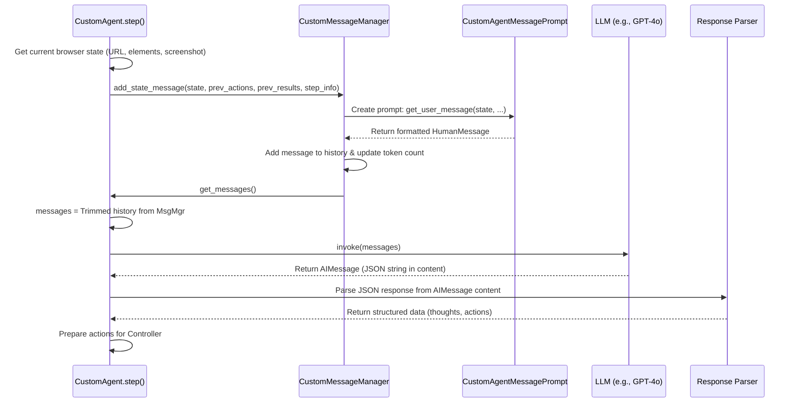

# Chapter 3: LLM Communication & Prompts

In [Chapter 2: Agent Execution (Org/Custom)](02_agent_execution__org_custom__.md), we saw how the agent starts running and follows the Observe-Think-Act cycle. But how does the "Think" part actually work? How does the agent decide what to do next? That's where the Large Language Model (LLM) comes in!

Imagine the LLM as the agent's "brain". This chapter explains how `2bykilt` communicates with this brain to figure out the next steps in completing your task.

Let's stick with our example: **"Search Google for the latest news about Artificial Intelligence."** How does the agent know to type "latest news about Artificial Intelligence" into the search bar and click the search button? It asks the LLM!

## The Agent Needs a Brain: The LLM

The agent itself is good at *doing* things in the browser (clicking, typing), but it doesn't inherently *understand* your high-level goal (like "find news"). It needs an intelligent component to translate your task and the current situation on the web page into concrete browser actions. This intelligent component is the LLM.

Communicating effectively with the LLM is crucial. We need to:

1.  **Choose the right brain:** Select an LLM provider (like OpenAI, Google, Anthropic, or a local one like Ollama) and a specific model (like `gpt-4o` or `llama3`).
2.  **Speak its language:** Format the information about the task and the current browser state into a "prompt" that the LLM can understand.
3.  **Get the instructions:** Send the prompt to the LLM and understand the response, which tells the agent what actions to take next.
4.  **Keep track of the conversation:** Manage the history of messages sent to the LLM so it has context.

## Choosing Your LLM: The AI Provider and Model

Just like you might choose different tools for different jobs, you can choose different LLMs for your agent. Some might be faster, some might be better at understanding complex tasks, and some might be cheaper to use.

You select the LLM provider and model in the **"🔧 LLM Configuration"** tab in the `2bykilt` UI, as mentioned in [Chapter 1: Task Definition & Configuration](01_task_definition___configuration_.md).

*   **Provider:** OpenAI, Anthropic, Google, Ollama (for local models), etc.
*   **Model Name:** `gpt-4o`, `claude-3-opus-20240229`, `llama3`, etc.
*   **Other Settings:** API Keys, Temperature (creativity), Base URL (for local models).

### Under the Hood: Getting the Model Ready

When you run the agent, `2bykilt` uses the settings from the UI to create the connection to the chosen LLM. The `get_llm_model` function in `src/utils/llm.py` handles this.

```python
# Simplified from src/utils/llm.py
from langchain_openai import ChatOpenAI
from langchain_ollama import ChatOllama
# ... other imports

def get_llm_model(provider: str, **kwargs):
    """Gets the right LangChain LLM model object based on provider"""
    api_key = kwargs.get("api_key") # Get API key from UI/env
    model_name = kwargs.get("model_name")
    temperature = kwargs.get("temperature", 0.0)
    base_url = kwargs.get("base_url") # Important for Ollama/local

    if provider == "openai":
        return ChatOpenAI(model=model_name, temperature=temperature, api_key=api_key, base_url=base_url)
    elif provider == "ollama":
        # Note: Ollama doesn't need an API key
        return ChatOllama(model=model_name, temperature=temperature, base_url=base_url)
    # ... other providers like Anthropic, Google ...
    else:
        raise ValueError(f"Unsupported provider: {provider}")
```

This code simply checks the `provider` you selected and creates the corresponding LangChain object (like `ChatOpenAI` or `ChatOllama`) with your settings, ready to be used by the agent.

## Prompts: Giving Instructions to the LLM

A "prompt" is the text message we send to the LLM. Think of it like giving detailed instructions to a very smart, but very literal, assistant who has amnesia and needs to be reminded of everything *every single time* you ask them to do something.

The prompt needs to contain all the information the LLM needs to make a good decision:

*   The overall goal (your original task).
*   The rules the agent must follow.
*   What the browser window currently looks like (URL, visible elements).
*   What happened in the previous steps (actions taken, errors encountered).
*   Any memory or important information gathered so far.

`2bykilt` uses specific classes to structure these prompts, especially when using the `custom` agent type:

### 1. The `SystemPrompt`: Setting the Ground Rules

This is like the initial briefing you give your assistant. It defines the agent's overall personality, capabilities, rules, and crucially, the **format** it MUST use to reply. It's sent only once at the very beginning of the conversation.

The `CustomSystemPrompt` class (in `src/agent/custom_prompts.py`) provides these rules for the `custom` agent.

```python
# Simplified from src/agent/custom_prompts.py - CustomSystemPrompt

class CustomSystemPrompt(SystemPrompt):
    def important_rules(self) -> str:
        """Defines the core rules for the LLM agent."""
        return r"""
1. RESPONSE FORMAT: You must ALWAYS respond with valid JSON in this exact format:
   {
     "current_state": {
       "prev_action_evaluation": "Success|Failed|Unknown - Was the last action successful?",
       "important_contents": "Key info seen on the page relevant to the task.",
       "task_progress": "What parts of the task are done?",
       "future_plans": "What needs to be done next?",
       "thought": "Your reasoning for the next action(s).",
       "summary": "Brief summary of the next action(s)."
     },
     "action": [
       { "action_name": { "parameter": "value" } },
       // More actions if needed...
     ]
   }

2. ACTIONS: You can list multiple actions. Use the available tools (like click, type, scroll, done).

3. ELEMENT INTERACTION: Use the numeric index provided for elements (e.g., [33]<button>Submit</button>).

4. TASK COMPLETION: Use the "done" action when the task is finished. Include final result.
# ... (Other rules omitted for brevity) ...
"""
```

This prompt tells the LLM exactly how to structure its JSON response (`current_state` for analysis, `action` for the next steps) and gives it rules on how to interact with web elements and complete the task.

### 2. The `AgentMessagePrompt`: The Step-by-Step Update

This is the prompt sent at *each step* of the Observe-Think-Act loop. It contains the dynamic information about the current situation. Think of it as saying: "Okay, based on the rules I gave you earlier, here's what the browser looks like *right now*, here's what just happened, and here's the task again. What should I do next?"

The `CustomAgentMessagePrompt` class (in `src/agent/custom_prompts.py`) formats this message for the `custom` agent.

```python
# Simplified from src/agent/custom_prompts.py - CustomAgentMessagePrompt

class CustomAgentMessagePrompt(AgentMessagePrompt):
    # ... (init stores state, actions, result, step_info) ...

    def get_user_message(self, use_vision: bool = True) -> HumanMessage:
        """Creates the prompt message for the current step."""

        # 1. Basic Info (Task, Hints, Step Number, Time)
        step_info_description = f'Current step: {self.step_info.step_number}/{self.step_info.max_steps}\n'
        # ... (add current time) ...

        # 2. Browser State (URL, Tabs, Interactive Elements)
        elements_text = self.state.element_tree.clickable_elements_to_string(...)
        state_description = f"""
{step_info_description}
1. Task: {self.step_info.task}.
2. Hints(Optional): {self.step_info.add_infos}
3. Memory: {self.step_info.memory}
4. Current url: {self.state.url}
5. Available tabs: {self.state.tabs}
6. Interactive elements:
{elements_text}
        """

        # 3. Previous Action Results (if any)
        if self.actions and self.result:
            state_description += "\n **Previous Actions** \n"
            for i, result in enumerate(self.result):
                action = self.actions[i]
                state_description += f"Previous action {i+1}: {action.model_dump_json(...)}\n"
                if result.error:
                    state_description += f"Error: {result.error[-self.max_error_length:]}\n"
                # ... (add extracted content if any) ...

        # 4. Add Screenshot (if vision is enabled)
        if self.state.screenshot and use_vision:
            return HumanMessage(content=[
                {'type': 'text', 'text': state_description},
                {'type': 'image_url', 'image_url': {'url': f'data:image/png;base64,{self.state.screenshot}'}},
            ])
        else:
            return HumanMessage(content=state_description)
```

This function gathers the current step number, task, hints, memory, URL, tabs, visible elements, results of the *last* action, and optionally a screenshot. It packages all this into a `HumanMessage` to send to the LLM.

## The Conversation Flow

So, at each step of the agent's execution loop (`CustomAgent.step`):

1.  **Observe:** The agent gets the current browser state (URL, elements, screenshot) using `browser_context.get_state()`.
2.  **Format Prompt:** It uses `CustomAgentMessagePrompt` to combine this state with the task, history, and previous results into a message.
3.  **Manage History:** The `CustomMessageManager` adds this new message to the conversation history, making sure it doesn't exceed the LLM's token limit.
4.  **Think (Call LLM):** The agent sends the complete message history (including the system prompt and all previous steps) to the LLM using `llm.invoke()`.
5.  **Receive Response:** The LLM sends back a JSON response formatted according to the `SystemPrompt` rules. This JSON contains the LLM's thoughts (`current_state`) and the next actions to take (`action`).
6.  **Parse & Prepare for Action:** The agent parses this JSON response to extract the list of actions. These actions are then passed to the [Chapter 4: Action Execution (Controller)](04_action_execution__controller_.md) to be executed in the browser.

## `CustomMessageManager`: Remembering the Conversation

Since LLMs don't automatically remember past interactions in a conversation, we need a way to manage the history of messages sent back and forth. The `CustomMessageManager` (in `src/agent/custom_message_manager.py`) does exactly this.

Its main jobs are:

*   **Storing Messages:** Keeps a list of all messages (`SystemMessage`, `HumanMessage` for agent prompts, `AIMessage` for LLM responses).
*   **Adding New Messages:** Adds the latest `SystemPrompt` or `AgentMessagePrompt` and the LLM's response to the history.
*   **Calculating Tokens:** Keeps track of the total number of "tokens" (pieces of words) in the conversation history.
*   **Trimming History:** If the history gets too long (exceeds the LLM's `max_input_tokens` limit), it removes the oldest messages (keeping the system prompt) to make space. This prevents errors and controls costs.

```python
# Simplified from src/agent/custom_message_manager.py

class CustomMessageManager(MessageManager):
    def __init__(self, llm, task, ..., system_prompt_class, agent_prompt_class, max_input_tokens):
        super().__init__(...)
        self.agent_prompt_class = agent_prompt_class
        self.history = MessageHistory() # Stores messages and token counts
        # Add the initial system prompt
        self._add_message_with_tokens(self.system_prompt)
        # ... (add optional initial context message) ...

    def add_state_message(self, state, actions=None, result=None, step_info=None, use_vision=True):
        """Formats and adds the current step's prompt to history."""
        # Use the agent prompt class to format the message
        state_message = self.agent_prompt_class(
            state, actions, result, ..., step_info=step_info
        ).get_user_message(use_vision)
        # Add it to history (also updates token count)
        self._add_message_with_tokens(state_message)

    def get_messages(self) -> list[BaseMessage]:
        """Returns the current list of messages, potentially trimmed."""
        self.cut_messages() # Trim if over token limit
        return self.history.messages # Return the list of LangChain messages

    def cut_messages(self):
        """Removes old messages if token limit is exceeded."""
        # Calculate how many tokens we are over the limit
        diff = self.history.total_tokens - self.max_input_tokens
        # While over limit and have messages to remove (keep system prompt)
        while diff > 0 and len(self.history.messages) > 1: # Keep at least sys prompt
            # Remove the oldest message after the system prompt
            self.history.remove_message(1) # Index 1 is the oldest user/AI message pair
            diff = self.history.total_tokens - self.max_input_tokens

    # _add_message_with_tokens(message) - Adds message and updates token count (internal)
    # _count_text_tokens(text) - Estimates tokens for text (internal)
```

This manager ensures the LLM gets a relevant chunk of the conversation history without exceeding its limits, allowing it to make contextually aware decisions.

## Under the Hood: The Thinking Process

Let's visualize how the agent uses the LLM in the `custom` agent flow:



This diagram shows the agent getting the state, using the `CustomMessageManager` and `CustomAgentMessagePrompt` to build the prompt, sending it to the LLM, and parsing the response to get the next actions.

Inside the `CustomAgent.step` method (in `src/agent/custom_agent.py`):

```python
# Simplified from src/agent/custom_agent.py - step method

async def step(self, step_info: Optional[CustomAgentStepInfo] = None) -> None:
    # ... (get current browser state) ...
    state = await self.browser_context.get_state()

    # Add current state + previous results to message history
    self.message_manager.add_state_message(
        state, self._last_actions, self._last_result, step_info, self.use_vision
    )

    # Get the potentially trimmed message list
    input_messages = self.message_manager.get_messages()

    # === Ask the LLM ===
    model_output = await self.get_next_action(input_messages)
    # ===================

    # Add LLM's response (AIMessage) back to history (happens inside get_next_action)
    # ... (self.message_manager._add_message_with_tokens(ai_message) called in get_next_action)

    # Extract actions from the parsed model_output
    actions: list[ActionModel] = model_output.action

    # Send actions to the Controller (covered in Chapter 4)
    result: list[ActionResult] = await self.controller.multi_act(actions, ...)

    # Store results for the *next* step's prompt
    self._last_result = result
    self._last_actions = actions
    # ... (handle errors, update history item) ...

async def get_next_action(self, input_messages: list[BaseMessage]) -> AgentOutput:
    """Sends messages to LLM and parses the response."""
    # Invoke the LLM with the full message history
    ai_message = self.llm.invoke(input_messages) # Sends prompt to LLM API

    # Add the LLM's response to our history manager
    self.message_manager._add_message_with_tokens(ai_message)

    # --- Parse the JSON response ---
    # (Simplified - actual code handles different content types and repairs JSON)
    ai_content = ai_message.content
    ai_content = ai_content.replace("```json", "").replace("```", "") # Clean up
    import json
    from json_repair import repair_json
    parsed_json = json.loads(repair_json(ai_content)) # Parse the JSON string
    parsed: AgentOutput = self.AgentOutput(**parsed_json) # Load into Pydantic model
    # ------------------------------

    self._log_response(parsed) # Log thoughts and actions
    return parsed
```

This code shows the core loop: prepare the prompt using the manager, call the LLM via `llm.invoke`, add the response to the manager, parse the JSON, and extract the actions.

## Conclusion

You've now learned how the agent "thinks" by communicating with a Large Language Model (LLM).

*   The **LLM acts as the agent's brain**, deciding the next browser actions based on the task and current state.
*   You **choose the LLM provider and model** in the UI settings.
*   **Prompts** are the carefully crafted instructions sent to the LLM.
    *   `SystemPrompt` sets the overall rules and response format.
    *   `AgentMessagePrompt` provides the current context (browser state, history, task) for each step.
*   The `CustomMessageManager` handles the **conversation history**, ensuring the LLM has context without exceeding token limits.
*   The agent sends the prompt, receives a JSON response containing thoughts and actions, and parses it.

The LLM provides the plan (the actions), but how does the agent actually *execute* those actions like "click element [42]" or "type 'hello' into input [23]"? That's the job of the Controller.

Let's move on to [Chapter 4: Action Execution (Controller)](04_action_execution__controller_.md) to see how actions are brought to life!

---

Generated by [AI Codebase Knowledge Builder](https://github.com/The-Pocket/Tutorial-Codebase-Knowledge)