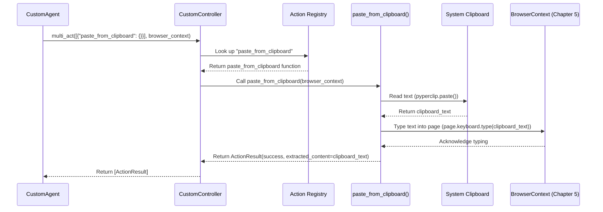

# Chapter 4: Action Execution (Controller)

Welcome back! In [Chapter 3: LLM Communication & Prompts](03_llm_communication___prompts_.md), we saw how the agent uses its "brain" (the LLM) to decide *what* action to take next based on your task and the current web page. For example, the LLM might respond with a plan like: `{"action": [{"click_element": {"element_id": 42}}]}`.

But how does the agent actually *perform* that click? How does it translate the LLM's instruction into a real interaction with the browser? That's the job of the **Controller**, the focus of this chapter.

## Motivation: From Plan to Action

Imagine you're building with LEGOs. The instruction manual (the LLM's plan) tells you "Place the red 2x4 brick on top of the blue 2x4 brick." Your hands are the **Controller** – they take that instruction and physically perform the action of picking up the red brick and placing it correctly.

Similarly, the agent needs a component that:

1.  Knows all the possible actions it can perform in a browser (like clicking, typing, scrolling).
2.  Receives the specific action instruction from the LLM.
3.  Executes that action precisely within the browser window.

This component is the **Controller**.

## Key Concepts

### 1. Actions: The Agent's Toolbox

Actions are the specific "tools" or commands the agent can use to interact with the web browser. Think of them like the different functions on a Swiss Army knife. Some common actions include:

*   `click_element`: Clicks on a button, link, or other element on the page.
*   `input_text`: Types text into an input field (like a search bar or login form).
*   `scroll`: Scrolls the page up or down.
*   `go_to_url`: Navigates to a specific web address.
*   `extract_page_content`: Grabs the main text content from the current page.
*   `done`: Signals that the task is complete.

Each action usually takes some parameters. For example, `click_element` needs to know *which* element to click (often identified by a unique number or description provided in the prompt), and `input_text` needs to know *what* text to type and *where* to type it.

### 2. The Controller: The Tool Manager

The `Controller` is like the manager of the agent's toolbox. Its main responsibilities are:

*   **Holding the Tools (Registry):** It maintains a list, called a "registry," of all the available actions (tools) the agent knows how to use. Each entry in the registry maps an action name (like `"click_element"`) to the actual code function that performs that action.
*   **Executing Actions:** When the agent decides to perform an action (based on the LLM's output), it tells the Controller, "Use the 'click\_element' tool on element 42." The Controller finds the `click_element` function in its registry and runs it with the provided parameter (element 42).

### 3. Action Execution: Making it Happen

This is the core process:

1.  The agent gets the action(s) from the LLM's JSON response (e.g., `[{ "click_element": { "element_id": 42 } }, { "input_text": { "element_id": 23, "text": "hello" } }]`).
2.  The agent passes this list of actions to the Controller's `multi_act` method.
3.  The Controller iterates through the actions. For each one:
    *   It looks up the action name (`"click_element"`, `"input_text"`) in its registry.
    *   It calls the corresponding function, passing the parameters (`{"element_id": 42}`, `{"element_id": 23, "text": "hello"}`).
    *   The action function uses the underlying browser control mechanisms (covered in [Chapter 5: Browser Control (Wrapper around Playwright)](05_browser_control__wrapper_around_playwright_.md)) to interact with the browser page (e.g., physically click the button, type "hello").
    *   The action function reports back whether it succeeded or failed, and potentially returns any data it extracted (like page content).
4.  The Controller collects the results of all actions and returns them to the agent.

### 4. `CustomController`: Adding Special Tools

While the base `browser-use` library provides a standard `Controller` with common browser actions, `2bykilt` uses a `CustomController`. This is like adding specialized tools to your toolbox.

The `CustomController` inherits all the standard actions but adds some unique ones specific to `2bykilt`'s needs, such as:

*   `copy_to_clipboard`: Copies specified text to the computer's clipboard.
*   `paste_from_clipboard`: Pastes text *from* the computer's clipboard into the focused element on the web page.

This allows the `custom` agent (from [Chapter 2: Agent Execution (Org/Custom)](02_agent_execution__org_custom__.md)) to perform tasks involving clipboard interaction, which the standard agent cannot do. It also includes an enhanced `extract_page_content` action that uses an external library (`main_content_extractor`) for potentially cleaner results.

## How the Agent Uses the Controller

Let's revisit the flow from [Chapter 3: LLM Communication & Prompts](03_llm_communication___prompts_.md). After the LLM provides its JSON response, the `CustomAgent` takes the `action` part and uses the `CustomController` to execute it.

```python
# Simplified from src/agent/custom_agent.py - step method

async def step(self, step_info: Optional[CustomAgentStepInfo] = None) -> None:
    # ... (previous steps: get state, format prompt, call LLM) ...

    # 1. Get LLM response (already done)
    # model_output contains the parsed JSON, including model_output.action

    # 2. Extract the list of actions from the response
    actions: list[ActionModel] = model_output.action # e.g., [{'click_element': {...}}, {'input_text': {...}}]

    # 3. Pass actions to the Controller for execution
    #    The 'self.controller' here is an instance of CustomController
    result: list[ActionResult] = await self.controller.multi_act(
        actions,                 # The list of actions from the LLM
        self.browser_context,    # The connection to the specific browser page (Chapter 5)
        # ... other parameters ...
    )

    # 4. Store the results (success/failure/extracted data)
    self._last_result = result
    self._last_actions = actions # Store actions for the next prompt
    # ... (handle errors, update history) ...
```

This code snippet shows the `CustomAgent` getting the list of `actions` decided by the LLM and simply handing them off to `self.controller.multi_act`. The controller handles the rest!

## Under the Hood: Executing an Action

What happens inside `controller.multi_act`?

1.  It receives the list of actions.
2.  It loops through each action in the list.
3.  For an action like `{"paste_from_clipboard": {}}`:
    *   It looks up `"paste_from_clipboard"` in its action registry.
    *   It finds the associated function (e.g., the `paste_from_clipboard` function defined in `CustomController`).
    *   It calls this function, passing the necessary context (like the `browser_context` which represents the current browser page).
    *   The `paste_from_clipboard` function reads from the actual system clipboard (`pyperclip.paste()`) and then uses the `browser_context` to simulate typing that text into the page (`page.keyboard.type(text)`).
    *   The function creates an `ActionResult` (e.g., reporting success and the pasted text) and returns it.
4.  The `multi_act` method collects all the `ActionResult` objects and returns them as a list.



This diagram shows how the Controller uses its registry to find the right function, which then interacts with external resources (like the clipboard) and the browser context to perform the action.

### Code Glimpse: Defining Custom Actions

How are the special tools added to `CustomController`? It uses a Python feature called "decorators". Think of `@self.registry.action(...)` as a label you put on a function to automatically add it to the Controller's list of tools.

```python
# Simplified from src/controller/custom_controller.py

import pyperclip # Library for clipboard access
from browser_use.agent.views import ActionResult
from browser_use.browser.context import BrowserContext
from browser_use.controller.service import Controller
# ... other imports ...

class CustomController(Controller):
    def __init__(self, ...):
        super().__init__(...)
        self._register_custom_actions() # Call the method to register tools

    def _register_custom_actions(self):
        """Register all custom browser actions"""

        # This decorator registers the function below as the action
        # named "Copy text to clipboard" in the Controller's registry.
        @self.registry.action("Copy text to clipboard")
        def copy_to_clipboard(text: str):
            """Copies the given text to the system clipboard."""
            pyperclip.copy(text) # Use the pyperclip library
            return ActionResult(extracted_content=text, include_in_memory=False)

        # This decorator registers the paste function.
        @self.registry.action("Paste text from clipboard")
        async def paste_from_clipboard(browser: BrowserContext): # Needs browser context
            """Pastes text from the system clipboard into the current page."""
            text = pyperclip.paste() # Get text from clipboard
            page = await browser.get_current_page() # Get the browser page object (Chapter 5)
            # Tell the browser page to type the text
            await page.keyboard.type(text) # Use Playwright via BrowserContext (Chapter 5)
            return ActionResult(extracted_content=text, include_in_memory=False)

        # The enhanced extract_page_content is also registered here (simplified)
        @self.registry.action('Extract page content to get the pure markdown.')
        async def extract_content(browser: BrowserContext):
            # ... (code to get page content and use MainContentExtractor) ...
            # ... (uses browser.get_current_page(), page.content()) ...
            pass # Implementation details omitted
```

This code shows how the `CustomController` defines functions like `copy_to_clipboard` and `paste_from_clipboard`. The `@self.registry.action(...)` line above each function tells the Controller: "Hey, add this function to your list of available tools under this name!" The `paste_from_clipboard` function then uses `pyperclip` for the clipboard and `browser.get_current_page()` (from [Chapter 5: Browser Control (Wrapper around Playwright)](05_browser_control__wrapper_around_playwright_.md)) to interact with the browser.

## Conclusion

You've now learned about the crucial role of the **Controller** in `2bykilt`:

*   It acts as the agent's "hands", executing the actions planned by the LLM.
*   It manages a **registry** of available **actions** (tools) like `click_element`, `input_text`, etc.
*   When the agent calls `controller.multi_act`, the Controller finds the right action function in its registry and runs it.
*   The `CustomController` in `2bykilt` adds special tools like clipboard access (`copy_to_clipboard`, `paste_from_clipboard`) and enhanced content extraction.

The Controller acts as an intermediary. It receives instructions and delegates the actual browser manipulation (like clicking a button or typing text) to the underlying browser control layer. How does *that* layer work?

Let's dive into how `2bykilt` actually talks to and controls the browser using Playwright in [Chapter 5: Browser Control (Wrapper around Playwright)](05_browser_control__wrapper_around_playwright_.md).

---

Generated by [AI Codebase Knowledge Builder](https://github.com/The-Pocket/Tutorial-Codebase-Knowledge)