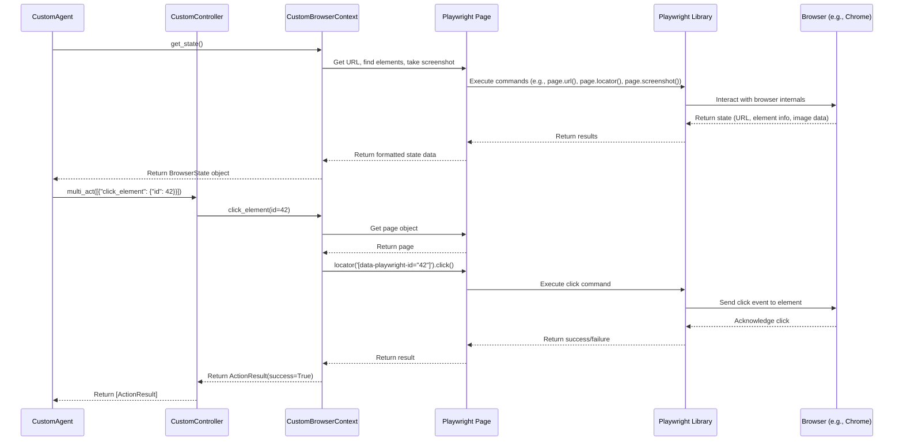

# Chapter 5: Browser Control (Wrapper around Playwright)

Welcome back! In [Chapter 4: Action Execution (Controller)](04_action_execution__controller_.md), we saw how the `Controller` takes the LLM's plan (like "click button X") and knows *which* function to call to make that happen. But how does that function *actually* interact with the web browser? How does it physically perform the click, type text, or see what's on the screen?

This chapter focuses on the **Browser Control** layer – the agent's virtual "hands and eyes" that directly manipulate and observe the web browser. `2bykilt` uses a powerful library called **Playwright** for this, wrapping it in its own classes for better integration.

## Motivation: The Agent Needs Hands and Eyes

Imagine our agent is trying to accomplish the task: **"Search Google for the latest news about Artificial Intelligence."**

The LLM ([Chapter 3: LLM Communication & Prompts](03_llm_communication___prompts_.md)) decides the next action is "Type 'latest AI news' into the search bar". The Controller ([Chapter 4: Action Execution (Controller)](04_action_execution__controller_.md)) knows this means calling the `input_text` function.

But the `input_text` function itself needs to:
1.  Find the search bar element on the Google page.
2.  Simulate keyboard typing into that element.

Similarly, before the LLM can even *decide* what to do, the agent needs to:
1.  "Look" at the current web page.
2.  Identify all the buttons, links, and input fields.
3.  Maybe even take a screenshot.

The Browser Control layer is responsible for all these low-level interactions with the actual browser application (like Chrome, Firefox, or WebKit). It provides the mechanisms for the agent to *perceive* the web (`get_state`) and *act* upon it (`click`, `type`, etc.).

## Key Concepts: Playwright's Building Blocks

`2bykilt` uses the popular Playwright library to handle the nitty-gritty browser interactions. Playwright provides several core concepts that `2bykilt` wraps and extends:

### 1. `Browser`: The Browser Application

*   **Analogy:** Think of this as launching the entire browser application itself (like opening Chrome or Firefox).
*   **What it does:** It represents the connection to a specific browser instance (e.g., Chromium, Firefox, WebKit). It's the top-level object needed to start doing anything browser-related.
*   **`2bykilt`'s version:** `CustomBrowser` (in `src/browser/custom_browser.py`) inherits from `Browser` (from `browser-use`) and handles the initial setup, like deciding whether to run in headless mode (invisible) or headed mode (visible), based on your settings in the UI ([Chapter 1: Task Definition & Configuration](01_task_definition___configuration_.md)).

### 2. `BrowserContext`: An Isolated Browser Session

*   **Analogy:** Imagine opening a fresh, clean Incognito window in your browser. Each `BrowserContext` is like one of these isolated sessions.
*   **What it does:** It represents an independent session within the `Browser`. Each context has its own cookies, local storage, and settings. This is crucial for running tasks without interference from your personal browsing history or other tasks. It's also where you configure things like:
    *   **Recording:** Saving a video of the session.
    *   **Tracing:** Saving detailed logs of every action for debugging.
    *   **Window Size:** Setting the dimensions of the browser window.
*   **`2bykilt`'s version:** `CustomBrowserContext` (in `src/browser/custom_context.py`) inherits from `BrowserContext` (from `browser-use`). It manages these session-specific settings based on your UI choices and provides the core methods for interacting with the session's pages.

### 3. `Page`: A Single Browser Tab

*   **Analogy:** This is like a single tab within that Incognito window.
*   **What it does:** Represents a single web page (or tab) within a `BrowserContext`. This is the object you use for most interactions:
    *   Navigating to a URL (`page.goto(...)`)
    *   Finding elements (`page.locator(...)`)
    *   Clicking (`page.click(...)`)
    *   Typing (`page.keyboard.type(...)`)
    *   Getting the page's HTML content (`page.content()`)
    *   Taking screenshots (`page.screenshot(...)`)
*   **`2bykilt`'s version:** `2bykilt` primarily uses the `Page` object provided by Playwright indirectly through the `CustomBrowserContext`. Methods like `get_state()` or actions in the `CustomController` will internally get the current `Page` object from the context and use its methods.

## How It's Used: Connecting the Pieces

Let's see how these components work together during the agent's execution ([Chapter 2: Agent Execution (Org/Custom)](02_agent_execution__org_custom__.md)):

**1. Setup (Start of `run_custom_agent`):**

*   If no browser is open yet (`_global_browser` is `None`), a `CustomBrowser` instance is created based on UI settings (headless, etc.).
*   Then, a `CustomBrowserContext` is created from the `CustomBrowser`, again using UI settings (recording path, trace path, window size). This context is stored globally (`_global_browser_context`) so different parts of the agent can use it.

```python
# Simplified from bykilt.py - run_custom_agent function

async def run_custom_agent(
        # ... llm, task, config parameters ...
        headless, window_w, window_h, save_recording_path, save_trace_path,
        # ... other config ...
):
    global _global_browser, _global_browser_context, _global_agent
    try:
        # --- Browser Setup ---
        if _global_browser is None:
            _global_browser = CustomBrowser(
                config=BrowserConfig(headless=headless, ...) # Uses UI setting
            )
        # ---------------------

        # --- Browser Context Setup ---
        if _global_browser_context is None:
            _global_browser_context = await _global_browser.new_context(
                config=CustomBrowserContextConfig(
                    save_recording_path=save_recording_path, # Uses UI setting
                    trace_path=save_trace_path,           # Uses UI setting
                    browser_window_size=BrowserContextWindowSize(width=window_w, height=window_h), # Uses UI setting
                    # ... other context settings ...
                )
            )
        # ---------------------------

        # ... (Create CustomAgent using _global_browser_context) ...
        # ... (Run agent) ...

    # ... (Error handling and cleanup) ...
```
This code shows how the main script uses the configuration settings selected in the UI to initialize the `CustomBrowser` and `CustomBrowserContext` before the agent starts its work.

**2. Agent Observation (Inside `CustomAgent.step`):**

*   The agent needs to "see" the page. It calls `_global_browser_context.get_state()`.
*   This method internally uses the current Playwright `Page` object to:
    *   Get the URL.
    *   Find all interactive elements (buttons, inputs, links).
    *   Take a screenshot (if `use_vision` is enabled).
*   This state information is then formatted into the prompt for the LLM ([Chapter 3: LLM Communication & Prompts](03_llm_communication___prompts_.md)).

```python
# Simplified concept - Actual get_state is more complex
class CustomBrowserContext:
    async def get_state(self):
        # Get the active Playwright Page object for the current tab
        page = await self.get_current_page()

        # Use Playwright Page methods to gather info
        current_url = page.url
        # ... (logic to find interactive elements using page.locator(...)) ...
        interactive_elements = self._find_elements(page)

        screenshot_base64 = None
        # ... (logic to take screenshot if needed: page.screenshot(...)) ...

        # Package the information
        state = BrowserState(
            url=current_url,
            elements=interactive_elements,
            screenshot=screenshot_base64,
            # ... other state info ...
        )
        return state

    async def get_current_page(self) -> "Page":
        # Simplified: Get the currently active Playwright Page
        # (Actual implementation might handle multiple tabs)
        return self.playwright_context.pages[-1] # Get the last opened/active page

    def _find_elements(self, page):
        # Simplified: Use Playwright locators to find elements
        # buttons = page.locator('button').all()
        # links = page.locator('a').all()
        # inputs = page.locator('input').all()
        # ... combine and format ...
        return "List of elements found by Playwright"
```
This shows how `get_state` uses the underlying Playwright `page` object to fetch details like the URL and elements, acting as the agent's "eyes".

**3. Action Execution (Inside `CustomController` actions):**

*   The LLM decides on an action, e.g., `{"click_element": {"element_id": 42}}`.
*   The `CustomAgent` passes this to `controller.multi_act`.
*   The `CustomController` looks up the action (e.g., `click_element`) and calls its function.
*   The action function receives the `CustomBrowserContext` as an argument.
*   It uses the context to get the current Playwright `Page` object (`page = await browser_context.get_current_page()`).
*   It then uses Playwright `Page` methods to perform the action (e.g., `await page.locator(f'[data-playwright-id="{element_id}"]').click()`).

```python
# Simplified from src/controller/custom_controller.py

# Example action within CustomController
class CustomController(Controller):
    # ... (registry setup) ...

    @self.registry.action("Click an element")
    async def click_element(self, browser: CustomBrowserContext, element_id: str):
        """Clicks the element with the given ID."""
        try:
            # 1. Get the current Playwright Page from the context
            page = await browser.get_current_page()

            # 2. Use Playwright's locator to find the element by its unique ID
            element_locator = page.locator(f'[data-playwright-id="{element_id}"]')

            # 3. Use Playwright's click method to perform the action
            await element_locator.click(timeout=5000) # Add a timeout

            return ActionResult(success=True)
        except Exception as e:
            return ActionResult(success=False, error=f"Failed to click element {element_id}: {e}")

    # Another example: Paste from clipboard action
    @self.registry.action("Paste text from clipboard")
    async def paste_from_clipboard(self, browser: CustomBrowserContext):
        text = pyperclip.paste() # Get text from system clipboard
        page = await browser.get_current_page() # Get the page
        # Use Playwright's keyboard simulation
        await page.keyboard.type(text)
        return ActionResult(extracted_content=text)
```
This demonstrates how controller actions use the `CustomBrowserContext` to get the underlying Playwright `Page` and call its methods (like `click` or `keyboard.type`) to physically interact with the browser - the agent's "hands".

## Under the Hood: The Playwright Connection

The core interaction flow looks like this: The Agent or Controller needs something done in the browser. They talk to the `CustomBrowserContext`, which manages the specific session. The `CustomBrowserContext` then uses the appropriate Playwright `Page` object to execute the command via the Playwright library, which handles the direct communication with the browser application.



This diagram shows that both getting state (observing) and performing actions involve the `CustomBrowserContext` using the Playwright `Page` object, which relies on the Playwright library to communicate with the actual browser application.

## Conclusion

You've now seen how `2bykilt` controls the web browser at a low level:

*   It uses the **Playwright** library as the foundation.
*   `CustomBrowser` launches and manages the browser application instance.
*   `CustomBrowserContext` manages isolated sessions (like incognito windows) handling cookies, recordings, window size, and providing access to pages.
*   Playwright `Page` objects represent individual tabs and are used for direct interaction (getting state, clicking, typing).
*   The Agent uses the `Context` to "see" (`get_state`), and the Controller uses the `Context` to "act" (calling Playwright `Page` methods like `click`).

This browser control layer provides the fundamental capabilities for the agent to interact with the web. Now that we understand the core components (Task, Agent, LLM, Controller, Browser Control), let's look at how they can be combined for a more complex, specific workflow.

Ready to see a multi-step process in action? Let's explore the [Chapter 6: Deep Research Workflow](06_deep_research_workflow_.md).

---

Generated by [AI Codebase Knowledge Builder](https://github.com/The-Pocket/Tutorial-Codebase-Knowledge)