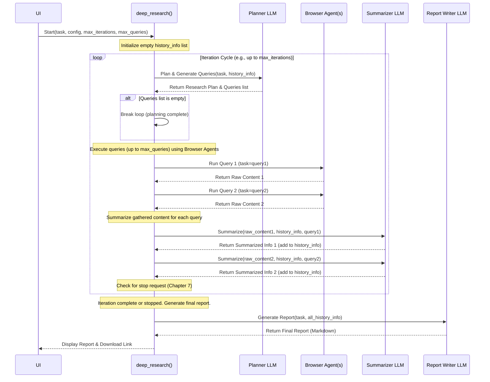

# Chapter 6: Deep Research Workflow

Welcome back! In [Chapter 5: Browser Control (Wrapper around Playwright)](05_browser_control__wrapper_around_playwright_.md), we saw how `2bykilt` directly controls the browser to perform basic actions like clicking and typing. But what if your task is much bigger than a single action or a short sequence? What if you need to perform in-depth research, gather information from multiple sources, summarize it, and compile a report?

This chapter introduces the **Deep Research Workflow**, a specialized, multi-step process designed for exactly these kinds of complex research tasks.

## Motivation: Beyond Simple Tasks

Imagine you want to create a detailed report on a complex topic, like: **"Compose a report on the use of Reinforcement Learning for training Large Language Models, encompassing its origins, current advancements, and future prospects, substantiated with examples of relevant models and techniques."**

A single run of the basic agent we saw in [Chapter 2: Agent Execution (Org/Custom)](02_agent_execution__org_custom__.md) wouldn't be sufficient. It might find one or two relevant pages, but it wouldn't be able to:

*   Plan a comprehensive research strategy.
*   Explore multiple facets of the topic systematically.
*   Gather information from various sources.
*   Synthesize and summarize the findings.
*   Compile everything into a final, structured report.

This is where the Deep Research Workflow comes in. It automates the process of managing a small research project.

## Key Concepts: The Research Project Manager

Think of the Deep Research Workflow as an automated project manager overseeing a team of AI assistants (LLMs) and browser operators (agents). Here's how it breaks down the complex research task:

1.  **Research Planning & Query Generation (The Planner):**
    *   An LLM acts as a "Research Planner". You give it the main research goal.
    *   It analyzes the goal and creates a high-level plan (e.g., "1. Research RLHF origins. 2. Find current RL techniques for LLMs. 3. Identify future prospects.").
    *   Based on the plan, it generates specific search queries (e.g., `"history of reinforcement learning from human feedback"`, `"PPO algorithm for large language models"`).

2.  **Browser Agent Execution (The Interns):**
    *   Regular browser agents (like the `custom` agent from [Chapter 2: Agent Execution (Org/Custom)](02_agent_execution__org_custom__.md)) take the search queries generated by the Planner.
    *   They execute these queries in the browser, navigate to relevant links, and use tools like `extract_page_content` ([Chapter 4: Action Execution (Controller)](04_action_execution__controller_.md)) to gather raw information from the web pages.

3.  **Information Summarization & Recording (The Note-Taker):**
    *   Another LLM role acts as a "Summarizer" or "Note-Taker".
    *   It receives the raw content gathered by the browser agents for a specific query.
    *   It reads the content, extracts the key information relevant to the main goal, summarizes it concisely, and records it along with the source URL and title.
    *   Crucially, it tries to avoid adding information that's already been recorded from previous searches.

4.  **Iteration (Review and Refine):**
    *   The workflow repeats Steps 1-3 in cycles.
    *   In the next cycle, the Planner LLM looks at the *original goal* AND the *summaries recorded so far*.
    *   It then generates *new* search queries designed to fill knowledge gaps, explore sub-topics identified in the summaries, or find more supporting evidence.
    *   This iterative process continues until the system believes it has enough information, or it reaches a predefined limit on the number of search cycles.

5.  **Final Report Generation (The Writer):**
    *   Once the iterative search and summarization phase is complete, a final LLM role acts as the "Report Writer".
    *   It takes the *entire collection* of recorded summaries, source information, and the *original research goal*.
    *   It synthesizes all this information and writes a coherent, structured report (usually in Markdown format), complete with citations based on the recorded sources.

This structured, iterative approach allows `2bykilt` to tackle research tasks that are far too complex for a single agent run.

## How to Use It: The "Deep Research" Tab

Using this workflow is straightforward thanks to the dedicated "🧐 Deep Research" tab in the `2bykilt` UI.

```
[UI Screenshot Placeholder: Show the "Deep Research" tab with its input fields and button highlighted.]
```

Here's what you'll find:

1.  **Research Task:** This is where you enter your main research goal, like our example about RL in LLMs. Be descriptive!
2.  **Max Search Iteration:** How many cycles of Plan -> Search -> Summarize should the workflow run? (e.g., 3 means it will generate queries and search up to 3 times). This prevents infinite loops and controls depth.
3.  **Max Query per Iteration:** In each cycle, how many search queries should the Planner generate at most? (e.g., 2 means it will run up to 2 browser agents in parallel or sequence per cycle).
4.  **Run Deep Research Button:** Click this to start the workflow. Make sure your LLM and Browser settings in the other tabs are configured appropriately, as the workflow uses them!
5.  **Stop Button:** Since research can take time, this button allows you to interrupt the process gracefully (more on stopping in [Chapter 7: State Management (Async Stop & Persistence)](07_state_management__async_stop___persistence__.md)).
6.  **Research Report Display:** Once the workflow completes (or is stopped), the final generated Markdown report will appear here.
7.  **Download Research Report Button:** Allows you to save the generated Markdown report as a file.

**Example:**

*   You paste the RL/LLM research task into the "Research Task" box.
*   You set "Max Search Iteration" to `3`.
*   You set "Max Query per Iteration" to `2`.
*   You ensure your preferred LLM (e.g., `gpt-4o`) is selected in the "LLM Configuration" tab and Browser Settings (e.g., `headless`) are set.
*   You click "▶️ Run Deep Research".

`2bykilt` will now kick off the multi-step process described above. You might see the browser view update if running headed, or just wait for the final report to appear in the display area.

## Under the Hood: Orchestrating the Research

When you click the "Run Deep Research" button, the UI calls the `run_deep_search` function in `bykilt.py`. This function gathers the UI parameters and then calls the core logic function `deep_research` located in `src/utils/deep_research.py`.

The `deep_research` function orchestrates the entire workflow. Let's visualize the high-level flow:



This diagram shows the iterative cycle: the Planner LLM generates queries, Browser Agents fetch content, the Summarizer LLM processes and records it, and the loop repeats with the updated history until completion. Finally, the Report Writer LLM compiles the report.

### Code Glimpse: Orchestration in `deep_research`

Let's look at simplified snippets from `src/utils/deep_research.py`:

**1. The Main Loop:**

```python
# Simplified from src/utils/deep_research.py - deep_research function

async def deep_research(task, llm, agent_state=None, **kwargs):
    # ... (setup: task_id, save_dir, max_query_num, browser setup) ...

    history_query = []  # Keep track of past queries
    history_infos = []  # Store recorded summaries

    search_iteration = 0
    max_search_iterations = kwargs.get("max_search_iterations", 10)

    try:
        while search_iteration < max_search_iterations:
            search_iteration += 1
            logger.info(f"Start {search_iteration}th Search...")

            # --- Step 1: Planning & Query Generation ---
            query_plan, query_tasks = await get_plan_and_queries(
                task, llm, history_query, history_infos, search_system_prompt
            )
            if not query_tasks:  # If planner returns no queries, we're done searching
                break
            history_query.extend(query_tasks) # Add new queries to history
            # -----------------------------------------

            # --- Step 2: Browser Agent Execution ---
            # (Runs agents for each query_task, gets raw results)
            raw_query_results = await run_browser_agents_for_queries(
                query_tasks, llm, use_vision, controller, browser_context, browser, **kwargs
            )
            # ---------------------------------------

            # --- Check for Stop Request (Chapter 7 detail) ---
            if agent_state and agent_state.is_stop_requested():
                break # Exit loop if user clicked stop
            # -----------------------------------------------

            # --- Step 3: Information Summarization & Recording ---
            new_infos = await summarize_and_record(
                task, llm, query_plan, query_tasks, raw_query_results, history_infos, record_system_prompt
            )
            history_infos.extend(new_infos) # Add new summaries to overall history
            # -------------------------------------------------

            # --- Check for Stop Request Again ---
            if agent_state and agent_state.is_stop_requested():
                break
            # ------------------------------------

        # --- Step 5: Final Report Generation ---
        logger.info("Finish Searching, Start Generating Report...")
        return await generate_final_report(task, history_infos, save_dir, llm)
        # -------------------------------------

    # ... (Error handling and browser closing) ...
```

This code shows the main `while` loop controlling the search iterations. Inside the loop, it calls helper functions (we'll imagine these exist for simplicity) to handle planning (`get_plan_and_queries`), agent execution (`run_browser_agents_for_queries`), and summarization (`summarize_and_record`). It also checks for stop requests. Finally, it calls `generate_final_report`.

**2. Planning/Query Generation (Conceptual):**

```python
# Conceptual helper function (simplified from logic within deep_research)
async def get_plan_and_queries(task, llm, history_query, history_infos, system_prompt):
    history_query_str = json.dumps(history_query)
    history_infos_str = json.dumps(history_infos)
    # Format prompt with task, history, and iteration info
    prompt = f"User Instruction:{task}\nPrevious Queries:\n{history_query_str}\nPrevious Results:\n{history_infos_str}"
    # Call the Planner LLM
    response = llm.invoke([SystemMessage(content=system_prompt), HumanMessage(content=prompt)])
    # Parse the JSON response
    # (Simplified - includes JSON repair)
    data = json.loads(repair_json(response.content))
    return data.get("plan", ""), data.get("queries", [])
```

This snippet shows how the planner prompt is constructed using the original task and the history collected so far. The LLM is invoked ([Chapter 3: LLM Communication & Prompts](03_llm_communication___prompts_.md)), and its JSON response containing the plan and new queries is parsed.

**3. Agent Execution (Conceptual):**

```python
# Conceptual helper function (simplified from logic within deep_research)
async def run_browser_agents_for_queries(query_tasks, llm, use_vision, controller, browser_context, browser, **kwargs):
    results = []
    for query in query_tasks:
        # Create a CustomAgent instance for each query
        agent = CustomAgent(
            task=query,
            llm=llm,
            browser=browser, # May be shared or new depending on config
            browser_context=browser_context, # May be shared or new
            use_vision=use_vision,
            controller=controller, # Uses CustomController (Chapter 4)
            # ... other params ...
        )
        # Run the agent (Chapter 2)
        agent_history = await agent.run(max_steps=kwargs.get("max_steps", 10))
        results.append(agent_history.final_result())
        # (Simplified: Actual implementation might run agents in parallel)
    return results
```

This shows how, for each query generated by the planner, a `CustomAgent` ([Chapter 2: Agent Execution (Org/Custom)](02_agent_execution__org_custom__.md)) is created and run. It uses the `CustomController` ([Chapter 4: Action Execution (Controller)](04_action_execution__controller_.md)) which likely uses the special `extract_page_content` action. The final results (raw text extracted) are collected.

**4. Summarization (Conceptual):**

```python
# Conceptual helper function (simplified from logic within deep_research)
async def summarize_and_record(task, llm, plan, queries, raw_results, history_infos, system_prompt):
    all_new_infos = []
    for i, raw_result in enumerate(raw_results):
        if not raw_result: continue # Skip if agent failed to get content
        history_infos_str = json.dumps(history_infos)
        # Format prompt for summarizer LLM
        prompt = f"User Instruction:{task}\nPrevious Info:\n{history_infos_str}\nCurrent Plan:\n{plan}\nCurrent Query:\n{queries[i]}\nCurrent Results:\n{raw_result[:30000]}" # Limit input size
        # Call the Summarizer LLM
        response = llm.invoke([SystemMessage(content=system_prompt), HumanMessage(content=prompt)])
        # Parse the JSON response (list of summaries)
        # (Simplified - includes JSON repair)
        new_summaries = json.loads(repair_json(response.content))
        all_new_infos.extend(new_summaries)
    return all_new_infos
```

Here, for each piece of raw content gathered by an agent, the Summarizer LLM is called with the task context, previous summaries, and the new raw content. It returns a list of structured summaries (including URL, title, content, thinking), which are collected.

**5. Report Generation:**

```python
# Simplified from src/utils/deep_research.py - generate_final_report function

async def generate_final_report(task, history_infos, save_dir, llm, error_msg=None):
    # ... (Save history_infos to JSON file) ...
    history_infos_str = json.dumps(history_infos, indent=4)
    # Format prompt for the Writer LLM
    report_prompt = f"User Instruction:{task}\nSearch Information:\n{history_infos_str}"
    report_messages = [SystemMessage(content=writer_system_prompt), HumanMessage(content=report_prompt)]
    # Call the Writer LLM
    ai_report_msg = llm.invoke(report_messages)
    report_content = ai_report_msg.content
    # ... (Clean up Markdown formatting) ...
    # ... (Add error message if research was interrupted) ...
    # ... (Save report_content to final_report.md) ...
    logger.info(f"Save Report at: {report_file_path}")
    return report_content, report_file_path
```

Finally, this function takes *all* the recorded `history_infos` and the original `task`, prompts the Writer LLM, gets the Markdown report, cleans it up, saves it, and returns the content and path.

## Conclusion

You've now learned about the **Deep Research Workflow**, a powerful feature in `2bykilt` for tackling complex research tasks automatically.

*   It breaks down research into an **iterative cycle** of Planning, Query Generation, Browser Execution, and Summarization.
*   It uses multiple **LLM roles** (Planner, Summarizer, Writer) coordinated by the main workflow logic.
*   It leverages the core agent capabilities ([Chapter 2: Agent Execution (Org/Custom)](02_agent_execution__org_custom__.md)) and browser control ([Chapter 5: Browser Control (Wrapper around Playwright)](05_browser_control__wrapper_around_playwright_.md)) to gather information.
*   The final output is a **synthesized report** based on the gathered and summarized information.
*   You can easily trigger this workflow from the **"Deep Research" tab** in the UI.

These workflows, especially Deep Research, can run for a while. What happens if you need to stop them midway? How does the application manage its state, especially when dealing with potentially long-running asynchronous operations?

Let's explore these aspects in the final chapter: [Chapter 7: State Management (Async Stop & Persistence)](07_state_management__async_stop___persistence_.md).

---

Generated by [AI Codebase Knowledge Builder](https://github.com/The-Pocket/Tutorial-Codebase-Knowledge)