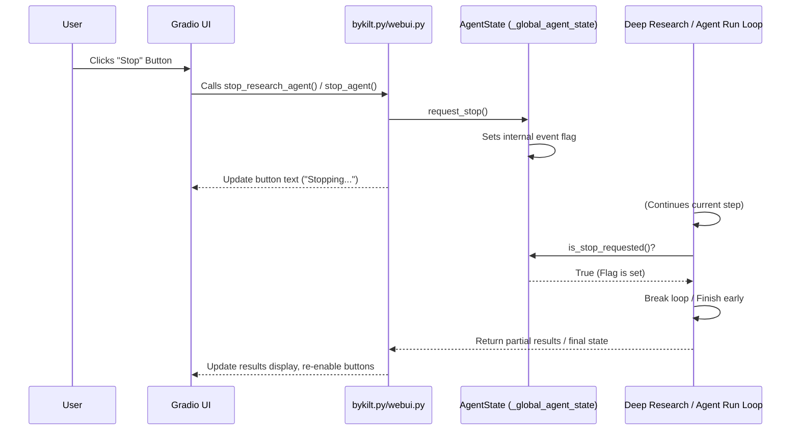
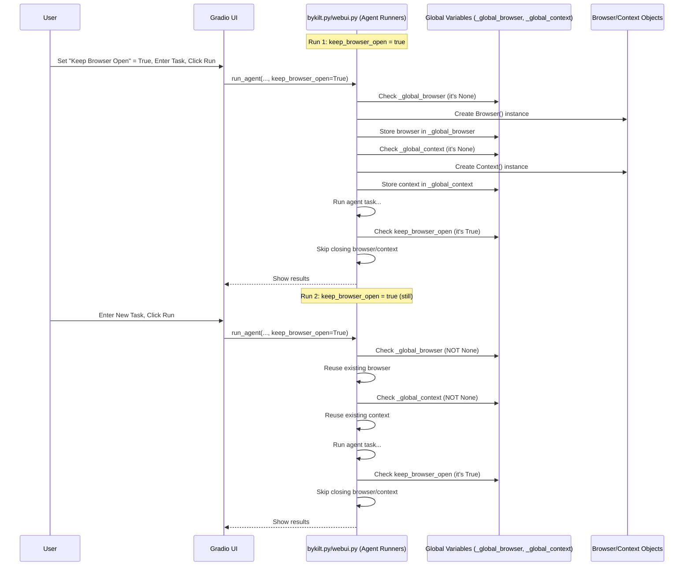

# Chapter 7: State Management (Async Stop & Persistence)

Welcome to the final chapter of our core tutorial! In [Chapter 6: Deep Research Workflow](06_deep_research_workflow_.md), we saw how `2bykilt` can manage complex, multi-step tasks like conducting in-depth research. These tasks, and even simpler ones, can sometimes take a while to run.

What if you start a Deep Research task and realize halfway through that you wanted something slightly different? Or what if you want to run several small tasks quickly without the delay of opening and closing the browser each time? This chapter explores how `2bykilt` manages its **state**, specifically focusing on:

1.  **Stopping Long Tasks:** How you can tell a running agent (like the Deep Research workflow) to stop gracefully.
2.  **Keeping Things Open (Persistence):** How you can optionally keep the browser open between runs to save time.

**Use Case:** Imagine you start a Deep Research task that you set for 5 iterations, but after 2 iterations, you see it's gathering the information you need, and you want to stop it early to generate the report. Alternatively, you might want to quickly check the weather on Google, then search for a nearby restaurant, without waiting for the browser to relaunch.

## Key Concepts: Managing How the Agent Runs

State management here isn't about complex application data; it's about controlling the *runtime* behavior of the agent and browser.

### 1. Asynchronous Stop: The "Please Stop" Flag

When you run a task, especially a complex one like Deep Research, it happens *asynchronously*. This means the UI doesn't freeze; the task runs in the background. But how do you interrupt it cleanly?

`2bykilt` uses a simple "flag" system. Think of it like raising a flag to signal the running process:

*   **`AgentState`:** A central object (specifically, a single instance shared across the application) holds the state information. A key part of this is an `asyncio.Event` called `_stop_requested`.
*   **Requesting a Stop:** When you click a "Stop" button in the UI, it calls a function that essentially "sets" this event flag in the `AgentState`.
*   **Checking the Flag:** The running agent code (either the main agent loop or the Deep Research orchestrator) periodically checks if this flag has been set (`is_stop_requested()`).
*   **Graceful Exit:** If the agent sees the flag is set, it finishes its current small step, cleans up (like saving any partial results), and stops running the rest of the task.

This allows the agent to stop without crashing or leaving things in a messy state.

### 2. Persistence: Reusing the Browser

Opening a new browser window takes time. If you're running many quick tasks, this delay can be annoying. `2bykilt` offers an option to keep the browser instance open between runs.

*   **Global Variables:** The main UI script (`bykilt.py` or `webui.py`) uses global variables like `_global_browser` and `_global_browser_context` to hold the currently active browser and its session context ([Chapter 5: Browser Control (Wrapper around Playwright)](05_browser_control__wrapper_around_playwright_.md)).
*   **`keep_browser_open` Setting:** A checkbox in the "Browser Settings" tab controls this behavior.
*   **Conditional Creation:** When you start a task, the code checks if `_global_browser` is already set.
    *   If it is (and `keep_browser_open` was likely checked previously), it reuses the existing browser and context.
    *   If it's `None`, it creates a new browser and context instance.
*   **Conditional Closing:** When a task finishes, the code checks the `keep_browser_open` setting.
    *   If it's *unchecked*, the browser and context are closed, and the global variables are reset to `None`.
    *   If it's *checked*, the browser and context remain open, ready for the next task.

This simple mechanism allows you to trade off resource usage (keeping the browser running) for speed (faster task starts).

## How to Use It

Controlling these state aspects happens directly in the `2bykilt` UI.

### Stopping a Task

*   **For Regular Agent Runs:** When you click "▶️ Run Agent" on the "Run Agent" tab, the button might become disabled, and a "⏹️ Stop" button next to it becomes active. Clicking this "Stop" button triggers the asynchronous stop mechanism.
*   **For Deep Research:** Similarly, on the "Deep Research" tab, after clicking "▶️ Run Deep Research", a "⏹️ Stop" button becomes active. Clicking it signals the research workflow to halt after its current step (e.g., finishing the current query summarization).

```
[UI Screenshot Placeholder: Show the "Run Agent" tab with the Stop button active during a run.]
```

```
[UI Screenshot Placeholder: Show the "Deep Research" tab with the Stop button active during a run.]
```

The UI will usually indicate that a stop has been requested (e.g., the Stop button text might change to "Stopping..."). The agent will stop as soon as it checks the flag.

### Keeping the Browser Open

1.  Go to the **"🌐 Browser Settings"** tab in the UI.
2.  Find the checkbox labeled **"Keep Browser Open"**.
3.  **Check** this box if you want the browser instance to persist between runs.
4.  **Uncheck** it if you want the browser to close automatically after each task finishes.

```
[UI Screenshot Placeholder: Show the "Browser Settings" tab with the "Keep Browser Open" checkbox highlighted.]
```

Remember: If you check this box, the browser window (if not running headless) will stay open until you either uncheck the box and run another task, or manually close the `2bykilt` application.

## Under the Hood: Implementing Stop and Persistence

Let's peek at the code that makes these features work.

### Stopping Mechanism

**1. The State Holder (`AgentState`):**

This class uses `asyncio.Event`, which is a way for different asynchronous parts of a program to signal each other.

```python
# Simplified from src/utils/agent_state.py
import asyncio

class AgentState:
    def __init__(self):
        # The core signal flag
        self._stop_requested = asyncio.Event()
        # ... (other potential state like last_valid_state) ...

    def request_stop(self):
        # Set the flag - signals others to stop
        self._stop_requested.set()

    def clear_stop(self):
        # Reset the flag - before starting a new task
        self._stop_requested.clear()

    def is_stop_requested(self):
        # Check if the flag has been set
        return self._stop_requested.is_set()
```
This simple class provides methods to set, clear, and check the stop flag. A single instance (`_global_agent_state`) is created and shared.

**2. Triggering the Stop (UI Backend):**

When you click the "Stop" button in the UI, it calls a function like `stop_research_agent` or `stop_agent` (depending on the tab) in `bykilt.py`/`webui.py`.

```python
# Simplified from bykilt.py / webui.py

# Global state instance used by UI functions
_global_agent_state = AgentState()

async def stop_research_agent():
    """Called when the Deep Research Stop button is clicked."""
    try:
        # Tell the shared state object to set the stop flag
        _global_agent_state.request_stop()
        message = "Stop requested - the agent will halt..."
        logger.info(f"🛑 {message}")
        # Update UI buttons (e.g., disable stop, maybe disable run)
        return (
            gr.update(value="Stopping...", interactive=False), # Stop button
            gr.update(interactive=False), # Run button
        )
    except Exception as e:
        # Handle errors, update UI accordingly
        # ... error handling ...
```
This function simply calls `request_stop()` on the global state object and updates the UI elements.

**3. Checking for Stop (Inside the Long Task):**

The code running the task needs to check the flag periodically. For example, in the Deep Research workflow:

```python
# Simplified from src/utils/deep_research.py - deep_research function

async def deep_research(task, llm, agent_state=None, **kwargs):
    # ... (setup) ...
    try:
        while search_iteration < max_search_iterations:
            # ... (Step 1: Planning) ...
            # ... (Step 2: Browser Agent Execution) ...

            # --- Check for Stop Request ---
            if agent_state and agent_state.is_stop_requested():
                logger.info("Stop requested during research cycle. Exiting.")
                break # Exit the main loop gracefully
            # --------------------------------

            # ... (Step 3: Summarization) ...

            # --- Check Again After Summarization ---
            if agent_state and agent_state.is_stop_requested():
                logger.info("Stop requested after summarization. Exiting.")
                break
            # -------------------------------------
        # ... (Step 5: Final Report Generation - potentially adds note about stop) ...
    # ... (Error handling) ...
```
The code checks `agent_state.is_stop_requested()` at logical points in its loop. If it returns `True`, the loop breaks, preventing further iterations. A similar check exists within the agent's own step loop in `CustomAgent.run`.

**Stop Flow Diagram:**



### Persistence Mechanism

**1. Global Variables:**

At the top of `bykilt.py` or `webui.py`, variables are declared to hold the browser objects.

```python
# In bykilt.py / webui.py
_global_browser = None
_global_browser_context = None
_global_agent = None # Sometimes the agent itself might be persisted briefly
_global_agent_state = AgentState()
```
These start as `None`.

**2. Conditional Creation (Inside agent runners):**

Functions like `run_custom_agent` check these globals before creating new browser objects.

```python
# Simplified from bykilt.py / webui.py - run_custom_agent function

async def run_custom_agent(
    # ... parameters ...
    keep_browser_open, headless, # ... other config ...
):
    global _global_browser, _global_browser_context, _global_agent
    try:
        # --- Browser Setup ---
        if _global_browser is None:
            logger.info("No existing browser found, creating new one.")
            _global_browser = CustomBrowser(config=BrowserConfig(headless=headless, ...))
        else:
            logger.info("Reusing existing browser instance.")
        # ---------------------

        # --- Browser Context Setup ---
        if _global_browser_context is None:
            logger.info("No existing context found, creating new one.")
            _global_browser_context = await _global_browser.new_context(config=...)
        else:
            logger.info("Reusing existing browser context.")
        # ---------------------------

        # ... (Create agent using potentially existing context) ...
        # ... (Run agent) ...

    # ... (Error handling) ...
    finally:
        _global_agent = None # Always clear the agent instance itself
        # --- Conditional Cleanup ---
        if not keep_browser_open:
            logger.info("Keep browser open is OFF. Closing browser.")
            if _global_browser_context:
                await _global_browser_context.close()
                _global_browser_context = None
            if _global_browser:
                await _global_browser.close()
                _global_browser = None
        else:
            logger.info("Keep browser open is ON. Browser remains open.")
        # ---------------------------
```
This code explicitly checks if `_global_browser` and `_global_browser_context` are `None`. If not, it skips creating them. The `finally` block ensures cleanup happens correctly based on the `keep_browser_open` flag value read from the UI settings.

**Persistence Flow Diagram:**


This diagram shows how the first run creates the browser objects and stores them globally because `keep_browser_open` is true. The second run finds the existing objects in the globals and reuses them.

## Conclusion

You've reached the end of the core `2bykilt` tutorial! In this chapter, we covered state management related to runtime control:

*   **Asynchronous Stop:** Learned how `AgentState` and `asyncio.Event` provide a flag mechanism for users to gracefully stop long-running tasks via the UI.
*   **Persistence:** Understood how global variables (`_global_browser`, `_global_browser_context`) combined with the `keep_browser_open` UI setting allow reusing browser instances between tasks for faster execution.

Throughout these chapters, you've journeyed from defining a task and configuring the environment ([Chapter 1: Task Definition & Configuration](01_task_definition___configuration_.md)), through agent execution ([Chapter 2: Agent Execution (Org/Custom)](02_agent_execution__org_custom__.md)), LLM communication ([Chapter 3: LLM Communication & Prompts](03_llm_communication___prompts_.md)), action execution ([Chapter 4: Action Execution (Controller)](04_action_execution__controller_.md)), low-level browser control ([Chapter 5: Browser Control (Wrapper around Playwright)](05_browser_control__wrapper_around_playwright_.md)), complex workflows ([Chapter 6: Deep Research Workflow](06_deep_research_workflow_.md)), and finally, managing the runtime state ([Chapter 7: State Management (Async Stop & Persistence)](07_state_management__async_stop___persistence_.md)).

You should now have a solid foundational understanding of how `2bykilt` works and how its different components collaborate to turn your instructions into automated browser actions. Happy automating!

---

Generated by [AI Codebase Knowledge Builder](https://github.com/The-Pocket/Tutorial-Codebase-Knowledge)