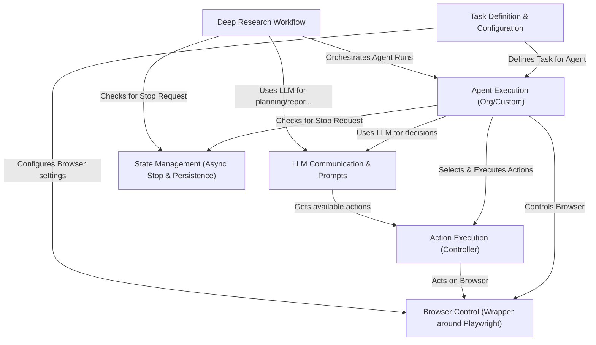

# Tutorial: 2bykilt

This project, **2bykilt**, is a tool that uses *Artificial Intelligence* (specifically Large Language Models or LLMs) to **control a web browser**.
You can give it tasks in plain English (like "find the latest news about AI") or run predefined scripts.
The AI agent then *figures out the steps* (like clicking buttons, typing text) needed to complete the task in the browser.
It also includes a special mode for *deep research* that automates searching, gathering, and summarizing information into a report.

**Source Repository:** [https://github.com/Nobukins/2bykilt](https://github.com/Nobukins/2bykilt)

## Chapters

1. [Task Definition & Configuration
](01_task_definition___configuration_.md)
2. [Agent Execution (Org/Custom)
](02_agent_execution__org_custom__.md)
3. [LLM Communication & Prompts
](03_llm_communication___prompts_.md)
4. [Action Execution (Controller)
](04_action_execution__controller__.md)
5. [Browser Control (Wrapper around Playwright)
](05_browser_control__wrapper_around_playwright__.md)
6. [Deep Research Workflow
](06_deep_research_workflow_.md)
7. [State Management (Async Stop & Persistence)
](07_state_management__async_stop___persistence__.md)

---

Generated by [AI Codebase Knowledge Builder](https://github.com/The-Pocket/Tutorial-Codebase-Knowledge)