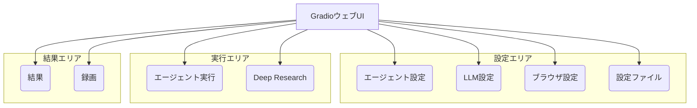
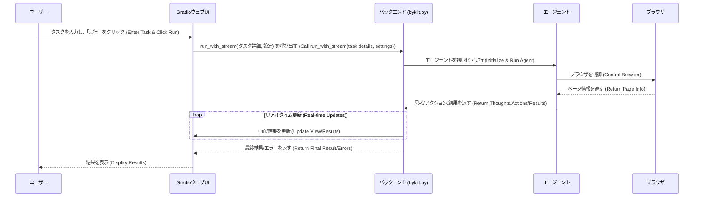

# Chapter 1: GradioウェブUI


ようこそ `2bykilt` のチュートリアルへ！ この章では、プロジェクトの中心的な操作パネルである **GradioウェブUI** について学びます。

## GradioウェブUIとは？ なぜ必要？

AIエージェントにウェブサイトの操作を自動化してもらいたい、と考えたとします。例えば、「最新のAI技術に関するニュース記事をいくつか見つけて、要約してほしい」といったタスクです。

しかし、どうやってエージェントに指示を出し、設定を調整し、結果を確認すればよいでしょうか？ ここで **GradioウェブUI** の出番です。

GradioウェブUIは、`2bykilt`プロジェクトの **コックピット** のようなものです。

*   **設定の入力:** どのAIモデルを使うか、ブラウザをどのように動かすか（画面を表示するかどうかなど）を設定します。
*   **タスクの指示:** エージェントに何をしてほしいかを具体的に伝えます。
*   **実行の監視:** エージェントがタスクを実行している様子をリアルタイムで見守ります（ヘッドレスモードでない場合）。
*   **結果の確認:** エージェントが完了したタスクの最終的な成果物、途中で発生したエラー、エージェントの「思考プロセス」、そして操作の録画などを確認できます。

このUIを通じて、あなたはエージェントのパイロットとなり、複雑な操作も簡単に行えるようになります。

## UIの主要な構成要素

`2bykilt` を起動すると、ウェブブラウザにUIが表示されます。UIはいくつかのタブに分かれており、それぞれ特定の機能を持っています。



*   **⚙️ エージェント設定 (Agent Settings):** どのような種類のエージェントを使うか（`org` または `custom`）、エージェントが最大で何ステップ動作するかなどを設定します。詳細は [カスタムエージェント (`CustomAgent`)](02_カスタムエージェント___customagent___.md) で説明します。
*   **🔧 LLM設定 (LLM Configuration):** エージェントの「頭脳」となる大規模言語モデル（LLM）を選択・設定します。どの会社のAI（OpenAI, Googleなど）を使うか、どのモデル（GPT-4o, Geminiなど）を使うか、APIキーなどを指定します。詳細は [LLM連携とプロンプト生成](03_llm連携とプロンプト生成_.md) で触れます。
*   **🌐 ブラウザ設定 (Browser Settings):** エージェントが操作するブラウザに関する設定です。画面を表示せずに裏で動かす（ヘッドレスモード）、操作を録画するかどうか、ウィンドウサイズなどを設定します。詳細は [ブラウザ制御とカスタムアクション](04_ブラウザ制御とカスタムアクション_.md) で関連する内容を扱います。
*   **🤖 エージェント実行 (Run Agent):** ここがメインの操作エリアです。
    *   **タスク説明 (Task Description):** エージェントに実行させたいタスクを自然言語で入力します。（例：「LinkedInで "AIエンジニア" の求人を検索して」） 特定のスクリプトを実行することも可能です。 ([スクリプトベース自動化](05_スクリプトベース自動化_.md) 参照)
    *   **追加情報 (Additional Information):** タスクをこなす上で役立つ補足情報を任意で入力します。
    *   **実行/停止ボタン (Run/Stop):** エージェントの実行開始と緊急停止を行います。
    *   **ライブブラウザビュー (Live Browser View):** ヘッドレスモードが無効の場合、エージェントが操作しているブラウザの画面がリアルタイムで表示されます。
*   **🧐 Deep Research:** 特定のトピックについて、より深く調査を行うための専用機能です。詳細は [詳細調査機能 (`Deep Research`)](06_詳細調査機能___deep_research___.md) で説明します。
*   **📊 結果 (Results):** エージェントの実行が完了した後、成果物やエラー、思考プロセス（どのような判断をしたか）などが表示されます。
*   **🎥 録画 (Recordings):** ブラウザ設定で録画を有効にした場合、過去の実行時の録画ファイルが一覧表示され、再生できます。
*   **📁 設定ファイル (Configuration):** 現在のUI設定（LLM、ブラウザ設定など）をファイルに保存したり、保存した設定ファイルを読み込んだりできます。

## 使ってみよう：簡単なタスクの実行

では、実際にGradioウェブUIを使って簡単なタスクを実行してみましょう。

1.  **UIの起動:**
    ターミナル（コマンドプロンプト）を開き、`2bykilt` プロジェクトのディレクトリに移動して、以下のコマンドを実行します。

    ```bash
    python bykilt.py
    ```
    しばらくすると、ターミナルに `Running on local URL: http://127.0.0.1:7788` のようなメッセージが表示されます。このURLをウェブブラウザで開くと、Gradio UIが表示されます。

2.  **タブの選択:**
    UI上部にあるタブから「**🤖 エージェント実行 (Run Agent)**」をクリックします。

3.  **タスクの入力:**
    「**タスク説明 (Task Description)**」というテキストボックスに、エージェントに実行させたいことを入力します。例えば、次のように入力してみましょう。
    `「2bykilt」プロジェクトのGitHubリポジトリを検索して表示して`

4.  **実行:**
    「**▶️ エージェント実行 (Run Agent)**」ボタンをクリックします。

5.  **実行の確認:**
    *   もし「ブラウザ設定」タブで「ヘッドレスモード」にチェックを入れていなければ、「ライブブラウザビュー」にエージェントがブラウザを操作する様子が表示されるはずです（検索エンジンを開き、キーワードを入力し、検索結果をクリックするなど）。
    *   処理が完了すると、「📊 結果 (Results)」タブに自動で切り替わるか、手動で切り替えて確認します。
    *   「**最終結果 (Final Result)**」に、タスクの結果（例えば、見つかったGitHubリポジトリのURLなど）が表示されます。
    *   もし途中で問題が発生した場合は、「**エラー (Errors)**」に情報が表示されます。
    *   「**思考プロセス (Model Thoughts)**」や「**モデルアクション (Model Actions)**」を見ると、エージェントがどのように考えて、どのような手順でタスクを実行したかを知ることができます。
    *   もし「ブラウザ設定」で「録画を有効にする」にチェックを入れていれば、「**最新の録画 (Latest Recording)**」に操作のビデオが表示されたり、「🎥 録画 (Recordings)」タブで確認できたりします。

これで、GradioウェブUIの基本的な使い方がわかりました。設定を調整したり、タスクを変えたりして、色々と試してみてください。

## 内部の仕組み：UIはどのように動いている？

GradioウェブUIがどのようにしてエージェントと連携しているのか、少しだけ内部を覗いてみましょう。

### 大まかな流れ

ユーザーがUIで操作を行うと、裏側では次のようなことが起こっています。

1.  **ユーザー操作:** あなたがタスクを入力し、「実行」ボタンをクリックします。
2.  **UIからバックエンドへ:** Gradio UIは、入力されたタスク情報や各種設定（LLMの種類、ブラウザ設定など）を `bykilt.py` スクリプト（バックエンド）に渡します。
3.  **バックエンド処理:** `bykilt.py` は受け取った情報をもとに、適切な [エージェント](02_カスタムエージェント___customagent___.md) を準備し、[LLM](03_llm連携とプロンプト生成_.md) や [ブラウザ](04_ブラウザ制御とカスタムアクション_.md) と連携しながらタスク実行を開始します。
4.  **リアルタイム更新:** エージェントがブラウザを操作したり、思考したりするたびに、その状況（現在のブラウザ画面のスナップショットや、思考内容など）がバックエンドからUIに送られ、リアルタイムで表示が更新されます（特にライブブラウザビュー）。
5.  **結果の表示:** タスクが完了すると、最終的な結果やエラー情報などがバックエンドからUIに送られ、「結果」タブに表示されます。

これを簡単なシーケンス図で見てみましょう。



### コードでの実装

実際のコード (`bykilt.py`) では、Gradioライブラリを使ってこのUIが構築されています。

1.  **UIの定義 (`create_ui` 関数):**
    `bykilt.py` の中の `create_ui` 関数が、UIの見た目や要素（タブ、ボタン、テキストボックスなど）を定義しています。例えば、「タスク説明」の入力欄や「実行」ボタンは次のように作られています。

    ```python
    # --- File: bykilt.py ---
    # (create_ui 関数内)

    # ... 他のUI要素の定義 ...

    with gr.TabItem("🤖 Run Agent", id=4): # 「エージェント実行」タブ
        task = gr.Textbox( # タスク入力欄
            label="Task Description",
            lines=4,
            placeholder="Enter your task or script name...",
            value=config['task'],
            info="Describe what you want the agent to do..."
        )
        # ... 追加情報入力欄など ...
        with gr.Row():
            run_button = gr.Button("▶️ Run Agent", variant="primary", scale=2) # 実行ボタン
            stop_button = gr.Button("⏹️ Stop", variant="stop", scale=1) # 停止ボタン
        with gr.Row():
            browser_view = gr.HTML( # ライブブラウザビュー表示エリア
                value="<h1 style='width:80vw; height:50vh'>Waiting for browser session...</h1>",
                label="Live Browser View"
            )

    # ... 他のタブ (結果、設定など) の定義 ...
    ```
    *   `gr.TabItem` でタブを作成します。
    *   `gr.Textbox` でテキスト入力欄を、`gr.Button` でボタンを作成します。
    *   `gr.HTML` は、HTMLコンテンツ（ここではライブビューの画像やメッセージ）を表示するために使われます。

2.  **ボタンクリック時の動作 (`run_button.click`):**
    「実行」ボタンがクリックされたときに何をするかは、`.click()` メソッドで指定されます。

    ```python
    # --- File: bykilt.py ---
    # (create_ui 関数内、UI定義の後)

    run_button.click( # 実行ボタンがクリックされたら
        fn=run_with_stream, # run_with_stream 関数を実行する
        inputs=[ # run_with_stream に渡す入力値 (UIの各設定値)
            agent_type, llm_provider, llm_model_name, llm_num_ctx, llm_temperature, llm_base_url, llm_api_key,
            use_own_browser, keep_browser_open, headless, disable_security, window_w, window_h,
            save_recording_path, save_agent_history_path, save_trace_path, enable_recording, task, add_infos,
            max_steps, use_vision, max_actions_per_step, tool_calling_method
        ],
        outputs=[ # run_with_stream からの出力値を受け取るUI要素
            browser_view, final_result_output, errors_output, model_actions_output, model_thoughts_output,
            recording_display, trace_file, agent_history_file, stop_button, run_button
        ],
    )
    ```
    *   `fn=run_with_stream`: クリック時に `run_with_stream` という非同期関数を呼び出すことを指定します。
    *   `inputs=[...]`: `run_with_stream` 関数に渡す引数を、UI上の各コンポーネント（ドロップダウン、テキストボックス、チェックボックスなど）から集めてリストで指定します。
    *   `outputs=[...]`: `run_with_stream` 関数の戻り値（または `yield` される値）を、どのUIコンポーネント（結果表示用のテキストボックス、ビデオ表示エリアなど）に表示するかを指定します。

3.  **バックエンド処理の開始 (`run_with_stream` 関数):**
    `run_with_stream` 関数 (これも `bykilt.py` 内) は、UIから受け取った設定を使って、実際にエージェントを実行する `run_browser_agent` 関数を呼び出します。ヘッドレスモードが有効な場合は、`capture_screenshot` 関数を使って定期的にブラウザ画面を取得し、`yield` キーワードを使ってUIに送信することで、ライブビューを実現しています。

    ```python
    # --- File: bykilt.py ---

    async def run_with_stream(...): # UIから呼び出される関数
        # ... (初期設定など) ...

        if not headless: # ヘッドレスモードでない場合
            # run_browser_agent を直接呼び出し、結果をまとめて返す
            result = await run_browser_agent(...)
            html_content = "..." # 固定メッセージ
            yield [html_content] + list(result) # 結果をUIに返す
        else: # ヘッドレスモードの場合
            # run_browser_agent をバックグラウンドタスクとして開始
            agent_task = asyncio.create_task(run_browser_agent(...))

            # タスク完了までループ
            while not agent_task.done():
                try:
                    # ブラウザ画面を取得
                    encoded_screenshot = await capture_screenshot(_global_browser_context)
                    if encoded_screenshot:
                        html_content = f''
                    else:
                        html_content = "<h1>Waiting...</h1>"
                except Exception:
                    html_content = "<h1>Waiting...</h1>"

                # 現在の画面と途中結果をUIに送信 (yield)
                yield [html_content, ..., stop_button, run_button]
                await asyncio.sleep(0.05) # 短い待機

            # タスク完了後、最終結果を取得してUIに送信 (yield)
            result = await agent_task
            yield [...] # 最終結果を含むリスト
        # ... (エラーハンドリングなど) ...
    ```
    *   `yield` は、関数の実行を一時停止し、値を呼び出し元（ここではGradio UI）に返すためのキーワードです。これにより、処理が完全に終わる前でも、途中の画面や情報をUIに送ることができます。

このように、GradioはUI要素の定義と、それらの要素とバックエンドのPython関数（`bykilt.py`内）を結びつける仕組みを提供しています。ユーザーの操作をトリガーに関数が実行され、その結果がUIに反映される、という流れになっています。

## まとめ

この章では、`2bykilt` の操作インターフェースである GradioウェブUI について学びました。これが設定の調整、タスクの指示、結果の確認を行うための中心的な場所であることを理解しました。簡単なタスクを実行する手順と、UIが内部でどのようにバックエンドと連携しているかの概要も確認しました。

これでUIの基本的な使い方がわかりました。しかし、エージェントはどのようにしてタスクを理解し、ブラウザを操作しているのでしょうか？ 次の章では、エージェント自体の仕組み、特に [カスタムエージェント (`CustomAgent`)](02_カスタムエージェント___customagent___.md) について詳しく見ていきましょう。

---

Generated by [AI Codebase Knowledge Builder](https://github.com/The-Pocket/Tutorial-Codebase-Knowledge)