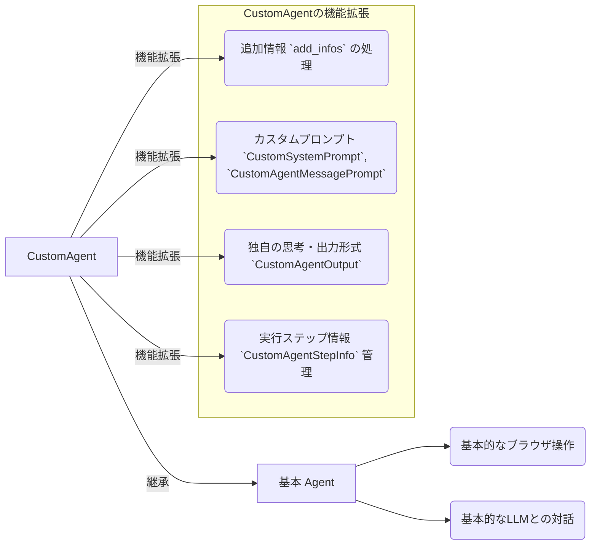

# Chapter 2: カスタムエージェント (`CustomAgent`)

前の章[GradioウェブUI](01_gradioウェブui_.md)では、`2bykilt`を操作するためのコックピットであるUIの使い方を学びました。タスクを入力し、実行ボタンを押せばエージェントが動き出すことはわかりましたが、エージェントは一体どのようにして私たちの指示を理解し、賢く振る舞っているのでしょうか？ 特に、もっと複雑な指示や、状況に応じた柔軟な対応をさせたい場合はどうすればよいのでしょう？

この章では、`2bykilt`プロジェクトの「熟練シェフ」とも言える **カスタムエージェント (`CustomAgent`)** について学びます。

## カスタムエージェント (`CustomAgent`) とは？ なぜ必要？

`browser-use`ライブラリには、基本的なウェブ操作を行うための `Agent` が用意されています。これは言わば「基本のレシピ」を知っている見習いシェフのようなものです。簡単な指示ならこなせますが、もう少し込み入ったリクエストには応えられないかもしれません。

例えば、あなたが「A社の最新の株価を調べて、もし前日比で5%以上変動していたら、関連ニュースも3つ探してきて」というタスクを頼みたいとします。このタスクには、単に株価を調べるだけでなく、条件（5%以上の変動）に基づいて追加のアクション（ニュース検索）を行う判断が必要です。

ここで登場するのが **カスタムエージェント (`CustomAgent`)** です。これは`browser-use`の基本`Agent`を**継承**し、さらに賢く、柔軟に動けるように機能拡張されたエージェントです。

`CustomAgent`は、基本のレシピ（`Agent`の機能）に加えて、以下のような独自の工夫や隠し味を持っています。

*   **追加情報 (`add_infos`) の活用:** ユーザーからの「ヒント」や「補足情報」を理解し、タスク実行に活かせます。（例：「株価は〇〇証券のサイトで調べて」「ニュースは△△新聞から探して」）
*   **カスタムプロンプトの使用:** エージェントの思考回路や応答方法をカスタマイズした「指示書」（`CustomSystemPrompt`, `CustomAgentMessagePrompt`）を使います。これにより、より的確な判断や情報整理が可能になります。
*   **独自の思考・出力形式 (`CustomAgentOutput`):** タスクの進捗状況、次に何をすべきかの計画、集めた重要な情報などを、より詳細な形式で考え、出力します。
*   **実行ステップ情報の管理 (`CustomAgentStepInfo`):** 各ステップでのタスクの進捗、記憶している重要情報（メモリ）、今後の計画などを記録・管理し、次の判断に活かします。

まるで、基本レシピに独自の経験と工夫を加えて、お客さんの細かな要望にも応えられる**熟練シェフ**のようですね。`CustomAgent`を使うことで、より複雑な指示にも対応し、気の利いた振る舞いをさせることができるのです。

## `CustomAgent` の主要な機能

`CustomAgent` が基本の `Agent` と比べてどのような点が優れているのか、もう少し詳しく見ていきましょう。



*   **追加情報 (`add_infos`) の処理:**
    Gradio UIの「追加情報 (Additional Information)」に入力されたテキストは、`CustomAgent` に `add_infos` として渡されます。`CustomAgent` はこの情報をプロンプト（LLMへの指示書）に含めることで、タスク実行の際の重要なヒントとして利用します。これにより、「〇〇を優先して」「△△は除外して」といった細かなニュアンスを指示に反映できます。

*   **カスタムプロンプト (`CustomSystemPrompt`, `CustomAgentMessagePrompt`):**
    プロンプトは、エージェントがLLM（大規模言語モデル）に「何を考えて、どう動くべきか」を指示するためのテンプレートです。
    *   `CustomSystemPrompt`: エージェント全体の基本的な役割、守るべきルール、出力形式などを定義します。`CustomAgent` 用に調整されており、より詳細な思考（タスク進捗、今後の計画など）を促します。
    *   `CustomAgentMessagePrompt`: 各ステップで、現在のブラウザの状態、過去のアクションの結果、そして `add_infos` や蓄積されたメモリなどの `CustomAgentStepInfo` を含めて、LLMに状況を伝えるためのプロンプトです。これにより、LLMはより多くの文脈を考慮して次のアクションを決定できます。
    これらのカスタムプロンプトの詳細は、次の章 [LLM連携とプロンプト生成](03_llm連携とプロンプト生成_.md) で詳しく解説します。

*   **独自の思考・出力形式 (`CustomAgentOutput`):**
    LLMが考えた結果（思考プロセス）と、次に行うべきアクション（指示）は、特定のJSON形式で出力されます。`CustomAgent` では、この出力形式 `CustomAgentOutput` が拡張されており、基本的なアクション指示に加えて、以下のような「思考の中身」も含まれます。
    *   `prev_action_evaluation`: 前のアクションが成功したかどうかの評価。
    *   `important_contents`: 現在のページで見つけた重要な情報。
    *   `task_progress`: これまでに完了したタスクの項目。
    *   `future_plans`: 次に実行しようとしている計画。
    *   `thought`: 次のアクションに至るまでの思考プロセス。
    *   `summary`: 次のアクションの簡単な要約。
    これにより、エージェントが「今何を考えているのか」「どこまで進んでいるのか」をより詳しく知ることができます。これらの情報はGradio UIの「結果」タブにも表示されます。

*   **実行ステップ情報の管理 (`CustomAgentStepInfo`):**
    エージェントはタスクを一度に完了させるのではなく、一連のステップ（思考→アクション→状態確認→思考...）を繰り返します。`CustomAgentStepInfo` は、これらのステップを通じて変化していく情報を管理するための入れ物です。
    *   `step_number`: 現在のステップ数。
    *   `max_steps`: 最大ステップ数。
    *   `task`: 実行中のタスク。
    *   `add_infos`: ユーザーからの追加情報。
    *   `memory`: これまでに見つけた重要な情報の蓄積。
    *   `task_progress`: 現在のタスク進捗（`CustomAgentOutput`から更新）。
    *   `future_plans`: 今後の計画（`CustomAgentOutput`から更新）。
    `CustomAgent` は各ステップの終わりに `CustomAgentOutput` の思考結果を使ってこの `CustomAgentStepInfo` を更新し、次のステップのプロンプト生成（特に `CustomAgentMessagePrompt`）に利用します。これにより、エージェントは過去の行動や収集した情報を踏まえた上で、より賢明な判断を下せるようになります。

## `CustomAgent` を使ってみよう

では、実際に `CustomAgent` を使って、少し複雑なタスクを実行してみましょう。

1.  **Gradio UIの起動:** (前章参照)
    ```bash
    python bykilt.py
    ```
2.  **エージェントの選択:**
    UIの「⚙️ エージェント設定 (Agent Settings)」タブで、「エージェントタイプ (Agent Type)」が `custom` になっていることを確認します。（デフォルトで `custom` が選択されているはずです）
3.  **タスクと追加情報の入力:**
    「🤖 エージェント実行 (Run Agent)」タブに移動し、以下のように入力します。
    *   **タスク説明 (Task Description):**
        `東京で開催されるAI関連のカンファレンスを検索して、直近のものを3つ教えて`
    *   **追加情報 (Additional Information):**
        `検索エンジンはGoogleを使ってください。connpassやTECH PLAYなどのイベント告知サイトを優先的に見てください。参加費無料のイベントがあれば、それを最初にリストアップしてください。`
4.  **実行:**
    「▶️ エージェント実行 (Run Agent)」ボタンをクリックします。
5.  **結果の確認:**
    エージェントの実行が完了したら、「📊 結果 (Results)」タブを確認します。
    *   **最終結果 (Final Result):** 指示通りに検索されたカンファレンス情報が表示されているはずです。
    *   **思考プロセス (Model Thoughts):** `CustomAgentOutput` の `thought`, `task_progress`, `future_plans` などに基づいた、エージェントの思考過程が表示されます。例えば、以下のような内容が見られるかもしれません。
        ```
        思考:
        ユーザーは東京のAIカンファレンスを探しており、Google検索、特定のイベントサイト、無料イベントを優先するように指示されている。まずGoogleで検索し、connpassやTECH PLAYのサイトへのリンクを探そう。見つかったイベント情報を整理し、無料のものを優先してリストアップする必要がある。

        タスク進捗:
        1. Google検索を実行した。
        2. connpassで関連イベントをいくつか見つけた。

        今後の計画:
        1. TECH PLAYでも検索する。
        2. 見つけたイベント情報を整理し、参加費を確認する。
        3. 無料イベントを優先して、直近の3件をリストアップする。
        ```
    このように、`CustomAgent` は `add_infos` を考慮し、より詳細な思考プロセスを経てタスクを実行します。

## 内部の仕組み：`CustomAgent` はどう動く？

`CustomAgent` がどのようにしてこれらの機能を実現しているのか、内部の動きを覗いてみましょう。

### 処理の流れ（ステップ・バイ・ステップ）

ユーザーがタスクと追加情報を入力して実行すると、`CustomAgent` は以下のようなステップで動作します。

1.  **初期化:** バックエンド (`bykilt.py`) は、UIから受け取ったタスク説明と追加情報 (`add_infos`) を使って `CustomAgent` を準備します。このとき、`CustomAgentStepInfo` も初期化されます（タスク、追加情報などがセットされる）。
2.  **実行ループ開始:** `CustomAgent` の `run` メソッドが呼ばれ、最大ステップ数に達するかタスクが完了するまでループ処理が始まります。
3.  **ステップ実行 (`step` メソッド):** ループの各ステップで以下の処理が行われます。
    a.  **状態取得:** 現在のブラウザのURL、表示されている要素、スクリーンショットなどの状態を取得します ([ブラウザ制御とカスタムアクション](04_ブラウザ制御とカスタムアクション_.md)関連)。
    b.  **プロンプト生成:** `CustomMessageManager` が `CustomAgentMessagePrompt` を使って、LLMへの指示書（プロンプト）を作成します。このプロンプトには、現在のブラウザ状態、直前のアクション結果、そして `CustomAgentStepInfo`（タスク、`add_infos`、現在のメモリ、進捗、計画など）の内容が含まれます。
    c.  **LLM呼び出し:** 生成されたプロンプトを [LLM](03_llm連携とプロンプト生成_.md) に送信します。
    d.  **思考とアクションの受信:** LLMはプロンプトを解釈し、次に取るべきアクションのリストと、その判断に至った思考プロセス（`prev_action_evaluation`, `important_contents`, `task_progress`, `future_plans`, `thought`, `summary` など）を `CustomAgentOutput` の形式で返します。
    e.  **アクション実行:** `CustomAgent` は `CustomAgentOutput` からアクションのリストを取り出し、[コントローラー](04_ブラウザ制御とカスタムアクション_.md) を通じてブラウザ上で実行します（例: 要素をクリック、テキスト入力など）。
    f.  **ステップ情報更新:** `CustomAgentOutput` に含まれる思考結果（`important_contents`, `task_progress`, `future_plans` など）を使って、`CustomAgentStepInfo` のメモリ、進捗、計画などを更新します。これにより、次のステップのプロンプト生成時に最新の情報が反映されます。
    g.  **完了判定:** `CustomAgentOutput` に含まれるアクションが「完了 (`Done`)」を示すものであれば、ループを終了します。
4.  **結果返却:** ループが終了したら、最終的な結果（収集した情報やエラーなど）をバックエンド経由でGradio UIに返します。

これを簡単なシーケンス図で見てみましょう。

```mermaid
sequenceDiagram
    participant User as ユーザー
    participant GradioUI as Gradio UI
    participant Backend as バックエンド
    participant CustomAgent as カスタムエージェント
    participant LLM as 大規模言語モデル

    User->>GradioUI: タスクと追加情報入力、実行
    GradioUI->>Backend: 実行指示 (タスク, 追加情報)
    Backend->>CustomAgent: 初期化 (タスク, 追加情報, StepInfo初期化)
    loop 各ステップ (最大ステップ数まで or 完了まで)
        CustomAgent->>CustomAgent: ブラウザ状態取得
        CustomAgent->>CustomAgent: プロンプト生成 (状態, StepInfo[追加情報, メモリ, 進捗, 計画] を使用)
        CustomAgent->>LLM: プロンプト送信
        LLM-->>CustomAgent: 思考とアクション (CustomAgentOutput[進捗, 計画, アクションリストなど])
        CustomAgent->>CustomAgent: アクション実行 (ブラウザ制御経由)
        CustomAgent->>CustomAgent: StepInfo更新 (Outputの思考[進捗, 計画など]を反映)
        alt Doneアクション受信
            CustomAgent-->>Backend: ループ終了、最終結果
            break
        end
    end
    Backend-->>GradioUI: 結果表示
    GradioUI-->>User: 結果確認
```

### コードでの実装

実際のコード (`src/agent/custom_agent.py` など) では、これらの機能がどのように実装されているか、主要な部分を見てみましょう。

1.  **`CustomAgent` の初期化 (`__init__`)**
    ここで、タスク (`task`) や追加情報 (`add_infos`) を受け取り、カスタムのメッセージ管理クラス `CustomMessageManager` を初期化しています。

    ```python
    # --- File: src/agent/custom_agent.py ---
    class CustomAgent(Agent):
        def __init__(
                self,
                task: str,
                llm: BaseChatModel,
                add_infos: str = "", # 追加情報を受け取る
                # ... 他の引数 ...
                agent_prompt_class: Type[AgentMessagePrompt] = AgentMessagePrompt, # カスタムプロンプトクラス
                # ...
        ):
            super().__init__(...) # 親クラス(Agent)の初期化
            # ...
            self.add_infos = add_infos # 追加情報をインスタンス変数に保持

            # カスタムのメッセージマネージャーを使用
            self.message_manager = CustomMessageManager(
                llm=self.llm,
                task=self.task,
                action_descriptions=self.controller.registry.get_prompt_description(),
                system_prompt_class=self.system_prompt_class, # SystemPromptも指定可能
                agent_prompt_class=agent_prompt_class, # CustomAgentMessagePrompt を使うように指定
                # ... 他の設定 ...
            )
            # ...
            # CustomAgentOutput を使うようにアクションモデルを設定
            self._setup_action_models()
    ```
    *   `add_infos` を引数で受け取り、インスタンス変数に保存しています。
    *   `CustomMessageManager` を初期化する際に、`agent_prompt_class` として `CustomAgentMessagePrompt` (またはその互換クラス) を渡すことで、カスタムのプロンプト生成ロジックが使われるようになります。
    *   `_setup_action_models` で、LLMの出力形式として `CustomAgentOutput` を使うように設定しています。

2.  **ステップ実行 (`step`) 内でのプロンプト生成と情報更新**
    `step` メソッドの中で、`CustomAgentStepInfo` を使ってプロンプトを生成し、LLMからの応答 (`CustomAgentOutput`) を使って `CustomAgentStepInfo` を更新しています。

    ```python
    # --- File: src/agent/custom_agent.py ---
    class CustomAgent(Agent):
        # ... (initなど) ...

        async def step(self, step_info: Optional[CustomAgentStepInfo] = None) -> None:
            # ... (状態取得など) ...
            try:
                state = await self.browser_context.get_state()
                # ...

                # CustomMessageManager を使ってプロンプト(メッセージ)を生成
                # ここで step_info (add_infos, memory, progress, plans などを含む) が使われる
                self.message_manager.add_state_message(state, self._last_actions, self._last_result, step_info, self.use_vision)
                input_messages = self.message_manager.get_messages()
                # ...

                # LLM を呼び出して次のアクションと思考 (CustomAgentOutput) を取得
                model_output: CustomAgentOutput = await self.get_next_action(input_messages) # 型ヒントが CustomAgentOutput になっている点に注意
                # ...

                # LLMの思考結果を使って step_info を更新
                self.update_step_info(model_output, step_info)
                # ...

                # model_output からアクションリストを取得して実行
                actions: list[ActionModel] = model_output.action
                result: list[ActionResult] = await self.controller.multi_act(...)
                # ... (結果処理、エラーハンドリングなど) ...

            except Exception as e:
                # ... (エラー処理) ...
            finally:
                # ... (後処理) ...

        def update_step_info(
                self, model_output: CustomAgentOutput, step_info: CustomAgentStepInfo = None
        ):
            # model_output の思考結果 (important_contents, task_progress, future_plans) を
            # step_info の memory, task_progress, future_plans に反映する
            if step_info is None:
                return
            step_info.step_number += 1
            important_contents = model_output.current_state.important_contents
            if (...): # 条件チェック
                step_info.memory += important_contents + "\n" # メモリに追加
            task_progress = model_output.current_state.task_progress
            if (...): # 条件チェック
                step_info.task_progress = task_progress # 進捗を更新
            future_plans = model_output.current_state.future_plans
            if (...): # 条件チェック
                step_info.future_plans = future_plans # 計画を更新
            # ...
    ```
    *   `message_manager.add_state_message` に `step_info` を渡しています。これにより、プロンプト生成時に `add_infos` や現在のメモリ、進捗、計画が考慮されます。
    *   `get_next_action` から返ってくる型が `CustomAgentOutput` になっており、思考情報が含まれています。
    *   `update_step_info` メソッドで、`model_output` (LLMの思考結果) を使って `step_info` の内容（メモリ、進捗、計画）を更新しています。

3.  **カスタムプロンプトの生成 (`CustomAgentMessagePrompt`)**
    `CustomMessageManager` が内部で使う `CustomAgentMessagePrompt` は、`step_info` を受け取り、プロンプトのテキストに情報を埋め込みます。

    ```python
    # --- File: src/agent/custom_prompts.py ---
    class CustomAgentMessagePrompt(AgentMessagePrompt):
        def __init__(
                self,
                state: BrowserState,
                # ... 他の引数 ...
                step_info: Optional[CustomAgentStepInfo] = None, # step_info を受け取る
        ):
            super().__init__(...)
            self.step_info = step_info # インスタンス変数に保持

        def get_user_message(self, use_vision: bool = True) -> HumanMessage:
            if self.step_info:
                # step_info から情報を取り出してプロンプトに含める
                step_info_description = f'Current step: {self.step_info.step_number}/{self.step_info.max_steps}\n'
                # ... (現在時刻なども追加) ...
            else:
                step_info_description = ''
            # ...

            state_description = f"""
{step_info_description}
1. Task: {self.step_info.task}.
2. Hints(Optional):
{self.step_info.add_infos}  # ここで add_infos を使用
3. Memory:
{self.step_info.memory}     # ここで現在のメモリを使用
4. Current url: {self.state.url}
5. Available tabs: ...
6. Interactive elements: ...
# (ここに現在のブラウザ要素などが続く)
            """
            # ... (前のアクション結果なども追加) ...

            # 画像を使う場合は画像データもメッセージに含める
            if self.state.screenshot and use_vision == True:
                return HumanMessage(content=[{'type': 'text', 'text': state_description}, {'type': 'image_url', ...}])
            else:
                return HumanMessage(content=state_description)
    ```
    *   `__init__` で `step_info` を受け取ります。
    *   `get_user_message` メソッド内で、`self.step_info.task`, `self.step_info.add_infos`, `self.step_info.memory` などを参照し、プロンプトのテキスト (`state_description`) に組み込んでいます。

4.  **カスタム出力形式とステップ情報の定義 (`CustomAgentOutput`, `CustomAgentStepInfo`)**
    これらのクラスは、エージェントがやり取りする情報の構造を定義しています。

    ```python
    # --- File: src/agent/custom_views.py ---
    from pydantic import BaseModel, Field
    from dataclasses import dataclass
    # ...

    @dataclass # データ保持用のシンプルなクラス
    class CustomAgentStepInfo:
        step_number: int
        max_steps: int
        task: str
        add_infos: str # 追加情報
        memory: str    # 蓄積された重要情報
        task_progress: str # タスク進捗
        future_plans: str  # 今後の計画

    class CustomAgentBrain(BaseModel): # LLMの思考部分の構造
        prev_action_evaluation: str
        important_contents: str
        task_progress: str
        future_plans: str
        thought: str
        summary: str

    class CustomAgentOutput(AgentOutput): # LLMからの出力全体の構造
        # ...
        current_state: CustomAgentBrain # 上で定義した思考部分を含む
        action: list[ActionModel] # 次のアクションリスト
        # ...
    ```
    *   `CustomAgentStepInfo`: エージェントがステップ間で引き継ぐ情報を定義します (`add_infos`, `memory`, `task_progress`, `future_plans` など)。
    *   `CustomAgentBrain`: LLMが出力する思考内容の構造を定義します。
    *   `CustomAgentOutput`: LLMからの応答全体の構造を定義し、`CustomAgentBrain` (思考) と `action` (アクション指示) を含みます。

このように、`CustomAgent` は基本の `Agent` を拡張し、`add_infos`、カスタムプロンプト、詳細な思考出力 (`CustomAgentOutput`)、ステップ間の情報管理 (`CustomAgentStepInfo`) を組み合わせることで、より高度で柔軟なタスク実行を実現しています。

## まとめ

この章では、`2bykilt` の賢い実行役である **カスタムエージェント (`CustomAgent`)** について学びました。`CustomAgent` が基本の `Agent` をどのように拡張し、追加情報 (`add_infos`) やカスタムプロンプト、独自の思考・出力形式 (`CustomAgentOutput`)、ステップ情報管理 (`CustomAgentStepInfo`) を使って、より複雑でニュアンスのある指示に対応できる「熟練シェフ」のような存在であることを理解しました。

Gradio UI を使って `CustomAgent` に追加情報を与える方法や、その結果としてエージェントの思考プロセスがどのように変化するかを確認しました。また、内部でこれらの情報がどのように処理され、プロンプト生成やステップ更新に利用されているかの概要も掴めました。

しかし、`CustomAgent` が賢く振る舞うためには、その「脳」である大規模言語モデル（LLM）との連携が不可欠です。エージェントはどのようにしてLLMに指示を出し（プロンプト生成）、LLMからの応答（思考とアクション）を解釈しているのでしょうか？

次の章、[LLM連携とプロンプト生成](03_llm連携とプロンプト生成_.md)では、このエージェントとLLMの対話の核心部分について、さらに詳しく掘り下げていきます。

---

Generated by [AI Codebase Knowledge Builder](https://github.com/The-Pocket/Tutorial-Codebase-Knowledge)