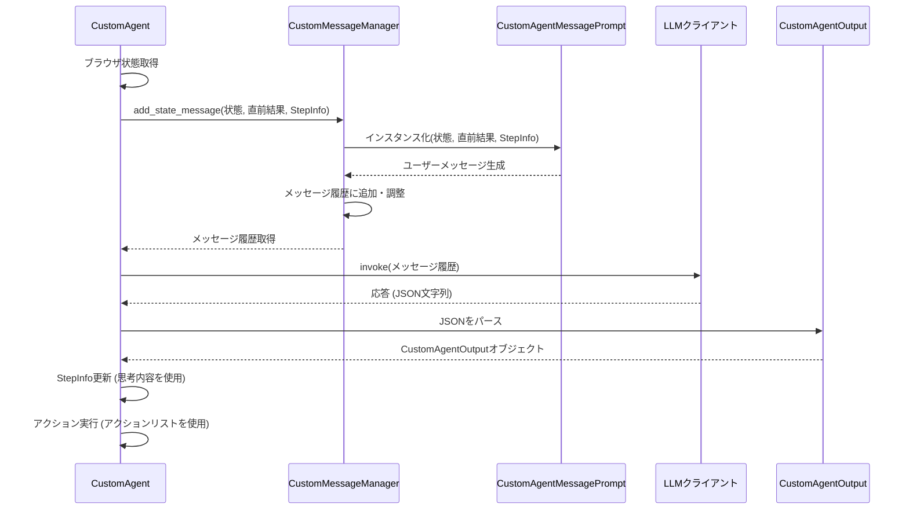

# Chapter 3: LLM連携とプロンプト生成

前の章[カスタムエージェント (`CustomAgent`)](02_カスタムエージェント___customagent___.md)では、`2bykilt`の賢い実行役である`CustomAgent`が、どのようにして追加情報などを活用し、柔軟にタスクをこなすのかを学びました。しかし、`CustomAgent`は、どのようにしてその「賢さ」の源である大規模言語モデル（LLM）と対話し、指示を仰いでいるのでしょうか？

この章では、エージェントとLLMをつなぐ「通訳者」の役割を果たす、**LLM連携とプロンプト生成**の仕組みについて詳しく見ていきます。

## LLM連携とプロンプト生成とは？ なぜ必要？

`CustomAgent`がタスクを実行する際、次に何をすべきかを自分で完全に判断しているわけではありません。まるで経験豊富なシェフが、手元のレシピ本（知識ベース）を参照するように、エージェントは強力な「頭脳」である**大規模言語モデル（LLM）**に相談します。

例えば、「東京で開催されるAI関連カンファレンスを検索して、直近のものを3つ教えて。connpassやTECH PLAYを優先して見てね」という指示（タスクと追加情報）をエージェントが受け取ったとします。エージェントはこの指示と、現在のブラウザの状況（どのページを開いているか、どんな要素が見えているかなど）を理解する必要があります。しかし、LLMはこの情報をそのままでは理解できません。

ここで**LLM連携とプロンプト生成**の出番です。これは、エージェントとLLMの間のコミュニケーションを円滑にするための重要なプロセスです。

1.  **LLM連携:** どのLLM（OpenAIのGPT-4o、GoogleのGemini、ローカルで動くOllamaなど）を使うかを選択し、接続を確立します。これは、どの専門家（LLM）に相談するかを決めるようなものです。
2.  **プロンプト生成:** エージェントが持っている情報（ユーザーの指示、現在のブラウザの状態、過去の実行履歴、蓄積した知識=メモリ）を、LLMが理解できる形式の「質問」や「指示書」（**プロンプト**）に変換します。これは、複雑な状況や要望を、専門家が理解できる言葉に翻訳する作業に似ています。

この仕組みがあるおかげで、エージェントは様々なLLMの能力を活用し、複雑な状況下でも的確な判断を下すことができるのです。まるで、多言語対応の優秀な**通訳者**が、クライアント（エージェント）の状況や要望を正確に相手（LLM）に伝え、相手からの指示を解釈してクライアントにフィードバックするような役割を果たしています。

## 主要な構成要素

LLM連携とプロンプト生成は、いくつかの要素で構成されています。

```mermaid
graph TD
    A[ユーザー指示 + ブラウザ状態] --> B(CustomAgent);
    B --> C{LLM連携};
    C -- プロバイダー選択 --> D[LLMプロバイダー (OpenAI, Google, Ollama...)];
    D -- モデル初期化 --> E[LLMクライアント (BaseChatModel)];
    B --> F{プロンプト生成};
    F -- システムプロンプト --> G[CustomSystemPrompt (基本ルール)];
    F -- メッセージプロンプト --> H[CustomAgentMessagePrompt (状況説明)];
    G & H --> I[プロンプト (LLMへの指示書)];
    E -- プロンプト送信 --> J((LLM));
    J -- 応答 (思考 + アクション) --> K[CustomAgentOutput];
    K -- 応答解釈 --> B;

    subgraph LLMとの対話
        C
        D
        E
        F
        G
        H
        I
        J
        K
    end
```

*   **LLMプロバイダー選択と初期化:**
    *   [GradioウェブUI](01_gradioウェブui_.md) の「🔧 LLM設定」タブで、どの会社のLLM（OpenAI, Google, Ollamaなど）を使うか、どのモデル（`gpt-4o`, `gemini-1.5-flash`, `qwen2.5:7b`など）を使うかを選択します。
    *   バックエンドでは、これらの設定に基づいて `src/utils/utils.py` の `get_llm_model` 関数が呼び出され、適切なLLMクライアント（`BaseChatModel`のインスタンス）が準備されます。APIキーなどの認証情報もここで設定されます。

*   **プロンプト生成 (`CustomMessageManager`):**
    *   `CustomAgent` は内部で `CustomMessageManager` というクラスを使って、LLMに送るメッセージ（プロンプト）を管理・生成します。
    *   **システムプロンプト (`CustomSystemPrompt`):** エージェントの基本的な役割、守るべきルール、応答の形式（JSON構造など）を定義する、いわば「取扱説明書」のようなものです。これは通常、対話の最初に一度だけLLMに伝えられます。`2bykilt` では、`CustomAgentOutput` の詳細な思考プロセスを出力させるようにカスタマイズされています (`src/agent/custom_prompts.py`)。
    *   **エージェントメッセージプロンプト (`CustomAgentMessagePrompt`):** 各ステップで、LLMに現在の状況を伝えるためのプロンプトです。これには以下の情報が含まれます。
        *   現在のブラウザの状態（URL、表示要素、スクリーンショットなど）
        *   直前のアクションとその結果
        *   [カスタムエージェント (`CustomAgent`)](02_カスタムエージェント___customagent___.md) が持つ `CustomAgentStepInfo` の内容:
            *   元のタスク (`task`)
            *   ユーザーからの追加情報 (`add_infos`)
            *   蓄積されたメモリ (`memory`)
            *   現在のタスク進捗 (`task_progress`)
            *   今後の計画 (`future_plans`)
        このプロンプトは、ステップごとに動的に生成され、LLMが最新の状況に基づいて判断を下すために不可欠です (`src/agent/custom_prompts.py`)。

*   **LLM呼び出し:**
    *   生成されたプロンプト（システムプロンプトと最新のエージェントメッセージプロンプトを組み合わせたもの）が、初期化されたLLMクライアントに送信されます。`CustomAgent` の `get_next_action` メソッド内で `llm.invoke` (同期的) または `llm.ainvoke` (非同期的) が使われます。

*   **応答解釈 (`CustomAgentOutput`):**
    *   LLMはプロンプトを解釈し、思考プロセスと次に実行すべきアクションのリストをJSON形式で返します。この形式は `CustomAgentOutput` クラス (`src/agent/custom_views.py`) で定義されています。
    *   `CustomAgent` はこのJSON応答をパースし、`current_state`（思考内容）と `action`（実行するアクションのリスト）を取り出します。思考内容は `CustomAgentStepInfo` の更新に使われ、アクションは [ブラウザ制御とカスタムアクション](04_ブラウザ制御とカスタムアクション_.md) を担当するコントローラーに渡されて実行されます。

## 使ってみよう：LLM設定とプロンプトの関係

実際に[GradioウェブUI](01_gradioウェブui_.md)での設定が、どのようにLLM連携とプロンプト生成に影響するかを見てみましょう。

1.  **LLMの選択:**
    *   UIの「🔧 LLM設定」タブを開きます。
    *   「LLMプロバイダー」で例えば `Ollama` を選択します。
    *   「LLMモデル名」に、ローカルのOllamaで利用可能なモデル名（例: `qwen2.5:7b`）を入力します。（必要に応じて「LLMベースURL」も確認・設定します）
    *   「APIキー」はOllamaの場合は通常不要です。
    *   「実行」ボタンを押すと、バックエンドではこれらの設定を使って `ChatOllama(model='qwen2.5:7b', base_url='http://localhost:11434')` のようなLLMクライアントが初期化されます。

2.  **タスク実行とプロンプト:**
    *   前の章の例と同じタスクを実行してみましょう。
        *   **タスク説明:** `東京で開催されるAI関連のカンファレンスを検索して、直近のものを3つ教えて`
        *   **追加情報:** `検索エンジンはGoogleを使ってください。connpassやTECH PLAYなどのイベント告知サイトを優先的に見てください。参加費無料のイベントがあれば、それを最初にリストアップしてください。`
    *   エージェントが最初のステップ（例えば、Googleを開いて検索する前）でLLMに送る**エージェントメッセージプロンプト** (`CustomAgentMessagePrompt` によって生成される内容) は、おおよそ以下のようになります（実際のプロンプトはもっと詳細です）。

    ```text
    現在のステップ: 1/100
    現在の時刻: 2023-10-27 10:00

    1. タスク: 東京で開催されるAI関連のカンファレンスを検索して、直近のものを3つ教えて
    2. ヒント(任意):
    検索エンジンはGoogleを使ってください。connpassやTECH PLAYなどのイベント告知サイトを優先的に見てください。参加費無料のイベントがあれば、それを最初にリストアップしてください。
    3. メモリ:
    (まだ何も蓄積されていない)
    4. 現在のURL: about:blank (または初期ページ)
    5. 利用可能なタブ: [...]
    6. インタラクティブ要素:
    (初期ページの要素リスト)

    (もし前のステップがあれば)
    **前のアクション**
    前のステップ: 0/100
    前のアクション 1/1: ...
    前のアクションの結果 1/1: ...
    ```

    *   このプロンプトには、タスク、**追加情報 (`add_infos`)**、現在のブラウザ状態などが含まれています。`CustomAgentMessagePrompt` がこれらの情報をテンプレートに埋め込んで生成します。
    *   LLM（この例ではOllamaの`qwen2.5:7b`）はこのプロンプトを受け取り、**システムプロンプト**で指示されたJSON形式で応答を返します。例えば、以下のような応答が返ってくるかもしれません。

    ```json
    {
      "current_state": {
        "prev_action_evaluation": "Unknown - Initial step.",
        "important_contents": "",
        "task_progress": "1. Initiated the task.",
        "future_plans": "1. Open Google search engine.\n2. Search for 'AI conference Tokyo'.\n3. Look for links to connpass or TECH PLAY.",
        "thought": "The user wants AI conferences in Tokyo, prioritizing Google search and specific event sites like connpass/TECH PLAY, and free events. First step is to open Google.",
        "summary": "Open Google search engine."
      },
      "action": [
        {"go_to_url": {"url": "https://www.google.com"}}
      ]
    }
    ```

    *   `CustomAgent` はこの応答（`CustomAgentOutput`）を受け取り、「思考 (`thought`)」や「今後の計画 (`future_plans`)」を次のステップのために記録し、「アクション (`action`)」リストにある `go_to_url` を実行します。

このように、UIでのLLM設定が使用する「頭脳」を決定し、プロンプト生成がエージェントの状態や指示をその「頭脳」が理解できる形に翻訳することで、エージェントはタスクを進めていきます。

## 内部の仕組み：エージェントはLLMとどう対話する？

エージェントがLLMと対話する際の内部的な流れを、もう少し詳しく見てみましょう。

### 対話のステップ

[カスタムエージェント (`CustomAgent`)](02_カスタムエージェント___customagent___.md) の `step` メソッドが実行されるたびに、以下のような対話が行われます。

1.  **状態取得:** エージェントは現在のブラウザの状態（URL、要素、スクリーンショットなど）を取得します。
2.  **メッセージ生成:** `CustomMessageManager` が `CustomAgentMessagePrompt` を使って、現在の状態、直前の結果、`CustomAgentStepInfo`（タスク、追加情報、メモリ、進捗、計画など）を含む新しい「ユーザーメッセージ」を作成します。
3.  **履歴に追加:** この新しいメッセージを、過去の対話履歴（システムプロンプトや過去のやり取り）に追加します。メッセージが長くなりすぎた場合は、古いものから削除してトークン数を調整します (`cut_messages`)。
4.  **LLM呼び出し:** `CustomMessageManager` が保持しているメッセージ履歴全体を、初期化されたLLMクライアント (`llm`) に `invoke` または `ainvoke` で渡します。
5.  **応答受信:** LLMはメッセージ履歴に基づいて思考し、次のアクションなどを `CustomAgentOutput` のJSON形式で返します。
6.  **応答処理:** エージェントは受け取ったJSONを `CustomAgentOutput` オブジェクトにパースします。
7.  **情報更新とアクション実行:** パースした `CustomAgentOutput` から思考内容を取り出して `CustomAgentStepInfo` を更新し、アクションリストを取り出して実行します。

この一連の流れを簡単なシーケンス図で示します。



### コードでの実装

関連するコードを見てみましょう。

1.  **LLMクライアントの取得 (`src/utils/utils.py`)**
    UIで選択されたプロバイダーとモデル名に基づいて、適切なLLMクライアントを生成します。

    ```python
    # --- File: src/utils/utils.py ---
    def get_llm_model(provider: str, **kwargs):
        """LLMモデルを取得する"""
        # ... (APIキーのチェックなど) ...

        if provider == "openai":
            # OpenAIのクライアントを返す
            return ChatOpenAI(
                model=kwargs.get("model_name", "gpt-4o"),
                temperature=kwargs.get("temperature", 0.0),
                # ... 他の引数 ...
            )
        elif provider == "google":
            # Google (Gemini) のクライアントを返す
            return ChatGoogleGenerativeAI(
                model=kwargs.get("model_name", "gemini-1.5-flash-latest"),
                # ... 他の引数 ...
            )
        elif provider == "ollama":
            # Ollama のクライアントを返す
            return ChatOllama(
                model=kwargs.get("model_name", "qwen2.5:7b"),
                # ... 他の引数 ...
            )
        # ... (他のプロバイダーの分岐) ...
        else:
            raise ValueError(f"サポートされていないプロバイダー: {provider}")
    ```
    *   UIからの選択に応じて、LangChainが提供する各LLMプロバイダー用のクラス (`ChatOpenAI`, `ChatGoogleGenerativeAI`, `ChatOllama` など) のインスタンスを作成して返します。

2.  **エージェント初期化とメッセージマネージャー (`src/agent/custom_agent.py`)**
    `CustomAgent` の初期化時にLLMクライアントを受け取り、`CustomMessageManager` を設定します。

    ```python
    # --- File: src/agent/custom_agent.py ---
    class CustomAgent(Agent):
        def __init__(
                self,
                task: str,
                llm: BaseChatModel, # get_llm_model で取得したクライアント
                add_infos: str = "",
                # ...
                agent_prompt_class: Type[AgentMessagePrompt] = CustomAgentMessagePrompt, # 使用するプロンプトクラス
                # ...
        ):
            super().__init__(...)
            self.llm = llm # LLMクライアントを保持
            # ...
            self.add_infos = add_infos

            # カスタムメッセージマネージャーを初期化
            self.message_manager = CustomMessageManager(
                llm=self.llm,
                task=self.task,
                # ...
                agent_prompt_class=agent_prompt_class, # CustomAgentMessagePrompt を指定
                # ...
            )
            # ...
            # 出力形式として CustomAgentOutput を使うように設定
            self._setup_action_models()
    ```
    *   `llm` 引数で渡されたLLMクライアントをインスタンス変数に保持します。
    *   `CustomMessageManager` を初期化し、その際に `agent_prompt_class` として `CustomAgentMessagePrompt` を指定します。これにより、カスタムのプロンプト生成ロジックが使われます。

3.  **メッセージ生成とLLM呼び出し (`src/agent/custom_agent.py`)**
    `step` メソッド内でメッセージを生成し、LLMを呼び出します。

    ```python
    # --- File: src/agent/custom_agent.py ---
    class CustomAgent(Agent):
        # ... (init など) ...

        async def step(self, step_info: Optional[CustomAgentStepInfo] = None) -> None:
            # ... (状態取得など) ...
            try:
                state = await self.browser_context.get_state()
                # ...

                # メッセージマネージャーを使って状態メッセージを追加
                # この中で CustomAgentMessagePrompt が使われ、step_info が渡される
                self.message_manager.add_state_message(state, self._last_actions, self._last_result, step_info, self.use_vision)

                # メッセージマネージャーから現在のメッセージ履歴を取得
                input_messages = self.message_manager.get_messages()
                # ...

                # LLM を呼び出して次のアクションと思考 (CustomAgentOutput) を取得
                model_output: CustomAgentOutput = await self.get_next_action(input_messages)
                # ... (応答の処理、StepInfo更新、アクション実行など) ...
            except Exception as e:
                # ... (エラー処理) ...

        async def get_next_action(self, input_messages: list[BaseMessage]) -> CustomAgentOutput:
            """LLMから次のアクションを取得する"""
            # LLMクライアントを呼び出す (非同期)
            ai_message = await self.llm.ainvoke(input_messages)
            # 応答をメッセージ履歴に追加 (トークン数計算のため)
            self.message_manager._add_message_with_tokens(ai_message)

            # ... (応答コンテンツの取得とJSON修復) ...
            ai_content = ai_message.content # JSON 文字列が含まれる
            ai_content = repair_json(ai_content) # JSON形式を修正
            parsed_json = json.loads(ai_content) # JSON をパース

            # パースしたJSONを CustomAgentOutput オブジェクトに変換
            parsed: CustomAgentOutput = self.AgentOutput(**parsed_json)
            # ... (ログ出力など) ...
            return parsed
    ```
    *   `self.message_manager.add_state_message` で、`step_info` を含む現在の状況に基づいたメッセージが履歴に追加されます。
    *   `self.message_manager.get_messages()` で、システムプロンプトを含む完全なメッセージリストを取得します。
    *   `self.llm.ainvoke(input_messages)` でLLMに対話履歴を渡し、応答 (`ai_message`) を受け取ります。
    *   受け取った応答のコンテンツからJSON文字列を取り出し、`json.loads` でパースし、`CustomAgentOutput` モデルに変換して返します。

4.  **カスタムプロンプトの定義 (`src/agent/custom_prompts.py`)**
    `CustomSystemPrompt` と `CustomAgentMessagePrompt` がプロンプトの内容を定義します。

    ```python
    # --- File: src/agent/custom_prompts.py ---
    class CustomSystemPrompt(SystemPrompt):
        def important_rules(self) -> str:
            # エージェントの基本ルールと応答形式(JSON)を定義
            text = r"""
1. RESPONSE FORMAT: You must ALWAYS respond with valid JSON in this exact format:
   {
     "current_state": {
       "prev_action_evaluation": "...",
       "important_contents": "...",
       "task_progress": "...",
       "future_plans": "...",
       "thought": "...",
       "summary": "..."
     },
     "action": [ ... ]
   }
# ... (その他のルール) ...
"""
            return text
        # ... (input_format なども定義) ...

    class CustomAgentMessagePrompt(AgentMessagePrompt):
        def __init__(self, state: BrowserState, ..., step_info: Optional[CustomAgentStepInfo] = None):
            super().__init__(...)
            self.step_info = step_info # StepInfo を保持

        def get_user_message(self, use_vision: bool = True) -> HumanMessage:
            # StepInfo の内容を使ってプロンプトテキストを構築
            step_info_description = f'Current step: {self.step_info.step_number}/{self.step_info.max_steps}\n'
            # ... (現在時刻など) ...

            state_description = f"""
{step_info_description}
1. Task: {self.step_info.task}.
2. Hints(Optional):
{self.step_info.add_infos}  # 追加情報を埋め込む
3. Memory:
{self.step_info.memory}     # メモリを埋め込む
4. Current url: {self.state.url}
# ... (現在のブラウザ要素などが続く) ...
            """
            # ... (前の結果などを追加) ...

            # Visionモデルを使う場合は画像もメッセージに含める
            if self.state.screenshot and use_vision == True:
                return HumanMessage(content=[{'type': 'text', 'text': state_description}, {'type': 'image_url', ...}])
            else:
                return HumanMessage(content=state_description)
    ```
    *   `CustomSystemPrompt` は、LLMに期待する応答形式（`CustomAgentOutput` のJSON構造）や基本的な振る舞いを指示します。
    *   `CustomAgentMessagePrompt` は、`step_info`（タスク、追加情報、メモリなど）や現在のブラウザ状態 (`state`) を受け取り、これらを整形してLLMへの具体的な指示メッセージ (`HumanMessage`) を生成します。

これらのコンポーネントが連携することで、エージェントは選択されたLLMと効果的に対話し、ユーザーの指示と現在の状況に基づいた適切な判断とアクションを引き出すことができるのです。

## まとめ

この章では、`2bykilt` がどのようにして強力な大規模言語モデル（LLM）と連携し、その「頭脳」を活用しているかを学びました。UIでのLLMプロバイダーとモデルの選択がバックエンドでどのようにLLMクライアントの初期化につながるか、そしてエージェントが「通訳者」のように機能し、現在の状況やユーザー指示をLLMが理解できる**プロンプト**に変換するプロセス（特に `CustomSystemPrompt` と `CustomAgentMessagePrompt` の役割）を理解しました。さらに、LLMからの応答（思考とアクションを含む `CustomAgentOutput`）をどのように解釈し、次の行動に繋げているかの内部的な流れも確認しました。

これで、エージェントがどのように考えて指示を出すのかがわかりました。しかし、LLMが出した指示（アクション）は、具体的にどのようにしてブラウザ上で実行されるのでしょうか？ エージェントはどのようにしてボタンをクリックしたり、テキストを入力したりするのでしょう？

次の章、[ブラウザ制御とカスタムアクション](04_ブラウザ制御とカスタムアクション_.md)では、エージェントがLLMからの指示を実行に移すための「手足」となる、ブラウザ操作の仕組みについて詳しく見ていきます。

---

Generated by [AI Codebase Knowledge Builder](https://github.com/The-Pocket/Tutorial-Codebase-Knowledge)