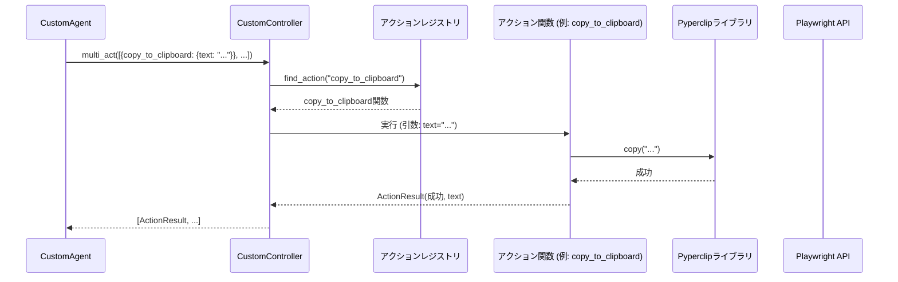

# Chapter 4: ブラウザ制御とカスタムアクション

前の章[LLM連携とプロンプト生成](03_llm連携とプロンプト生成_.md)では、エージェントがどのようにして大規模言語モデル（LLM）と対話し、次に何をすべきかの指示（思考とアクション）を受け取るのかを学びました。エージェントが「考える」部分はわかりましたが、LLMが出した「これをクリックして」「ここにテキストを入力して」といった指示は、一体どのようにして実行されるのでしょうか？

この章では、エージェントがウェブブラウザを操作するための「手足」となる、**ブラウザ制御とカスタムアクション**の仕組みについて詳しく見ていきます。

## ブラウザ制御とは？ なぜ必要？

エージェントにウェブサイトを使ったタスク（例：「会社のウェブサイトから問い合わせフォームを探して、特定のメッセージを送信してほしい」）を依頼したとしましょう。[LLM](03_llm連携とプロンプト生成_.md)が賢く考えて、「まず『お問い合わせ』リンクをクリックし、次に名前フィールドに『山田太郎』と入力し、メッセージ欄に『資料請求』と入力して、最後に送信ボタンをクリックする」という完璧な手順を指示したとしても、実際にブラウザ上でその操作を行う「実行役」がいなければ、タスクは進みません。

ここで**ブラウザ制御**が必要になります。これは、プログラムコードを使ってウェブブラウザ（`2bykilt`では主にChromium）を自動的に操作する技術です。

*   **ブラウザの起動:** 新しいブラウザウィンドウを開きます。
*   **ページへの移動:** 指定されたURLのウェブページを開きます。
*   **要素の操作:** ページ上のボタンをクリックしたり、テキストボックスに文字を入力したりします。
*   **情報の取得:** ページのタイトルや特定の要素のテキストなどを読み取ります。

`2bykilt`では、このブラウザ制御の基盤として **Playwright** という強力なライブラリを利用しています。Playwrightは、ウェブ開発者やテスターが使うツールですが、エージェントにとってもウェブを操作するための頼れる「手足」となるのです。

さらに、`2bykilt`では、Playwrightの基本的な操作に加えて、独自の**カスタムアクション**を定義しています。例えば、ウェブページ上のテキストをOSのクリップボードにコピーしたり、クリップボードの内容をテキストフィールドに貼り付けたりするような、少し特殊な操作です。

これらの基本的なブラウザ操作とカスタムアクションを組み合わせることで、エージェントはLLMからの指示に従って、まるで人間が操作するようにウェブサイトを自由に操ることができるようになります。

## 主要な構成要素：`Controller` と `CustomController`

エージェントがブラウザを操作する仕組みの中心には、`Controller`（コントローラー）と呼ばれるコンポーネントがあります。

```mermaid
graph LR
    subgraph ブラウザ制御レイヤー
        A[CustomAgent] --> B(CustomController);
        B -- 継承 --> C[Controller (browser-use)];
        B -- 登録 --> D{アクションレジストリ};
        D -- "copy_to_clipboard" --> E[カスタムアクション関数];
        D -- "paste_from_clipboard" --> F[カスタムアクション関数];
        D -- "click_element" --> G[基本アクション関数];
        C -- 登録 --> D;
        C -- Playwrightを利用 --> H((Playwright));
        B -- Playwrightを利用 --> H;
        H -- ブラウザを操作 --> I[Webブラウザ (Chromium)];
    end

    A -- アクション指示 --> B;
    B -- アクション実行 --> I;
    I -- ページ情報 --> B;
    B -- 実行結果 --> A;

```

*   **Playwright:** ブラウザを実際に動かすための低レベルな命令（API）を提供するライブラリです。ブラウザの起動、ページの読み込み、要素のクリックや入力などを担当します。（図の `H` と `I`）
*   **`Controller` (ベースクラス):** `browser-use`ライブラリに含まれる基本的なコントローラーです。Playwrightの操作をラップし、LLMが理解しやすい形のアクション（例: `click_element`、`input_text`、`go_to_url`）として定義します。どのアクションが利用可能かを管理する**アクションレジストリ** (`registry`) を持っています。（図の `C` と `D` の一部）
*   **`CustomController` (`2bykilt`固有):** `2bykilt`プロジェクトで定義されている、`Controller`を**継承**（機能を引き継ぎ、拡張）したクラスです。基本的なブラウザ操作アクションに加えて、`2bykilt`独自のカスタムアクション（例: `copy_to_clipboard`、`paste_from_clipboard`）をアクションレジストリに追加で登録します。（図の `B`、`D`、`E`、`F`）
*   **アクションレジストリ (`registry`):** `CustomController`が持つ、「利用可能なアクションの一覧表」のようなものです。LLMがエージェントに指示を出す際に、「どんなアクションが使えるか」をこのレジストリから参照します。また、実際にアクションを実行する際にも、このレジストリから対応する関数を見つけて呼び出します。（図の `D`）
*   **アクション関数:** 各アクション（例: `click_element`、`copy_to_clipboard`）に対応する実際の処理内容が書かれたPythonの関数です。`@registry.action(...)` という目印（デコレータ）を付けて登録されます。（図の `E`、`F`、`G`）

つまり、エージェントはLLMから受け取ったアクション指示（例：「`copy_to_clipboard`を実行して」）を `CustomController` に渡し、`CustomController` はアクションレジストリを見て対応するアクション関数（`copy_to_clipboard`を実行する関数）を探し出し、Playwrightを使ってブラウザ上で実行する、という流れになります。

## 使ってみよう：クリップボードを使ったコピー＆ペースト

`CustomController`に追加されたカスタムアクションがどのように役立つか、具体的な例を見てみましょう。

**シナリオ:** ウェブページ上に表示されている製品のシリアル番号をコピーして、別のページのサポートフォームの入力欄に貼り付けたい。

1.  **LLMの指示:**
    [LLM](03_llm連携とプロンプト生成_.md)は、このタスクを達成するために、以下のようなアクションのリストを生成するかもしれません。（これはLLMの内部的な判断であり、実際の出力形式は[カスタムエージェント (`CustomAgent`)](02_カスタムエージェント___customagent___.md)で定義された`CustomAgentOutput`に従います）

    ```json
    // LLMが生成するかもしれないアクション指示のイメージ (JSON形式)
    [
      {
        "copy_to_clipboard": { // カスタムアクション
          "text": "SN-12345ABC" // コピーしたいテキスト (LLMがページから読み取るなどして特定)
        }
      },
      {
        "go_to_url": { // 基本アクション
          "url": "https://support.example.com/contact" // サポートページのURL
        }
      },
      {
        "paste_from_clipboard": {} // カスタムアクション (貼り付け先の要素は自動でフォーカスするなど想定)
      },
      {
        "click_element": { // 基本アクション
          "selector": "#submit-button" // 送信ボタンのセレクタ
        }
      },
      {
        "done": { // 完了アクション
          "result": "シリアル番号 SN-12345ABC をサポートフォームに送信しました。"
        }
      }
    ]
    ```

2.  **エージェントからControllerへ:**
    [カスタムエージェント (`CustomAgent`)](02_カスタムエージェント___customagent___.md) は、LLMから受け取ったこのアクションリスト（`CustomAgentOutput`の`action`部分）を `CustomController` の `multi_act` メソッドに渡します。

3.  **Controllerによる実行:**
    `CustomController` はアクションリストを順番に処理します。
    *   **`copy_to_clipboard`:** アクションレジストリから `copy_to_clipboard` に対応する関数を見つけ、実行します。この関数は内部で `pyperclip.copy("SN-12345ABC")` のようなコードを実行し、OSのクリップボードにテキストをコピーします。
    *   **`go_to_url`:** 同様に `go_to_url` 関数を実行し、Playwrightを使ってブラウザを指定されたURLに遷移させます。
    *   **`paste_from_clipboard`:** `paste_from_clipboard` 関数を実行します。この関数は `pyperclip.paste()` でクリップボードの内容を取得し、Playwrightの機能（例: `page.keyboard.type(...)`）を使って、現在アクティブな入力フィールドにテキストを貼り付けます。
    *   **`click_element`:** `click_element` 関数を実行し、Playwrightを使って指定されたセレクタ（`#submit-button`）の要素をクリックします。
    *   **`done`:** 完了アクションとして処理されます。

4.  **結果の返却:**
    各アクションの実行結果（成功したか、エラーが発生したか、何か情報を取得したかなど）を示す `ActionResult` が `CustomController` からエージェントに返され、エージェントはそれを次のLLMへの報告に含めます。

このように、`CustomController` とカスタムアクションのおかげで、エージェントは単なるクリックや入力だけでなく、クリップボード操作のような少し高度な操作も実行でき、より複雑なタスクに対応できるようになります。

## 内部の仕組み：アクションはどのように登録・実行される？

`CustomController` がどのようにしてカスタムアクションを認識し、実行しているのか、もう少し詳しく見てみましょう。

### アクションの登録と実行の流れ

1.  **初期化と登録:** `CustomAgent` が初期化される際、内部で `CustomController` も初期化されます。`CustomController` の初期化処理 (`__init__`) の中で、`_register_custom_actions` というメソッドが呼ばれます。このメソッド内で、`@self.registry.action(...)` というデコレータを使って、カスタムアクション関数（例: `copy_to_clipboard` 関数）がアクションレジストリに登録されます。
2.  **アクション指示の受信:** エージェントがLLMからアクションリストを受け取り、`CustomController` の `multi_act` メソッドを呼び出します。
3.  **アクションの検索と実行:** `multi_act` メソッドは、リスト内の各アクション指示（例: `{"copy_to_clipboard": {"text": "..."}}`）を順番に処理します。
    *   アクション名（`copy_to_clipboard`）を使って、アクションレジストリから対応するアクション関数を探します。
    *   見つかったアクション関数を、指示された引数（`text="..."`）と共に呼び出します。
    *   アクション関数は内部で Playwright や `pyperclip` などのライブラリを使って実際の操作を実行します。
4.  **結果の返却:** アクション関数は実行結果を `ActionResult` オブジェクトとして返し、`multi_act` メソッドは全てのアクションの結果をまとめてエージェントに返します。

簡単なシーケンス図で見てみましょう。



### コードでの実装

実際のコード (`src/controller/custom_controller.py`) で、カスタムアクションがどのように定義・登録されているかを見てみましょう。

1.  **`CustomController` の初期化とカスタムアクション登録の呼び出し:**

    ```python
    # --- File: src/controller/custom_controller.py ---
    import logging
    import pyperclip # クリップボード操作用ライブラリ
    from typing import Optional, Type
    from pydantic import BaseModel
    from browser_use.agent.views import ActionResult
    from browser_use.browser.context import BrowserContext # ブラウザコンテキスト
    from browser_use.controller.service import Controller, DoneAction
    # ... 他のインポート ...

    logger = logging.getLogger(__name__)

    class CustomController(Controller):
        def __init__(self, exclude_actions: list[str] = [],
                     output_model: Optional[Type[BaseModel]] = None
                     ):
            # 親クラス(Controller)の初期化を呼び出す
            super().__init__(exclude_actions=exclude_actions, output_model=output_model)
            # カスタムアクションを登録するメソッドを呼び出す
            self._register_custom_actions()

        def _register_custom_actions(self):
            # ... (カスタムアクションの定義はここで行われる) ...
            pass # この後で具体的な登録コードを見る
    ```
    *   `CustomController` は `browser-use` の `Controller` を継承しています (`class CustomController(Controller):`)。
    *   `__init__` メソッドの中で、まず親クラスの `__init__` を呼び出し (`super().__init__(...)`)、その後で `_register_custom_actions()` を呼び出してカスタムアクションを登録しています。

2.  **カスタムアクションの定義と登録 (`_register_custom_actions`内):**
    `@self.registry.action(...)` デコレータを使って、関数をアクションとして登録します。

    ```python
    # --- File: src/controller/custom_controller.py ---
    class CustomController(Controller):
        # ... (initなど) ...

        def _register_custom_actions(self):
            """Register all custom browser actions"""

            # "Copy text to clipboard" という名前のアクションを登録
            @self.registry.action("Copy text to clipboard")
            def copy_to_clipboard(text: str): # アクションの引数を定義
                """指定されたテキストをクリップボードにコピーする"""
                pyperclip.copy(text) # pyperclipを使ってコピーを実行
                logger.info(f"Copied to clipboard: '{text[:50]}...'")
                # 実行結果を ActionResult で返す
                return ActionResult(extracted_content=f"Text copied to clipboard: {text}")

            # "Paste text from clipboard" という名前のアクションを登録
            @self.registry.action("Paste text from clipboard")
            async def paste_from_clipboard(browser: BrowserContext): # ブラウザコンテキストを引数に取る
                """クリップボードの内容を現在のページに貼り付ける"""
                text = pyperclip.paste() # pyperclipでクリップボードから取得
                if not text:
                    logger.warning("Clipboard is empty.")
                    return ActionResult(error="Clipboard is empty.", include_in_memory=False)

                # 現在のページを取得
                page = await browser.get_current_page()
                # Playwrightの機能を使ってテキストを入力 (アクティブな要素に)
                await page.keyboard.type(text)
                logger.info(f"Pasted from clipboard: '{text[:50]}...'")
                # 実行結果を ActionResult で返す
                return ActionResult(extracted_content=f"Pasted text from clipboard: {text}")
    ```
    *   `@self.registry.action("アクション名")`: このデコレータが、続く関数をコントローラーのアクションとして登録します。アクション名はLLMに提示される名前になります。
    *   関数の引数 (`text: str` や `browser: BrowserContext`) は、LLMがアクションを指示する際に指定するパラメータや、アクション実行に必要なコンテキスト（現在のブラウザの状態など）に対応します。
    *   関数の中身では、`pyperclip` や `browser` (Playwrightのラッパー) を使って実際の操作を行います。
    *   `ActionResult`: アクションの実行結果を格納するオブジェクトです。`extracted_content` には取得した情報、`error` にはエラーメッセージ、`is_done` はタスク完了を示すか、などを設定して返します。この情報はエージェントに渡され、次の判断に使われます。

このように、`CustomController` は `@self.registry.action` を使って簡単に関数を新しいアクションとして追加できます。これにより、基本的なブラウザ操作だけでなく、プロジェクト固有の要件に合わせた様々な操作をエージェントに実行させることが可能になります。

## まとめ

この章では、エージェントがLLMからの指示を具体的なブラウザ操作に変換するための「手足」である**ブラウザ制御**の仕組みについて学びました。

*   **Playwright** が実際のブラウザ操作の基盤となっていること。
*   `browser-use` の **`Controller`** がPlaywrightをラップし、基本的なアクションを定義していること。
*   `2bykilt` の **`CustomController`** が `Controller` を継承し、**アクションレジストリ**を使って独自の**カスタムアクション**（例: クリップボード操作）を追加していること。
*   `@registry.action` デコレータを使って簡単に関数を新しいアクションとして登録できること。

これにより、エージェントはLLMの指示に従って、クリック、入力、ページ遷移といった基本操作から、コピー＆ペーストのようなカスタム操作まで、幅広いアクションを実行できることを理解しました。

さて、これまではエージェントがLLMと考えながら一歩一歩タスクを進める方法を見てきました。しかし、もし定型的な作業を毎回同じ手順で実行させたい場合はどうでしょうか？ LLMの思考を毎回経由するのは非効率かもしれません。

次の章、[スクリプトベース自動化](05_スクリプトベース自動化_.md)では、あらかじめ定義された「台本」（スクリプト）に基づいて、エージェントに一連のブラウザ操作を自動実行させる方法について学びます。

---

Generated by [AI Codebase Knowledge Builder](https://github.com/The-Pocket/Tutorial-Codebase-Knowledge)