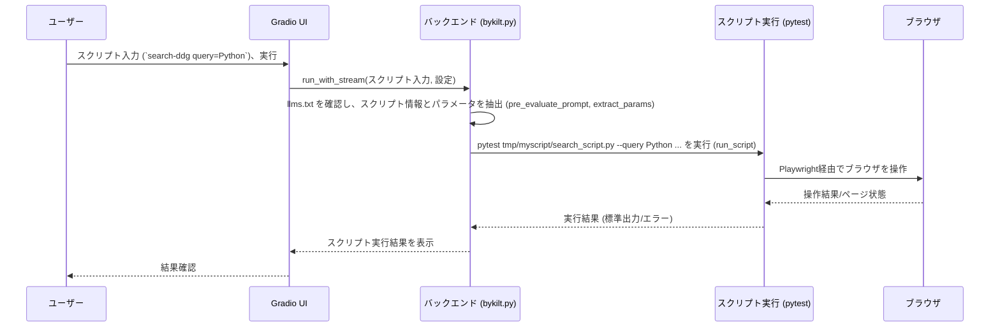

# Chapter 5: スクリプトベース自動化

前の章[ブラウザ制御とカスタムアクション](04_ブラウザ制御とカスタムアクション_.md)では、エージェントが[LLM](03_llm連携とプロンプト生成_.md)からの指示（「これをクリックして」「ここにこれを入力して」）を受け取り、`CustomController`を使って実際にブラウザを操作する方法を学びました。エージェントが柔軟に考えて動く様子がわかりましたね。

しかし、もし毎日同じウェブサイトにログインして、決まった情報をチェックするような、**完全に同じ手順の繰り返し作業**をさせたい場合はどうでしょうか？毎回LLMに考えてもらうのは少し時間がかかりますし、もしかしたら微妙に違う動きをしてしまうかもしれません。

この章では、このような定型的な作業を、毎回寸分違わず、素早く実行するための機能、**スクリプトベース自動化**について学びます。

## スクリプトベース自動化とは？ なぜ必要？

例えば、あなたが毎日特定の求人サイトに行って、「AIエンジニア」というキーワードで新しい求人が出ていないかチェックしたいとします。この作業は、毎日全く同じ手順で行いますよね。

1.  求人サイトを開く
2.  検索ボックスに「AIエンジニア」と入力する
3.  検索ボタンをクリックする
4.  （場合によっては）新しい求人情報を確認する

このような決まりきった作業を[カスタムエージェント (`CustomAgent`)](02_カスタムエージェント___customagent___.md)に頼むこともできますが、[LLM](03_llm連携とプロンプト生成_.md)が毎回「えーっと、まずサイトを開いて、次に検索ボックスを探して…」と考えるのは、少し非効率的です。それに、たまにLLMが違う手順を思いついてしまうかもしれません。

そこで登場するのが**スクリプトベース自動化**です。これは、あらかじめ用意しておいた「台本」や「指示書」（**スクリプト**）に従って、エージェント（というより、`2bykilt`のシステム）にブラウザを自動操作させる機能です。

この機能を使うと、まるで**指示された作業だけを正確にこなすロボットアーム**のように、特定の指示（タスク入力欄への特別な書き方）を受け取ると、LLMに相談することなく、決められた手順（スクリプト）を高速かつ確実に実行します。

## 主要な構成要素

スクリプトベース自動化は、いくつかの要素で成り立っています。

```mermaid
graph TD
    A[ユーザー] --> B(Gradio UI);
    B -- タスク入力: `script-nogtips query=AI` --> C{bykilt.py バックエンド};
    C -- llms.txt を確認 --> D(llms.txt);
    D -- スクリプト名、パラメータ定義 --> C;
    C -- スクリプト情報発見！ --> E{LLM連携をスキップ};
    C -- パラメータと共に実行指示 --> F[スクリプト実行 (例: pytest)];
    F -- Playwright経由 --> G[ブラウザ];
    G -- 画面/操作 --> F;
    F -- 実行結果 (ログ) --> C;
    C -- 結果表示 --> B;
    B -- 結果確認 --> A;

    subgraph 自動化プロセス
        C
        D
        E
        F
        G
    end
```

*   **事前定義スクリプト (Predefined Scripts):**
    *   これは、ブラウザに何をどの順番で実行させるかを具体的に記述した「指示書」ファイルです。`2bykilt`では、ウェブテストでよく使われる`pytest`というツールと、前の章で学んだPlaywrightを使って書かれます。（図の `F`）
    *   例えば、「LinkedInを開いて、特定のキーワードで検索する」という手順がコードで書かれています。
*   **`llms.txt` ファイル:**
    *   これは、利用可能なスクリプトの「メニュー」のようなものです。どの「合言葉」（トリガー入力）でどのスクリプトを呼び出すか、そしてそのスクリプトに追加で情報（パラメータ）を渡す必要があるかなどを定義します。（図の `D`）
    *   このファイルは、プロジェクトのルートディレクトリに置くか、URLで指定することができます。
*   **トリガー入力 (Trigger Input):**
    *   [GradioウェブUI](01_gradioウェブui_.md)の「タスク説明」欄に入力する、特定のスクリプトを実行するための「合言葉」です。`llms.txt`で定義された形式に従います。（例: `script-nogtips query="AIエンジニア"`）（図の `B` -> `C`）
*   **LLMバイパス (LLM Bypass):**
    *   トリガー入力が認識されると、`2bykilt`は[LLM連携とプロンプト生成](03_llm連携とプロンプト生成_.md)のプロセスを完全に**スキップ**します。LLMに相談するステップがなくなるため、処理が非常に高速になります。（図の `E`）

これらの要素が連携することで、定型的なブラウザ操作を効率的に自動化できます。

## 使ってみよう：求人検索スクリプトの実行

では、実際にスクリプトベース自動化を使って、特定のキーワードで求人を検索するタスクを実行してみましょう。

**1. スクリプトの準備 (例: `example/search_script.py`)**

まず、実行したいブラウザ操作を記述したPythonスクリプトが必要です。ここでは、`pytest`を使った簡単な例を見てみましょう。（このスクリプトは`2bykilt`プロジェクトの`example`フォルダに例として含まれているかもしれません）

```python
# --- File: example/search_script.py ---
# (簡略化された例)
from playwright.sync_api import sync_playwright, Page, expect
import pytest
import re

def test_example_search(request, page: Page) -> None:
    # コマンドライン引数から検索クエリを取得
    query = request.config.getoption("--query")
    if not query:
        pytest.skip("クエリが指定されていません。--query を使用してください。")

    print(f"'{query}' で検索を実行します...")

    # 例: DuckDuckGoで検索
    page.goto("https://duckduckgo.com")

    # 検索ボックスに入力
    page.locator("#search_form_input_homepage").fill(query)

    # 検索ボタンをクリック
    page.locator("#search_button_homepage").click()

    # 検索結果ページが表示されるのを待つ (タイトルにクエリが含まれるか確認)
    expect(page).to_have_title(re.compile(query, re.IGNORECASE))

    print(f"'{query}' の検索結果ページを表示しました。")
    # 簡単な待ち時間（実際の操作を確認するため）
    page.wait_for_timeout(5000) # 5秒待機
```

*   このスクリプトは、`pytest`というテストフレームワークの形式で書かれています。
*   `request.config.getoption("--query")` で、実行時に外から与えられる`query`という名前のパラメータを受け取ります。
*   Playwrightの `page` オブジェクトを使って、DuckDuckGoを開き、受け取った`query`で検索を実行します。
*   最後に5秒待機して、ブラウザの動きが見えるようにしています。

**2. `llms.txt` での定義**

次に、このスクリプトを`2bykilt`から呼び出せるように、`llms.txt`ファイルに定義を追加します。このファイルはYAMLという形式で書かれます。

```yaml
# --- File: llms.txt ---
actions:
  - name: search-ddg # UIで入力するトリガー名
    script: search_script.py # 実行するスクリプトファイル名 (tmp/myscript/ 内を想定)
    params: query # スクリプトが必要とするパラメータ名 (カンマ区切り)
    description: "DuckDuckGoで指定されたクエリを検索します (例: search-ddg query=Python)"
    slowmo: 500 # オプション: 操作間の待機時間 (ミリ秒)
```

*   `name`: これが[GradioウェブUI](01_gradioウェブui_.md)のタスク入力欄で使う「合言葉」（トリガー名）になります。
*   `script`: 実行するスクリプトのファイル名を指定します。`2bykilt`はこのファイルを`tmp/myscript/`ディレクトリから探します。（事前にこの場所にスクリプトを配置しておく必要があります）
*   `params`: スクリプトが受け取るパラメータの名前をカンマ区切りで指定します。ここでは`query`です。
*   `description`: このスクリプトが何をするかの説明です（UIには表示されません）。
*   `slowmo`: （オプション）各操作の間に指定したミリ秒だけ待機させます。デバッグや動作確認に便利です。

**3. Gradio UI からの実行**

準備ができたら、[GradioウェブUI](01_gradioウェブui_.md)からスクリプトを実行してみましょう。

1.  `2bykilt`を起動します (`python bykilt.py`)。
2.  「🤖 エージェント実行 (Run Agent)」タブを開きます。
3.  「**タスク説明 (Task Description)**」の入力欄に、`llms.txt`で定義したトリガー名とパラメータを入力します。例えば、`Python`というキーワードで検索したい場合は、次のように入力します。
    `search-ddg query=Python`
4.  「▶️ エージェント実行 (Run Agent)」ボタンをクリックします。

**期待される動作:**

*   LLMへの問い合わせは行われません。
*   ブラウザが起動し（ヘッドレスモードでなければ）、自動的にDuckDuckGoのページが開かれます。
*   検索ボックスに「Python」と入力され、検索が実行されます。
*   検索結果ページが表示され、5秒ほど待機します。
*   「📊 結果 (Results)」タブの「最終結果 (Final Result)」欄に、スクリプトの実行ログ（`print`文の内容など）が表示されます。
*   もし「ブラウザ設定」で録画が有効になっていれば、「🎥 録画 (Recordings)」タブや「最新の録画 (Latest Recording)」で操作のビデオを確認できます。

これで、LLMを使わずに、定義されたスクリプトを正確に実行できました！

## 内部の仕組み：合言葉はどうやってスクリプト実行につながる？

ユーザーが「合言葉」を入力したとき、`2bykilt`の内部では何が起こっているのでしょうか？

### ステップ・バイ・ステップ

1.  **入力受け取り:** ユーザーが[GradioウェブUI](01_gradioウェブui_.md)でタスク（例: `search-ddg query=Python`）を入力し、「実行」ボタンをクリックします。
2.  **合言葉チェック (`pre_evaluate_prompt`):** `bykilt.py`の `run_with_stream` (または `run_browser_agent`) 関数が呼び出されると、まず最初に入力されたタスクが `llms.txt` に定義されたスクリプトの合言葉 (`name`) と一致するかをチェックします (`pre_evaluate_prompt` 関数)。
3.  **スクリプト情報発見:** もし合言葉が見つかった場合（例: `search-ddg` が見つかった）、`llms.txt` から関連情報（スクリプトファイル名 `search_script.py`、必要なパラメータ `query` など）を取得します。LLMとの連携は **行いません**。
4.  **パラメータ抽出 (`extract_params`):** 次に、入力されたタスク文字列から、必要なパラメータの値（例: `query=Python` から `Python`）を抽出します (`extract_params` 関数)。
5.  **コマンド構築 (`run_script`):** 取得したスクリプトファイル名と抽出したパラメータを使って、スクリプトを実行するためのコマンドライン命令を組み立てます。例えば、`pytest tmp/myscript/search_script.py --query Python --headed --slowmo 500` のような形になります。（`--headed` はヘッドレスモードでない場合に追加されます）
6.  **スクリプト実行 (`run_script`):** 組み立てたコマンドを `asyncio.create_subprocess_exec` を使って実行します。これにより、`pytest` が起動し、指定されたスクリプト (`search_script.py`) が実行され、Playwrightを通じてブラウザが操作されます。
7.  **結果収集:** スクリプトの実行が完了すると、その標準出力（`print`文など）や標準エラー出力を受け取ります。
8.  **結果表示:** 受け取った出力を[GradioウェブUI](01_gradioウェブui_.md)の「結果」タブに表示します。

### シーケンス図

この流れを簡単なシーケンス図で見てみましょう。



### コードでの実装 (`bykilt.py`)

関連するコードが `bykilt.py` の中でどのように実装されているか、主要な部分を見てみましょう。

1.  **合言葉のチェックとスクリプト情報の取得 (`pre_evaluate_prompt`)**

    ```python
    # --- File: bykilt.py ---
    import yaml
    import re
    import os
    import requests # URLからllms.txtを取得する場合

    def fetch_llms_txt(prompt):
        # プロンプト中のURLか、ローカルのllms.txtを探す
        # ... (URL or local file reading logic) ...
        with open('llms.txt', 'r') as file: # ローカルファイルの場合
            return file.read()

    def parse_llms_txt(content):
        # YAML形式のテキストをPythonの辞書に変換
        data = yaml.safe_load(content)
        return data['actions'] # 'actions' リストを返す

    def pre_evaluate_prompt(prompt):
        try:
            content = fetch_llms_txt(prompt) # llms.txtの内容を取得
            actions = parse_llms_txt(content) # パースしてアクションリスト取得
            for action in actions:
                # アクション定義に'name'があり、それがプロンプトに含まれていたら
                if 'name' in action and action['name'] in prompt:
                    return action # そのアクション定義(辞書)を返す
            return None # 一致するものがなければNoneを返す
        except Exception as e:
            print(f"pre_evaluate_prompt でエラー: {str(e)}")
            return None
    ```
    *   `fetch_llms_txt` と `parse_llms_txt` で `llms.txt` の内容を読み込み、YAML形式からPythonのリスト/辞書に変換します。
    *   `pre_evaluate_prompt` は、ユーザーの入力 (`prompt`) が、`llms.txt` で定義されたアクションの `name` と一致するかどうかをチェックします。一致すれば、そのアクションの定義情報（スクリプト名、パラメータ名などが入った辞書）を返します。

2.  **パラメータの抽出 (`extract_params`)**

    ```python
    # --- File: bykilt.py ---
    import re

    def extract_params(prompt, param_names):
        params = {} # パラメータ名と値を格納する辞書
        if not param_names: # パラメータ定義がなければ空の辞書を返す
            return params
        # param_names は "query,limit" のようなカンマ区切り文字列
        for param in param_names.split(','):
            param = param.strip() # 前後の空白を削除
            # 正規表現で "param=value" の形式を探す
            match = re.search(rf'{param}=(\S+)', prompt)
            if match:
                # 見つかったら辞書に追加
                params[param] = match.group(1)
        return params
    ```
    *   `llms.txt` で定義されたパラメータ名 (`param_names`) をもとに、ユーザー入力 (`prompt`) から `パラメータ名=値` の形式で値を抜き出し、辞書に格納します。

3.  **スクリプト実行コマンドの構築と実行 (`run_script`)**

    ```python
    # --- File: bykilt.py ---
    import asyncio
    import os
    import logging

    logger = logging.getLogger(__name__)

    async def run_script(script_info, params, headless=False, save_recording_path=None):
        # スクリプトファイルのパスを構築 (tmp/myscript/ 内)
        script_path = os.path.join('tmp', 'myscript', script_info['script'])
        # ... (ファイル存在チェック) ...

        # pytest コマンドの基本部分
        command = ['pytest', script_path]
        if not headless:
            command.append('--headed') # ヘッドレスでなければ --headed を追加

        # パラメータをコマンドに追加 (例: --query Python)
        for param_name, param_value in params.items():
             command.extend([f'--{param_name}', param_value])

        # slowmo が定義されていれば追加
        slowmo = script_info.get('slowmo')
        if slowmo is not None:
             command.extend(['--slowmo', str(slowmo)])

        # ... (録画設定の処理) ...

        logger.info(f"実行コマンド: {' '.join(command)}")

        # 非同期でコマンドを実行
        process = await asyncio.create_subprocess_exec(
            *command,
            stdout=asyncio.subprocess.PIPE, # 標準出力を取得
            stderr=asyncio.subprocess.PIPE  # 標準エラーを取得
        )
        stdout, stderr = await process.communicate() # 実行完了を待つ

        if process.returncode != 0:
            # エラー処理
            error_msg = f"スクリプト実行失敗: {stderr.decode()}"
            logger.error(error_msg)
            return error_msg, None
        else:
            # 成功処理
            success_msg = f"スクリプト実行成功: {stdout.decode()}"
            logger.info(success_msg)
            # 成功メッセージとスクリプトパスを返す
            return success_msg, script_path
    ```
    *   `script_info` (アクション定義) と `params` (抽出されたパラメータ) を使って、`pytest` を実行するためのコマンドライン引数のリスト (`command`) を組み立てます。
    *   `asyncio.create_subprocess_exec` を使って、組み立てたコマンドを非同期で実行します。
    *   実行結果の標準出力 (`stdout`) と標準エラー (`stderr`) を取得し、結果メッセージとして返します。

4.  **メイン処理でのスクリプト実行の呼び出し (`run_browser_agent` または `run_with_stream`)**

    ```python
    # --- File: bykilt.py ---
    async def run_browser_agent(
        # ... (たくさんの引数) ...,
        task, # ユーザーが入力したタスク
        add_infos,
        # ...
    ):
        # ...
        try:
            # まず、入力がスクリプト呼び出しかどうかをチェック
            script_info = pre_evaluate_prompt(task)
            if script_info:
                # スクリプト呼び出しの場合
                params = extract_params(task, script_info.get('params', ''))
                # スクリプトを実行する関数を呼び出す
                script_output, script_path = await run_script(
                    script_info, params, headless=headless,
                    save_recording_path=save_recording_path if enable_recording else None
                )
                # スクリプトの実行結果をUIに返す形式でreturn
                return (
                    script_output, # Final Result
                    "",           # Errors (エラーがあれば run_script 内で設定される)
                    f"実行スクリプト: {script_path}", # Model Actions の代わりにスクリプトパス
                    "",           # Model Thoughts
                    # ... (録画ファイルパスなど) ...
                )

            # スクリプト呼び出しでなければ、通常のLLMエージェント処理に進む
            # ... (LLMの初期化、エージェントの実行など) ...

        except Exception as e:
            # ... (エラーハンドリング) ...
    ```
    *   メインの実行関数 (`run_browser_agent`) の冒頭で `pre_evaluate_prompt(task)` を呼び出しています。
    *   もし戻り値 (`script_info`) が `None` でなければ（つまり、合言葉が見つかったら）、`extract_params` と `run_script` を呼び出してスクリプトを実行し、その結果を返します。
    *   もし `script_info` が `None` であれば、後続のLLMを使ったエージェント処理（これまでの章で学んだ内容）に進みます。

このように、`bykilt.py` はユーザー入力をまずチェックし、それが `llms.txt` で定義されたスクリプト呼び出しであれば、LLM を介さずに直接スクリプトを実行する仕組みになっています。

## まとめ

この章では、**スクリプトベース自動化**について学びました。これは、以下のような特徴を持つ機能です。

*   `pytest`とPlaywrightで書かれた**事前定義スクリプト**を使って、決まったブラウザ操作を実行します。
*   **`llms.txt`** ファイルで、スクリプトを呼び出すための「合言葉」（トリガー名）と必要なパラメータを定義します。
*   [GradioウェブUI](01_gradioウェブui_.md)のタスク入力欄に合言葉を入力することで、対応するスクリプトが **LLMをバイパスして** 実行されます。
*   これにより、定型的なタスクを**高速**かつ**確実**に自動化できます。

これで、柔軟な思考が必要なタスクは[カスタムエージェント (`CustomAgent`)](02_カスタムエージェント___customagent___.md)と[LLM](03_llm連携とプロンプト生成_.md)に、決まりきった作業はスクリプトベース自動化に、と使い分けることができるようになりました。

さて、エージェントに単一のタスクを実行させるだけでなく、あるトピックについてウェブを深く掘り下げて調査し、レポートをまとめてもらうような、より高度な使い方も `2bykilt` は提供しています。

次の章、[詳細調査機能 (`Deep Research`)](06_詳細調査機能___deep_research___.md)では、この強力な調査機能について詳しく見ていきましょう。

---

Generated by [AI Codebase Knowledge Builder](https://github.com/The-Pocket/Tutorial-Codebase-Knowledge)