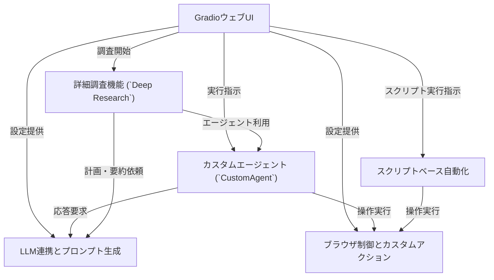

# Tutorial: 2bykilt

このプロジェクトは、***AI (大規模言語モデル)*** を活用してウェブブラウザ操作を自動化するツールです。
ユーザーは **GradioのウェブUI** を通じて、エージェントに自然言語で指示を与えたり、事前に定義された *スクリプト* を実行させたりできます。
ウェブサイトからの情報収集や複雑なタスクの自動化、さらには **詳細な自律調査** (`Deep Research`) も可能です。

**Source Repository:** [https://github.com/Nobukins/2bykilt](https://github.com/Nobukins/2bykilt)

## Chapters

1. [GradioウェブUI
](01_gradioウェブui_.md)
2. [カスタムエージェント (`CustomAgent`)
](02_カスタムエージェント___customagent___.md)
3. [LLM連携とプロンプト生成
](03_llm連携とプロンプト生成_.md)
4. [ブラウザ制御とカスタムアクション
](04_ブラウザ制御とカスタムアクション_.md)
5. [スクリプトベース自動化
](05_スクリプトベース自動化_.md)
6. [詳細調査機能 (`Deep Research`)
](06_詳細調査機能___deep_research___.md)

---

Generated by [AI Codebase Knowledge Builder](https://github.com/The-Pocket/Tutorial-Codebase-Knowledge)